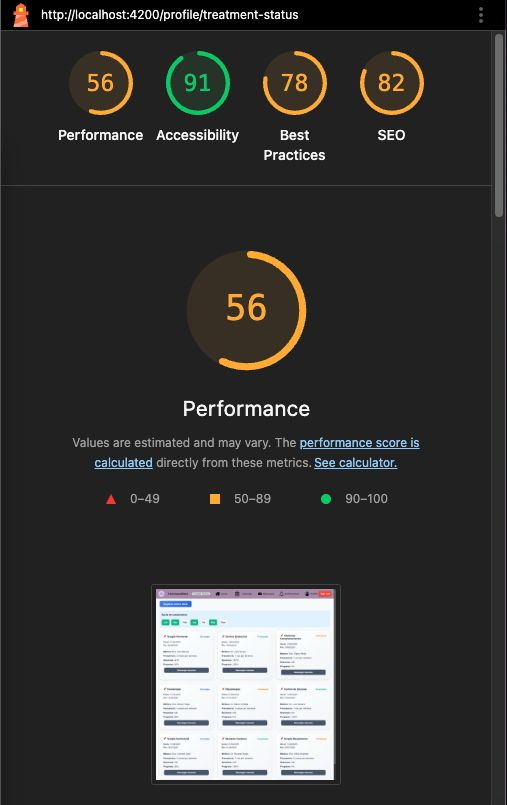

<p align="center">
  
</p>

<h1 align="center">Universidad Peruana de Ciencias Aplicadas</h1>

<h2 align="center">Ingeniería de Software</h2>
<h3 align="center">Ciclo 202510</h3>

<hr>

<h1 align="center">Diseño de Experimentos de Ingeniería de Software</h1>

<h2 align="center">TB2 REPORT</h2>

<p align="center"><strong>Código:</strong> 1ASI0732 </p>
<p align="center"><strong>Sección:</strong> 4441 </p>
<p align="center"><strong>Profesor:</strong> Julio Manuel Noriega Melendez </p>

<p align="center"><strong>StartUp Name:</strong> Los Hormonales </p>
<p align="center"><strong>Producto:</strong> HormonalCare</p>

<h3 align="center">Team Members:</h3>

<div align="center">

| Member                            |    Code    |
| :-------------------------------- | :--------: |
| Astuyauri Calderon, Jherson David | U202218451 |
| Estrada Cajamune, Abraham Andres  | U202112164 |
| Gamio Upiachihua, Brenda Lucía    | U202120344 |
| Soto Quispe, Diego Ulises         | U202214477 |

</div>


## Registro de versiones del informe

| Versión | Fecha       | Autor         | Descripción de la modificación |
|:-------:|:-----------:|:-------------:|:-------------------------------:|
| TB1     | 26/04/2025  | Los Hormonales | El equipo realizó la entrega del TB1, que incluye los capítulos I, II, III, IV y V completos. |
| TP    | 17/05/2025  | Los Hormonales | El equipo realizó la entrega del TP, que incluye los capítulos VI y VII completos. |
| TB2  | 16/06/2025  | Los Hormonales | El equipo realizó la entrega del TB2, que incluye los puntos 6.2, 6.3, 6.4, el punto 7.4 y el capítulo VIII.|
| TF  | 18/06/2025  | Los Hormonales | El equipo realizó los puntos asignados del capítulo VIII. |

## Project Report Collaboration Insights

El URL del repositorio se encuentra en: [https://github.com/Grupo-Diseno-los-hormonales/reporte-dise-o-de-experimentos/](https://github.com/Grupo-Diseno-los-hormonales/reporte-dise-o-de-experimentos/).


**TB1**: Para la primera entrega de nuestro informe de proyecto, presentamos un avance tanto de la aplicación web como de la aplicación móvil, desarrollado en base al backlog previamente definido.

Adoptamos un enfoque colaborativo y transparente para el desarrollo del informe, estableciendo un repositorio en la organización de GitHub de nuestro equipo, donde cada miembro contribuyó activamente.

La elaboración del informe se realizó de manera coordinada y eficiente. A través de reuniones periódicas en Discord, asignamos partes específicas del informe a cada integrante, asegurando una distribución equitativa de tareas y responsabilidades. Durante estas sesiones, brindamos orientación y apoyo mutuo para resolver dudas o dificultades surgidas durante la redacción.

Como evidencia de nuestra colaboración y transparencia, incluimos un gráfico de commits en GitHub que muestra visualmente la participación activa de cada integrante en el desarrollo del informe. Estos commits, disponibles en nuestro repositorio, reflejan nuestro compromiso con el trabajo en equipo y la responsabilidad compartida.

Este enfoque colaborativo no solo fortaleció la calidad del informe, sino que también promovió un sentido de pertenencia y compromiso con el proyecto en todos los miembros del equipo. Estamos comprometidos a mantener este nivel de colaboración y excelencia en futuras entregas del informe.

<div  align="center">

</div>


**TP**: Para esta entrega del TP, presentamos el avance correspondiente a los capítulos VI y VII, que abarcan las pruebas unitarias y funcionales de servicios y controladores, así como las prácticas y herramientas utilizadas en el desarrollo.

Trabajamos de forma colaborativa usando un repositorio en la organización de GitHub del equipo, donde cada integrante contribuyó activamente. Coordinamos nuestras tareas mediante reuniones en Discord, asignando responsabilidades específicas para asegurar una distribución equilibrada del trabajo.

Como evidencia de nuestra participación, incluimos el gráfico de commits del repositorio:

Este enfoque fortaleció el trabajo en equipo y permitió mantener un desarrollo ordenado y eficiente del informe.

<div align="center">  </div>

**TB2**: Para esta segunda entrega del trabajo práctico (TB2), desarrollamos los capítulos VI, VII y VIII, que abarcan desde la implementación de estándares de codificación y auditorías internas/externas, hasta la evaluación heurística, monitoreo continuo del sistema y la construcción de experimentos a través del modelo As-Is / To-Be. Todo este proceso estuvo enfocado en fortalecer la calidad del proyecto y asegurar la trazabilidad de los datos recolectados, hipótesis formuladas, métricas definidas y decisiones estratégicas tomadas en base a los resultados esperados.

El equipo trabajó de manera colaborativa mediante el uso de GitHub, donde cada integrante aportó a través de commits y revisiones continuas. La coordinación se mantuvo a través de reuniones frecuentes por Discord, permitiendo asignar responsabilidades específicas de forma equitativa. Además del trabajo individual, también se realizaron tareas grupales clave como el diseño y registro de entrevistas. Como evidencia del compromiso y esfuerzo colectivo, se adjunta el gráfico de actividad del repositorio del equipo.

<div align="center">  </div>

# Contenido

- [Registro de Versiones del Informe](#registro-de-versiones-del-informe)  
- [Student Outcome](#student-outcome)  

## Capítulo I: Introducción

- [1.1. Startup Profile](#11-startup-profile)  
  - [1.1.1. Descripción de la Startup](#111-descripción-de-la-startup)  
  - [1.1.2. Perfiles de integrantes del equipo](#112-perfiles-de-integrantes-del-equipo)  
- [1.2. Solution Profile](#12-solution-profile)  
  - [1.2.1. Antecedentes y problemática](#121-antecedentes-y-problemática)  
  - [1.2.2. Lean UX Process](#122-lean-ux-process)  
    - [1.2.2.1. Lean UX Problem Statements](#1221-lean-ux-problem-statements)  
    - [1.2.2.2. Lean UX Assumptions](#1222-lean-ux-assumptions)  
    - [1.2.2.3. Lean UX Hypothesis Statements](#1223-lean-ux-hypothesis-statements)  
    - [1.2.2.4. Lean UX Canvas](#1224-lean-ux-canvas)  
- [1.3. Segmentos objetivo](#13-segmentos-objetivo)  

## Capítulo II: Requirements Elicitation & Analysis

- [2.1. Competidores](#21-competidores)  
  - [2.1.1. Análisis competitivo](#211-análisis-competitivo)  
  - [2.1.2. Estrategias y tácticas frente a competidores](#212-estrategias-y-tácticas-frente-a-competidores)  
- [2.2. Entrevistas](#22-entrevistas)  
  - [2.2.1. Diseño de entrevistas](#221-diseño-de-entrevistas)  
  - [2.2.2. Registro de entrevistas](#222-registro-de-entrevistas)  
  - [2.2.3. Análisis de entrevistas](#223-análisis-de-entrevistas)  
- [2.3. Needfinding](#23-needfinding)  
  - [2.3.1. User Personas](#231-user-personas)  
  - [2.3.2. User Task Matrix](#232-user-task-matrix)  
  - [2.3.3. User Journey Mapping](#233-user-journey-mapping)  
  - [2.3.4. Empathy Mapping](#234-empathy-mapping)  
  - [2.3.5. As-is Scenario Mapping](#235-as-is-scenario-mapping)  
- [2.4. Ubiquitous Language](#24-ubiquitous-language)  

## Capítulo III: Requirements Specification

- [3.1. To-Be Scenario Mapping](#31-to-be-scenario-mapping)  
- [3.2. User Stories](#32-user-stories)  
- [3.3. Product Backlog](#33-product-backlog)  
- [3.4. Impact Mapping](#34-impact-mapping)  

## Capítulo IV: Product Design

- [4.1. Style Guidelines](#41-style-guidelines)  
  - [4.1.1. General Style Guidelines](#411-general-style-guidelines)  
  - [4.1.2. Web Style Guidelines](#412-web-style-guidelines)  
  - [4.1.3. Mobile Style Guidelines](#413-mobile-style-guidelines)  
    - [4.1.3.1. iOS Mobile Style Guidelines](#4131-ios-mobile-style-guidelines)  
    - [4.1.3.2. Android Mobile Style Guidelines](#4132-android-mobile-style-guidelines)  
- [4.2. Information Architecture](#42-information-architecture)  
  - [4.2.1. Organization Systems](#421-organization-systems)  
  - [4.2.2. Labeling Systems](#422-labeling-systems)  
  - [4.2.3. SEO Tags and Meta Tags](#423-seo-tags-and-meta-tags)  
  - [4.2.4. Searching Systems](#424-searching-systems)  
  - [4.2.5. Navigation Systems](#425-navigation-systems)  
- [4.3. Landing Page UI Design](#43-landing-page-ui-design)  
  - [4.3.1. Landing Page Wireframe](#431-landing-page-wireframe)  
  - [4.3.2. Landing Page Mock-up](#432-landing-page-mock-up)  
- [4.4. Mobile Applications UX/UI Design](#44-mobile-applications-uxui-design)  
  - [4.4.1. Mobile Applications Wireframes](#441-mobile-applications-wireframes)  
  - [4.4.2. Mobile Applications Wireflow Diagrams](#442-mobile-applications-wireflow-diagrams)  
  - [4.4.3. Mobile Applications Mock-ups](#443-mobile-applications-mock-ups)  
  - [4.4.4. Mobile Applications User Flow Diagrams](#444-mobile-applications-user-flow-diagrams)  
- [4.5. Mobile Applications Prototyping](#45-mobile-applications-prototyping)  
  - [4.5.1. Android Mobile Applications Prototyping](#451-android-mobile-applications-prototyping)  
  - [4.5.2. iOS Mobile Applications Prototyping](#452-ios-mobile-applications-prototyping)  
- [4.6. Web Applications UX/UI Design](#46-web-applications-uxui-design)  
  - [4.6.1. Web Applications Wireframes](#461-web-applications-wireframes)  
  - [4.6.2. Web Applications Wireflow Diagrams](#462-web-applications-wireflow-diagrams)  
  - [4.6.3. Web Applications Mock-ups](#463-web-applications-mock-ups)  
  - [4.6.4. Web Applications User Flow Diagrams](#464-web-applications-user-flow-diagrams)  
- [4.7. Web Applications Prototyping](#47-web-applications-prototyping)  
- [4.8. Domain-Driven Software Architecture](#48-domain-driven-software-architecture)  
  - [4.8.1. Software Architecture Context Diagram](#481-software-architecture-context-diagram)  
  - [4.8.2. Software Architecture Container Diagrams](#482-software-architecture-container-diagrams)  
  - [4.8.3. Software Architecture Components Diagrams](#483-software-architecture-components-diagrams)  
- [4.9. Software Object-Oriented Design](#49-software-object-oriented-design)  
  - [4.9.1. Class Diagrams](#491-class-diagrams)  
  - [4.9.2. Class Dictionary](#492-class-dictionary)  
- [4.10. Database Design](#410-database-design)  
  - [4.10.1. Relational/Non-Relational Database Diagram](#4101-relationalnon-relational-database-diagram)

## Capítulo V: Product Implementation

- [5.1. Software Configuration Management](#51-software-configuration-management)  
  - [5.1.1. Software Development Environment Configuration](#511-software-development-environment-configuration)  
  - [5.1.2. Source Code Management](#512-source-code-management)  
  - [5.1.3. Source Code Style Guide & Conventions](#513-source-code-style-guide--conventions)  
  - [5.1.4. Software Deployment Configuration](#514-software-deployment-configuration)  
- [5.2. Product Implementation & Deployment](#52-product-implementation--deployment)  
  - [5.2.1. Sprint Backlogs](#521-sprint-backlogs)  
  - [5.2.2. Implemented Landing Page Evidence](#522-implemented-landing-page-evidence)  
  - [5.2.3. Implemented Frontend-Web Application Evidence](#523-implemented-frontend-web-application-evidence)  
  - [5.2.4. Acuerdo de Servicio - SaaS](#524-acuerdo-de-servicio---saas)  
  - [5.2.5. Implemented Native-Mobile Application Evidence](#525-implemented-native-mobile-application-evidence)  
  - [5.2.6. Implemented RESTful API and/or Serverless Backend Evidence](#526-implemented-restful-api-andor-serverless-backend-evidence)  
  - [5.2.7. RESTful API documentation](#527-restful-api-documentation)  
  - [5.2.8. Team Collaboration Insights](#528-team-collaboration-insights)  
- [5.3. Video About-the-Product](#53-video-about-the-product)  

## Capítulo VI: Product Verification & Validation

- [6.1. Testing Suites & Validation](#61-testing-suites--validation)  
  - [6.1.1. Core Entities Unit Tests](#611-core-entities-unit-tests)  
  - [6.1.2. Core Integration Tests](#612-core-integration-tests)  
  - [6.1.3. Core Behavior-Driven Development](#613-core-behavior-driven-development)  
  - [6.1.4. Core System Tests](#614-core-system-tests)  
- [6.2. Static testing & Verification](#62-static-testing--verification)  
  - [6.2.1. Static Code Analysis](#621-static-code-analysis)  
    - [6.2.1.1. Coding Standard & Code Conventions](#6211-coding-standard--code-conventions)  
    - [6.2.1.2. Code Quality & Code Security](#6212-code-quality--code-security)  
  - [6.2.2. Reviews](#622-reviews)  
- [6.3. Validation Interviews](#63-validation-interviews)  
  - [6.3.1. Diseño de Entrevistas](#631-diseño-de-entrevistas)  
  - [6.3.2. Registro de Entrevistas](#632-registro-de-entrevistas)  
  - [6.3.3. Evaluaciones según heurísticas](#633-evaluaciones-según-heurísticas)  
- [6.4. Auditoría de Experiencias de Usuario](#64-auditoría-de-experiencias-de-usuario)  
  - [6.4.1. Auditoría realizada](#641-auditoría-realizada)  
    - [6.4.1.1. Información del grupo auditado](#6411-información-del-grupo-auditado)  
    - [6.4.1.2. Cronograma](#6412-cronograma)  
    - [6.4.1.3. Contenido](#6413-contenido)  
  - [6.4.2. Auditoría recibida](#642-auditoría-recibida)  
    - [6.4.2.1. Información del grupo auditor](#6421-información-del-grupo-auditor)  
    - [6.4.2.2. Cronograma](#6422-cronograma)  
    - [6.4.2.3. Contenido](#6423-contenido)  
    - [6.4.2.4. Resumen de modificaciones para subsanar hallazgos](#6424-resumen-de-modificaciones-para-subsanar-hallazgos)  

## Capítulo VII: DevOps Practices

- [7.1. Continuous Integration](#71-continuous-integration)  
  - [7.1.1. Tools and Practices](#711-tools-and-practices)  
  - [7.1.2. Build & Test Suite Pipeline Components](#712-build--test-suite-pipeline-components)  
- [7.2. Continuous Delivery](#72-continuous-delivery)  
  - [7.2.1. Tools and Practices](#721-tools-and-practices)  
  - [7.2.2. Stages Deployment Pipeline Components](#722-stages-deployment-pipeline-components)  
- [7.3. Continuous Deployment](#73-continuous-deployment)  
  - [7.3.1. Tools and Practices](#731-tools-and-practices)  
  - [7.3.2. Production Deployment Pipeline Components](#732-production-deployment-pipeline-components)  
- [7.4. Continuous Monitoring](#74-continuous-monitoring)  
  - [7.4.1. Tools and Practices](#741-tools-and-practices)  
  - [7.4.2. Monitoring Pipeline Components](#742-monitoring-pipeline-components)  
  - [7.4.3. Alerting Pipeline Components](#743-alerting-pipeline-components)  
  - [7.4.4. Notification Pipeline Components](#744-notification-pipeline-components)  

## Capítulo VIII: Experiment-Driven Development

- [8.1. Experiment Planning](#81-experiment-planning)  
  - [8.1.1. As-Is Summary](#811-as-is-summary)  
  - [8.1.2. Raw Material: Assumptions, Knowledge Gaps, Ideas, Claims](#812-raw-material-assumptions-knowledge-gaps-ideas-claims)  
  - [8.1.3. Experiment-Ready Questions](#813-experiment-ready-questions)  
  - [8.1.4. Question Backlog](#814-question-backlog)  
  - [8.1.5. Experiment Cards](#815-experiment-cards)  
- [8.2. Experiment Design](#82-experiment-design)  
  - [8.2.1. Hypotheses](#821-hypotheses)  
  - [8.2.2. Measures](#822-measures)  
  - [8.2.3. Conditions](#823-conditions)  
  - [8.2.4. Scale Calculations and Decisions](#824-scale-calculations-and-decisions)  
  - [8.2.5. Methods Selection](#825-methods-selection)  
  - [8.2.6. Data Analytics: Goals, KPIs and Metrics Selection](#826-data-analytics-goals-kpis-and-metrics-selection)  
  - [8.2.7. Web and Mobile Tracking Plan](#827-web-and-mobile-tracking-plan)  
- [8.3. Experimentation](#83-experimentation)  
  - [8.3.1. To-Be User Stories](#831-to-be-user-stories)  
  - [8.3.2. To-Be Product Backlog](#832-to-be-product-backlog)  
  - [8.3.3. Pipeline-supported, Experiment-Driven To-Be Software Platform Lifecycle](#833-pipeline-supported-experiment-driven-to-be-software-platform-lifecycle)  
    - [8.3.3.1. To-Be Sprint Backlogs](#8331-to-be-sprint-backlogs)  
    - [8.3.3.2. Implemented To-Be Landing Page Evidence](#8332-implemented-to-be-landing-page-evidence)  
    - [8.3.3.3. Implemented To-Be Frontend-Web Application Evidence](#8333-implemented-to-be-frontend-web-application-evidence)  
    - [8.3.3.4. Implemented To-Be Native-Mobile Application Evidence](#8334-implemented-to-be-native-mobile-application-evidence)  
    - [8.3.3.5. Implemented To-Be RESTful API and/or Serverless Backend Evidence](#8335-implemented-to-be-restful-api-andor-serverless-backend-evidence)  
    - [8.3.3.6. Team Collaboration Insights](#8336-team-collaboration-insights)  
  - [8.3.4. To-Be Validation Interviews](#834-to-be-validation-interviews)  
    - [8.3.4.1. Diseño de Entrevistas](#8341-diseño-de-entrevistas)  
    - [8.3.4.2. Registro de Entrevistas](#8342-registro-de-entrevistas)  
- [8.4. Experiment Aftermath & Analysis](#84-experiment-aftermath--analysis)  
  - [8.4.1. Analysis and Interpretation of Results](#841-analysis-and-interpretation-of-results)  
  - [8.4.2. Re-scored and Re-prioritized Question Backlog](#842-re-scored-and-re-prioritized-question-backlog)  
- [8.5. Continuous Learning](#85-continuous-learning)  
  - [8.5.1. Shareback Session Artifacts: Learning Workflow](#851-shareback-session-artifacts-learning-workflow)  
- [8.6. To-Be Software Platform Pre-launch](#86-to-be-software-platform-pre-launch)  
  - [8.6.1. About-the-Product Intro Video](#861-about-the-product-intro-video)

## Secciones Finales

- [Conclusiones](#conclusiones)  
- [Bibliografía](#bibliografía)  
- [Anexos](#anexos)


## STUDENT OUTCOME 

El curso contribuye al cumplimiento del Student Outcome ABET:

**ABET – EAC - Student Outcome 3**
**Criterio:** Capacidad de comunicarse efectivamente con un rango de audiencias.

En el siguiente cuadro se describe las acciones realizadas y enunciados de conclusiones por parte del grupo, que permiten sustentar el haber alcanzado el logro del ABET – EAC - Student Outcome 3.


| **Criterio específico**                                                                                                                                        | **Acciones realizadas**                                                                                                                                                                                                                                                                                                                                                                                                                                                                                                                                                                                                                                                                                                                                                                                                                                                                                                                                                                                                                      | **Conclusiones**                                                                                                                                                                                                             |
| -------------------------------------------------------------------------------------------------------------------------------------------------------------- | -------------------------------------------------------------------------------------------------------------------------------------------------------------------------------------------------------------------------------------------------------------------------------------------------------------------------------------------------------------------------------------------------------------------------------------------------------------------------------------------------------------------------------------------------------------------------------------------------------------------------------------------------------------------------------------------------------------------------------------------------------------------------------------------------------------------------------------------------------------------------------------------------------------------------------------------------------------------------------------------------------------------------------------------- | ---------------------------------------------------------------------------------------------------------------------------------------------------------------------------------------------------------------------------- |
| **c1. Reconoce responsabilidad ética y profesional en situaciones de ingeniería de software**                                                                  | **Astuyauri Calderón, Jherson David:**<br>- TB1: Lideré la elaboración del Problem Statement, asegurando que el planteamiento reflejara éticamente las necesidades reales de los usuarios, evitando sesgos o manipulaciones.<br>- TP: Implementé pruebas BDD (6.1.3) para validar escenarios fieles al comportamiento esperado.<br>- TB2: Documentó la auditoría realizada (6.4.1) con objetividad, transparencia y respeto al trabajo de otros equipos.<br>  - Elaboró los entregables 6.2.1.1, 6.4.1, 6.4.1.1, 6.4.1.2, 6.4.1.3 como responsable de auditoría realizada.<br>  - Desarrolló la fase de experiment planning con los entregables 8.1.1, 8.1.2, 8.1.3 y 8.1.4.<br><br>**Estrada Cajamune, Abraham Andrés:**<br>- TB1: Reflejó con respeto y confidencialidad las opiniones en análisis de entrevistas.<br>- TP: Validó pruebas de integración (6.1.2) asegurando correspondencia con el flujo real sin omitir errores.<br>- TB2: Participó en las evaluaciones heurísticas (6.3.3), brindando retroalimentación profesional basada en principios éticos.<br>  - Encargado del bloque 6.3.3 sobre validación UX.<br>  - Implementó el sistema completo de monitoreo continuo: 7.4, 7.4.1, 7.4.2, 7.4.3, 7.4.4.<br>  - Apoyó en diseño experimental con 8.2.3 y 8.2.4.<br><br>**Gamio Upiachihua, Brenda Lucía:**<br>- TB1: Diseñó Empathy Map y User Personas fieles a los sentimientos de usuarios.<br>- TP: Coordinó pruebas unitarias (6.1.1) documentando sesgos y promoviendo transparencia.<br>- TB2: Coordinó la auditoría recibida (6.4.2), promoviendo una actitud abierta a la crítica y asegurando respeto mutuo.<br>  - Ejecutó la auditoría recibida: 6.4.2, 6.4.2.1, 6.4.2.2, 6.4.2.3 y 6.4.2.4.<br>  - Fue responsable de los entregables de diseño experimental: 8.2.1 y 8.2.2.<br><br>**Soto Quispe, Diego Ulises:**<br>- TB1: Planteó hipótesis éticas en Lean UX Canvas.<br>- TP: Supervisó despliegue continuo (7.3.2) asegurando que versiones liberadas no afectaran negativamente la experiencia.<br>- TB2: Aplicó buenas prácticas en el análisis estático del código (6.2.1) fomentando responsabilidad técnica en la revisión interna.<br>  - Responsable de asegurar la calidad y seguridad del código (6.2.1.2).<br>  - Lideró el diseño de métodos (8.2.5), análisis de KPIs (8.2.6) y tracking web/mobile (8.2.7).<br>  - Redactó las historias de usuario To-Be (8.3.1) y el nuevo backlog (8.3.2). | TB1: Actuar éticamente en definición y análisis genera confianza y transparencia.<br>TP: Compromiso ético en validación y despliegue garantiza calidad sin comprometer seguridad ni privacidad.<br>TB2: El equipo demostró compromiso con la ética profesional al realizar validaciones cruzadas, auditorías y revisiones técnicas, fortaleciendo la transparencia y el respeto entre pares. |
| **c2. Emite juicios informados considerando el impacto de las soluciones de ingeniería de software en contextos globales, económicos, ambientales y sociales** | **Astuyauri Calderón, Jherson David:**<br>- TB1: Propuso soluciones accesibles de telemedicina para personas con recursos limitados en Lean UX Hypothesis.<br>- TP: Diseñó pruebas simulando baja conectividad (6.1.4) para funcionamiento en zonas rurales.<br>- TB2: Estableció métricas inclusivas en el tracking plan (8.2.7) para garantizar representatividad de usuarios diversos.<br>  - Elaboró los entregables 6.2.1.1, 6.4.1, 6.4.1.1, 6.4.1.2, 6.4.1.3 como responsable de auditoría realizada.<br>  - Desarrolló la fase de experiment planning con los entregables 8.1.1, 8.1.2, 8.1.3 y 8.1.4.<br><br>**Estrada Cajamune, Abraham Andrés:**<br>- TB1: Evaluó reducción de tiempos en To-Be Mapping para mejorar acceso a salud.<br>- TP: Diseñó pipelines eficientes (7.2.2) para acelerar entrega en situaciones críticas.<br>- TB2: Participó en la selección de métodos de experimentación (8.2.5) priorizando eficiencia y aplicabilidad.<br>  - Encargado del bloque 6.3.3 sobre validación UX.<br>  - Implementó el sistema completo de monitoreo continuo: 7.4, 7.4.1, 7.4.2, 7.4.3, 7.4.4.<br>  - Apoyó en diseño experimental con 8.2.3 y 8.2.4.<br><br>**Gamio Upiachihua, Brenda Lucía:**<br>- TB1: Propuso estrategias inclusivas para atención en zonas marginadas.<br>- TP: Adaptó pruebas unitarias para bajo rendimiento, promoviendo accesibilidad.<br>- TB2: Evaluó los resultados de los experimentos (8.4.1) considerando su aplicabilidad en distintos escenarios sociales.<br>  - Ejecutó la auditoría recibida: 6.4.2, 6.4.2.1, 6.4.2.2, 6.4.2.3 y 6.4.2.4.<br>  - Fue responsable de los entregables de diseño experimental: 8.2.1 y 8.2.2.<br><br>**Soto Quispe, Diego Ulises:**<br>- TB1: En Impact Mapping, propuso acciones para minimizar impacto ambiental.<br>- TP: Coordinó automatización en nube para reducir consumo de recursos físicos y huella ecológica.<br>- TB2: Configuró prácticas sostenibles de monitoreo continuo (7.4), minimizando alertas innecesarias y consumo de recursos.<br>  - Responsable de asegurar la calidad y seguridad del código (6.2.1.2).<br>  - Lideró el diseño de métodos (8.2.5), análisis de KPIs (8.2.6) y tracking web/mobile (8.2.7).<br>  - Redactó las historias de usuario To-Be (8.3.1) y el nuevo backlog (8.3.2). | TB1: Las soluciones deben maximizar beneficios sociales y económicos, minimizando impactos ambientales.<br>TP: Prácticas de testing y DevOps con perspectiva sostenible favorecen software accesible y con impacto positivo.<br>TB2: Las acciones tomadas reflejan una toma de decisiones consciente del entorno, con soluciones de software inclusivas, sostenibles y de impacto positivo para el usuario final y el ecosistema tecnológico. |

---

## Capítulo I: Introducción

### 1.1. Startup Profile

En esta sección describiremos la descripción de nuestra Startup.
#### 1.1.1. Descripción de la Startup

Los Hormonales es una startup conformada por estudiantes de la Facultad de Ingeniería y Ciencias de la Universidad Peruana de Ciencias Aplicadas (UPC), con el propósito de mejorar el seguimiento médico de pacientes. Nuestro objetivo es enfrentar los retos del sistema de salud peruano, especialmente en lo relacionado al monitoreo de enfermedades hormonales.

Actualmente, el seguimiento de estas enfermedades en el Perú presenta diversas limitaciones, tanto para médicos como para pacientes, debido a la falta de eficiencia en los procesos. Esta situación se agrava en los centros de salud públicos, donde la alta demanda supera la capacidad de atención. Frente a este panorama, NinjaCode propone soluciones tecnológicas que agilizan la atención médica y permiten un uso más eficiente de los recursos en distintas regiones del país.

Nuestra propuesta se basa en mejorar la comunicación, reforzar la seguridad y gestionar de manera efectiva la información médica de los usuarios. Con nuestra aplicación **HormonalCare**, desarrollada por **NinjaCode**, ofrecemos una plataforma digital segura, intuitiva y centrada en el usuario, diseñada específicamente para facilitar el seguimiento de enfermedades hormonales.

Tenemos una misión clara: transformar la experiencia del seguimiento médico y contribuir al bienestar de millones de personas. Aspiramos a posicionarnos como referentes en salud digital a través de la innovación, garantizando altos estándares en protección de datos, conectividad y experiencia de usuario para mejorar la atención médica en el Perú y más allá.

#### Logos

<p align="center">
  <b>Logo de la Startup:</b><br>
  
</p>

<p align="center">
  <b>Logo del Producto:</b><br>
  
</p>


#### 1.1.2. Perfiles de integrantes del equipo

| **Integrantes** | **Descripción** |
|:---------------:|:----------------|
| <p align="center"><br><b>Jherson David Astuyauri Calderón</b></p> | Hola, soy Jherson Astuyauri. Tengo 20 años y actualmente curso el séptimo ciclo de la carrera de Ingeniería de Software. Elegí esta carrera porque me apasiona la tecnología y su impacto en la evolución del mundo, así como en la mejora de la calidad de vida de las personas. Actualmente, me interesan especialmente las áreas de inteligencia artificial y ciberseguridad. Puedo aportar al equipo con los conocimientos técnicos que he adquirido a lo largo de los cursos previos, además de mi capacidad para trabajar en equipo de manera efectiva, con una actitud proactiva y responsabilidad. |
| <p align="center"><br><b>Joaquín Enrique Carranza Tesén</b></p> | Hola, soy Joaquín Carranza. Tengo 24 años y actualmente curso el sexto ciclo de la carrera de Ingeniería de Software. Me gusta la tecnología y la forma en que ayuda a las personas a resolver problemas de manera más rápida y eficiente. Me interesa especialmente el manejo de datos y la ciberseguridad. Siento que puedo aportar a mi equipo ideas desde otra perspectiva, ya que siempre me cuestiono cómo se podría mejorar el producto o hacia qué objetivo estamos apuntando. |
| <p align="center"><br><b>Brenda Lucía Gamio Upiachihua</b></p> | Soy Brenda Gamio. Tengo 20 años y me encuentro estudiando la carrera de Ingeniería de Software. Lo que más me motiva es entender cómo funcionan las cosas y encontrar nuevas formas de mejorarlas. Mi curiosidad es el motor que me lleva a explorar herramientas, frameworks y metodologías. Me encanta seguir aprendiendo y desafiarme constantemente. Cuando algo despierta mi interés, me sumerjo en ello: leo documentación, veo tutoriales, pruebo con código y no me detengo hasta entenderlo completamente. |
| <p align="center"><br><b>Abraham Andrés Estrada Cajamune</b></p> | Soy estudiante de Ingeniería de Software de la UPC cursando el séptimo ciclo. Me considero una persona comprometida con las actividades que se deben realizar, así como de trabajar en equipo eficientemente. Mi objetivo es aportar apoyo a mi equipo y poder satisfacer las necesidades que se requieran. |
| <p align="center"><br><b>Diego Ulises Soto Quispe</b></p> | Soy estudiante de 7.º ciclo en la carrera de Ingeniería de Software. Me considero una persona responsable, puntual y comprometido con los trabajos asignados. Fuera del ámbito académico, disfruto jugar básquet, salir a pasear, jugar videojuegos y manejar bicicleta. |

### 1.2. Solution Profile

**HormonalCare** representa una propuesta tecnológica innovadora enfocada en transformar la gestión de enfermedades hormonales en el sistema de salud peruano. La solución consiste en una **plataforma digital** que facilita a médicos y pacientes la **gestión de registros médicos**, el **monitoreo hormonal constante** y la **comunicación remota en tiempo real**, integrando funcionalidades de **historial clínico digital**, **videoconsultas médicas** y **seguimiento estadístico personalizado**.

Esta tecnología permite el **registro detallado de síntomas y exámenes médicos**, habilitando el **ajuste inmediato de tratamientos** y el **monitoreo continuo de la evolución del paciente**. De esta forma, se optimiza el tiempo de respuesta médica, se mejora la adherencia al tratamiento y se reducen los traslados innecesarios a centros de salud.

Así, **HormonalCare** proporciona **atención médica especializada más accesible y eficiente**, promoviendo una **gestión integral de enfermedades hormonales** que favorece tanto a los pacientes como a los médicos endocrinólogos, mejorando la calidad de vida y contribuyendo a la transformación digital en el sector salud.
#### 1.2.1. Antecedentes y problemática

Los trastornos hormonales se han convertido en una preocupación creciente dentro del sistema de salud pública, afectando a personas de distintas edades y géneros. En Lima, al igual que en muchas otras ciudades, existen grandes desafíos en cuanto al diagnóstico, tratamiento y monitoreo de estos padecimientos. Patologías como la menopausia o el hiperandrogenismo requieren un enfoque médico integral, control constante y ajustes periódicos en la medicación para mantener la estabilidad de la salud del paciente. En el Perú, estas condiciones presentan una alta prevalencia, pero el sistema de salud enfrenta serias limitaciones: la atención especializada es insuficiente, hay una escasez considerable de endocrinólogos y muchos pacientes abandonan sus tratamientos o no logran alcanzar los objetivos terapéuticos establecidos, complicando aún más el manejo adecuado de estas enfermedades en Lima.

Investigaciones como las de Farías y Bardales (2021), quienes analizaron la adherencia al tratamiento en pacientes con Diabetes Mellitus tipo 2 en el Hospital Reátegui, y las de Pocohuanca-Ancco, Villacorta y Hurtado-Roca (2021), sobre la falta de cumplimiento en el tratamiento antihipertensivo, revelan una preocupante realidad: los niveles de no-adherencia alcanzan el 40% y el 27%, respectivamente. Estas cifras evidencian las dificultades que enfrentan los endocrinólogos para dar un seguimiento adecuado a enfermedades que, en muchos casos, requieren control de por vida.

A esto se suman los prolongados tiempos de espera. Según datos del INEI (2014), en promedio, un paciente debe esperar 17 días para obtener una cita médica. El MINSA reporta un promedio de 12 días, EsSalud de 19 días, las Fuerzas Armadas y Policiales de 21 días, y las clínicas privadas de 8 días. Además, el 49,3% de los encuestados señalaron que la demora en la atención es el principal problema, seguido por el maltrato (34,4%) y la escasez de medicamentos (18,1%).

Por otro lado, las estadísticas agravan aún más el panorama: solo existen 42 médicos especialistas por cada 100 mil personas en centros del MINSA (MINSA, 2023) y apenas 10 endocrinólogos para cada 500 mil peruanos (Manrique, 2015). Mientras tanto, los índices de obesidad, hipertensión y diabetes mellitus en mayores de 15 años continúan creciendo, alcanzando en 2020 valores del 24,6%, 21,7% y 4,5%, respectivamente (INEI, 2020).

Ante este escenario, nuestro equipo identificó una oportunidad para desarrollar una aplicación que permita gestionar de forma eficiente los registros clínicos, realizar monitoreos hormonales y mejorar la comunicación entre pacientes y profesionales de la salud. Esta solución tecnológica busca acelerar los procesos de ajuste de tratamiento, reducir los tiempos de espera y traslados, y ofrecer una atención más rápida, personalizada y coordinada a quienes padecen trastornos hormonales en Lima.

Nos basamos en los resultados positivos del piloto "Teletriaje y Teleurgencias" del CENATE, que logró disminuir los tiempos de espera de 4-5 horas a tan solo 15 minutos, además de implementar historias clínicas digitales que aceleran significativamente la evaluación médica (EsSalud, 2022). Todo esto es posible también gracias al aumento del acceso a Internet en el Perú, donde el 71,1% de la población ya está conectada (OPS, 2023), lo que abre nuevas oportunidades para la transformación digital en salud.


A continuación, se presenta el análisis de la problemática utilizando el método de las **5W’s y 2H’s**:

- **What:** ¿Cuál es el problema?  
  El problema central radica en la inadecuada gestión de enfermedades hormonales en Lima. Estas afecciones requieren revisiones constantes, modificaciones frecuentes en la medicación y un manejo especializado. Sin embargo, la falta de endocrinólogos, los largos tiempos de espera y la baja adherencia al tratamiento dificultan un seguimiento adecuado.

- **Why:** ¿Por qué es un problema?  
  Porque la falta de atención y control adecuado puede desencadenar complicaciones graves que deterioran significativamente la calidad de vida del paciente. Los estudios muestran tasas preocupantes de incumplimiento en enfermedades crónicas como diabetes e hipertensión, aumentando el riesgo de enfermedades cardiovasculares, renales, dislipidemia y resistencia a la insulina.

- **Who:** ¿Quiénes se ven involucrados en el problema?  
  Los principales afectados son los pacientes con trastornos hormonales, que no logran acceder fácilmente a atención médica especializada ni reciben un seguimiento continuo. También están involucrados los endocrinólogos y demás personal médico, que enfrentan limitaciones en recursos y herramientas de seguimiento.

- **Where:** ¿Dónde se produce el problema?  
  Principalmente en la ciudad de Lima, aunque también se presenta en muchas otras zonas urbanas del país. Las deficiencias son notorias en establecimientos públicos como los del MINSA y EsSalud.

- **When:** ¿Cuándo se convierte en un problema?  
  El problema se vuelve crítico desde la aparición de los primeros síntomas si no se recibe diagnóstico, tratamiento o monitoreo oportuno, lo que puede agravar rápidamente la condición del paciente.

- **How:** ¿Cómo puede ayudar esta aplicación a abordar esta problemática?  
  La aplicación propuesta enfrentaría la situación de varias maneras:
  - Facilitando consultas virtuales con especialistas y mejor organización de citas.
  - Permitirá el monitoreo constante de síntomas, niveles hormonales y medicamentos, ayudando al médico a realizar ajustes en tiempo real.
  - Brindará información educativa personalizada para motivar a los pacientes a seguir su tratamiento.
  - Mejorará la comunicación entre pacientes y personal médico, haciendo más efectiva la atención y el seguimiento.

- **How much:** ¿Cuál sería el impacto al implementar esta aplicación?  
  La implementación de esta aplicación tendría un impacto positivo considerable: reduciría los tiempos de espera, facilitaría el acceso a especialistas y mejoraría la adherencia al tratamiento. Esto contribuiría a una atención médica más ágil, continua y centrada en el paciente, mejorando su calidad de vida y reduciendo las complicaciones asociadas a estas enfermedades.


#### 1.2.2. Lean UX Process

En esta sección se aplica la metodología **Lean UX**, cuyo alcance incluye la **conceptualización del modelo de atención médica digital** que sustentará el desarrollo de HormonalCare. Esta metodología ágil permite centrar los esfuerzos del equipo en el **diseño de una solución centrada en el paciente**, enfocada en mejorar el seguimiento, diagnóstico y tratamiento de enfermedades hormonales.

El enfoque Lean UX nos permitió alinear los requerimientos detectados con las necesidades reales de pacientes y médicos endocrinólogos, utilizando técnicas de **Design Thinking** y validación temprana de hipótesis. A partir de los hallazgos obtenidos, se orientó el diseño hacia una **experiencia de usuario intuitiva y eficiente**, asegurando que HormonalCare facilite la comunicación remota, el monitoreo hormonal continuo y la optimización de los tiempos de atención médica.

 ##### 1.2.2.1. Lean UX Problem Statements

HormonalCare ha sido diseñado con el propósito de abordar los desafíos en la gestión de enfermedades hormonales en Lima, Perú. Sus objetivos principales incluyen facilitar el acceso equitativo a servicios médicos especializados, mejorar la adherencia al tratamiento, promover el autocuidado entre los pacientes y reducir tanto la incidencia de complicaciones como los costos asociados para los pacientes y el sistema de salud en general.

Sin embargo, se ha identificado que aún no se alcanzan plenamente estos objetivos. Las principales áreas problemáticas son:

- **Inequidad en el acceso a servicios especializados**, lo que deriva en diagnósticos tardíos y tratamientos inadecuados.
- **Baja adherencia al tratamiento**, causada por la falta de educación en autocuidado y la limitada supervisión médica.
- **Incremento de costos y complicaciones médicas**, producto de la falta de seguimiento adecuado y de las barreras en el acceso a atención especializada.

Ante esta situación, el equipo busca optimizar HormonalCare para enfrentar estos desafíos de manera más efectiva. Surge así la siguiente interrogante central:

**¿Cómo podemos mejorar HormonalCare para superar las barreras tecnológicas, económicas y sociales, y promover una gestión eficiente del registro, seguimiento y tratamiento de pacientes con enfermedades hormonales en Lima?**

El enfoque estará en mejorar el acceso a la atención médica especializada, aumentar la adherencia al tratamiento y reducir tanto las complicaciones como los costos de salud asociados, siempre con una perspectiva centrada en el usuario y en la optimización continua del servicio.

##### 1.2.2.2. Lean UX Assumptions

**Features:**

1. **Comunicación y consulta de datos:** Plataforma que permite la comunicación bidireccional entre médicos y pacientes, así como el acceso y carga de información médica relevante.
2. **Monitoreo en historial clínico:** Funcionalidad que permite registrar tratamientos previos, resultados de pruebas y mediciones hormonales de los pacientes.
3. **Reuniones médicas virtuales:** Realización de consultas médicas en línea mediante videoconferencias, facilitando el seguimiento de tratamientos.
4. **Gestión de pacientes:** Herramientas para asignar pacientes a médicos, organizar citas, seguimientos y compartir información médica de manera segura.
5. **Análisis estadístico y de datos:** Generación de análisis estadísticos sobre el progreso de los pacientes, facilitando la toma de decisiones clínicas basadas en evidencia.

**Business Outcomes:**

1. **Incremento de la eficiencia en la atención médica:** Reducción de tiempos de espera y traslados, optimizando la gestión de recursos y aumentando la productividad en las consultas.
2. **Mejora en la calidad de la atención:** Facilitación del seguimiento y tratamiento de enfermedades hormonales, ofreciendo atención más efectiva y personalizada.
3. **Aumento de la satisfacción del cliente:** Mejora de la experiencia del usuario mediante una plataforma intuitiva y eficaz, beneficiando tanto a médicos como a pacientes.

**Users:**

1. **Médicos endocrinólogos:** Profesionales especializados que utilizan la plataforma para gestionar y monitorear el tratamiento de sus pacientes.
2. **Pacientes:** Personas que requieren tratamiento médico hormonal y utilizan la plataforma para acceder a consultas virtuales, cargar información y seguir su progreso.

**User Outcomes & Benefits:**

1. **Mayor accesibilidad a la atención médica:** Posibilidad de recibir atención especializada sin desplazamientos físicos, favoreciendo el acceso en zonas remotas o con limitaciones de movilidad.
2. **Seguimiento personalizado del tratamiento:** Mejora continua en el control de enfermedades hormonales mediante el monitoreo constante y el acceso al historial clínico actualizado.
3. **Experiencia de usuario mejorada:** Procesos simplificados, reducción de tiempos de espera y mayor comodidad en la interacción médico-paciente.

**Business Assumptions:**

1. Creemos que los usuarios necesitan agilizar su tratamiento médico hormonal mediante telemedicina, ya que reduce costos de traslado y tiempo.
2. Podemos resolver esta necesidad mediante una plataforma que permita la comunicación continua, el monitoreo en historial clínico y la realización de reuniones médicas virtuales.
3. Nuestros clientes iniciales serán médicos endocrinólogos que buscan optimizar el seguimiento de sus pacientes de forma estable y eficaz.
4. El valor más importante que ofreceremos es la simplicidad y efectividad en la comunicación médico-paciente, asegurando una experiencia de usuario ágil y clara.
5. El cliente también obtendrá beneficios adicionales como:
   - Organización del ingreso de controles médicos.
   - Asignación de pacientes entre colegas de la red médica.
   - Carga y análisis de resultados de exámenes de control en la plataforma.
6. Captaremos la mayoría de nuestros clientes mediante periodos de prueba gratuitos, donde los médicos podrán evaluar los beneficios antes de suscribirse.
7. Los ingresos se generarán a través de las suscripciones pagadas por médicos especializados en endocrinología.
8. Nuestra competencia principal será plataformas desarrolladas por centros de salud, como Teleatiendo de Essalud.
9. Nuestra ventaja competitiva radicará en la experiencia de usuario intuitiva y en el control detallado del historial clínico del paciente.
10. El mayor riesgo identificado es la pérdida de escalabilidad ante un aumento repentino de usuarios simultáneos.
11. Para mitigar este riesgo, realizaremos una planificación y gestión cuidadosa de la capacidad de servidores, permitiendo ajustes dinámicos según la demanda.
12. Suponemos que médicos y pacientes estarán dispuestos a adoptar tecnologías de telemedicina como alternativa viable y segura, y que no surgirán barreras regulatorias significativas.

**User Assumptions:**

1. **¿Quién es el usuario?**  
   Los médicos endocrinólogos son nuestros principales usuarios suscriptores. Los pacientes también serán usuarios, aunque no pagarán suscripción, y contarán con su propia interfaz.

2. **¿Dónde encaja nuestro producto en su trabajo o vida?**  
   Según Castillo (2023), en áreas rurales o remotas donde la disponibilidad de servicios especializados es limitada, HormonalCare facilita el acceso a médicos especialistas sin necesidad de desplazamientos extensos, optimizando el tratamiento remoto bajo supervisión médica.

3. **¿Qué problemas soluciona nuestro producto?**  
   HormonalCare facilita el acceso a atención especializada, agiliza el monitoreo remoto de enfermedades hormonales y optimiza la gestión del historial clínico, mejorando también la experiencia del paciente al reducir traslados y tiempos de espera.

4. **¿Cuándo y cómo se usa nuestro producto?**  
   El servicio se utiliza cuando el paciente agenda una reunión virtual con su médico y carga sus pruebas de manera organizada en la plataforma. Los datos son analizados por el médico y registrados automáticamente en el historial clínico para su seguimiento.

5. **¿Cuáles son las funcionalidades más importantes?**  
   Las funcionalidades clave son:
   - Gestión y análisis de datos de exámenes médicos.
   - Monitoreo de progresos hormonales.
   - Delegación de pacientes entre médicos, garantizando continuidad en la atención.

6. **¿Cómo debe verse nuestro producto y cómo debe comportarse?**  
   HormonalCare debe ser simple, intuitivo y eficaz, garantizando que tanto médicos como pacientes puedan utilizar todas sus funcionalidades de manera cómoda, segura y ágil.

##### 1.2.2.3. Lean UX Hypothesis Statements

• Creemos que, al desarrollar una aplicación que permita una gestión eficiente y eficaz de los registros médicos, un seguimiento de los niveles hormonales y una comunicación fluida entre los profesionales de la salud involucrados en el tratamiento de pacientes con enfermedades hormonales en Lima, podremos reducir significativamente los tiempos de espera para obtener atención médica especializada.  
Sabremos que hemos tenido éxito cuando observemos una disminución sustancial en los tiempos de espera reportados por los usuarios de nuestra aplicación en comparación con los datos previos a su implementación.

• Creemos que, al digitalizar los registros médicos y facilitar una comunicación inmediata entre los profesionales de la salud, podremos mejorar la eficiencia en el proceso de atención médica de pacientes con enfermedades hormonales en Lima, reduciendo así la carga de trabajo y optimizando los recursos disponibles.  
Sabremos que hemos tenido éxito cuando observemos una mejora en la eficiencia del proceso de atención médica, medida a través de la reducción de quejas relacionadas con tiempos de espera y la optimización del flujo de trabajo de los profesionales de la salud.

• Creemos que, al ofrecer una herramienta tecnológica que facilite el ajuste de tratamientos, reduzca los tiempos de traslado y mejore la coordinación entre profesionales de la salud, lograremos incrementar la adherencia al tratamiento y el cumplimiento de los objetivos terapéuticos por parte de los pacientes con enfermedades hormonales en Lima.  
Sabremos que hemos tenido éxito cuando observemos un aumento notable en la adherencia al tratamiento y en el cumplimiento de los objetivos terapéuticos por parte de los usuarios de nuestra aplicación en comparación con aquellos que no la utilizan.

• Creemos que, al ofrecer una plataforma que permita una gestión centralizada de los registros médicos y una coordinación más efectiva entre los diferentes especialistas involucrados en el tratamiento de enfermedades hormonales, podremos mejorar la calidad de vida de los pacientes al garantizar una atención más integral y personalizada.  
Sabremos que hemos tenido éxito cuando observemos una mejora en la percepción de la calidad de vida de los pacientes, evaluada mediante encuestas de satisfacción y testimonios positivos que reflejen una experiencia médica más satisfactoria y efectiva.

   ##### 1.2.2.4.	Lean UX Canvas.


Link : https://www.canva.com/design/DAGlv8sP4v4/KgG7eTq9_YaklhN8gP29VA/edit?utm_content=DAGlv8sP4v4&utm_campaign=designshare&utm_medium=link2&utm_source=sharebutton
### 1.3. Segmentos objetivo

**Pacientes con enfermedades hormonales en Lima**

Este segmento está compuesto por personas que enfrentan importantes obstáculos en la gestión de sus condiciones médicas. A pesar del creciente índice de enfermedades como la obesidad, hipertensión y diabetes mellitus, los pacientes se ven afectados por la falta de acceso oportuno a endocrinólogos, la escasez de recursos en el sistema de salud y las limitaciones en el seguimiento de sus tratamientos. Muchos experimentan largos tiempos de espera, baja adherencia terapéutica y una atención médica poco personalizada, lo que incrementa el riesgo de complicaciones graves y deteriora su calidad de vida.  
Estos pacientes buscan soluciones que les ofrezcan atención eficiente, coordinada e inmediata, así como herramientas digitales que les permitan monitorear sus niveles hormonales y síntomas de manera constante.

**Profesionales de la salud (endocrinólogos)**

Los endocrinólogos en Lima enfrentan desafíos significativos al gestionar el tratamiento de pacientes con trastornos hormonales. La escasez de especialistas y la alta demanda de consultas dificultan su labor diaria, generando sobrecarga de trabajo y reduciendo la capacidad de ofrecer un seguimiento personalizado y continuo.  
Estos profesionales necesitan soluciones tecnológicas que optimicen su tiempo, faciliten el monitoreo remoto de sus pacientes, mejoren la coordinación entre diferentes especialistas de la salud y les permitan brindar una atención médica más efectiva, ágil y centrada en las necesidades particulares de cada paciente.

## Capítulo-II Requirements Elicitation & Analysis 

### 2.1 Competidores

HormonalCare podría posicionarse frente a otras aplicaciones del rubro médico como las siguientes:

- **MyTherapy**: Aplicación gratuita que ayuda a los pacientes a seguir correctamente sus tratamientos mediante recordatorios de medicación, citas médicas y seguimiento de síntomas. Permite generar reportes de salud para compartir con médicos y ofrece una experiencia simple, sin anuncios y con gran compatibilidad en dispositivos móviles.
- **LOLIMSA**: Plataforma de software clínico-hospitalario dirigida a instituciones médicas. Gestiona historias clínicas, citas, farmacia, laboratorio, emergencias y áreas administrativas. Su enfoque integral permite optimizar la atención médica y la operatividad de clínicas y hospitales mediante tecnología especializada.
- **iClinic**: Plataforma digital en la nube diseñada para profesionales de salud. Permite gestionar historia clínica electrónica, consultas, prescripciones, resultados de laboratorio y evolución del paciente. Es útil para el seguimiento de enfermedades hormonales y mejora la eficiencia en consultorios y clínicas privadas.


## 2.1.1 Análisis competitivo

En esta sección se comparan las principales plataformas del sector para identificar cómo HormonalCare se diferencia y destaca frente a sus competidores directos e indirectos.

| **Competitive Analysis Landscape** |                                                                                                                                                                                                                                   |
|------------------------------------|-----------------------------------------------------------------------------------------------------------------------------------------------------------------------------------------------------------------------------------|
| **¿Por qué llevar a cabo este análisis?** | Identificar cómo HORMONALCARE se posiciona frente a sus competidores en términos de servicios ofrecidos, ventajas competitivas y estrategias de mercado para mejorar nuestra propuesta de valor y captar más clientes. |

| **Competidor** | | MyTherapy | LOLIMSA | iClinic | HormonalCare |
|----------------|------------|----------|---------|---------|--------------|
| **Logo** | |  |  |  |  |
| **Perfil** | **Overview** | Aplicación gratuita para el seguimiento del tratamiento médico. Ofrece recordatorios de medicación, citas y registro de síntomas, con generación de reportes. | Plataforma de software clínico-hospitalario para instituciones de salud. Gestiona áreas clínicas, administrativas y de soporte de forma integral. | Plataforma médica en la nube para clínicas y consultorios. Permite gestionar historia clínica, prescripciones, citas y seguimiento de salud. | Plataforma especializada en salud hormonal. Facilita el monitoreo de niveles hormonales, alertas personalizadas y comunicación directa con especialistas. |
| | **Ventaja competitiva ¿Qué valor ofrece a los clientes?** | Mejora la adherencia al tratamiento, organización personal de la salud y comunicación con médicos. | Optimiza la gestión institucional, mejora procesos clínicos y administrativos con módulos configurables. | Aumenta la productividad del consultorio, facilita la organización de pacientes y el seguimiento continuo. | Ofrece atención personalizada en endocrinología, interfaz fácil, seguimiento visual y conexión directa con profesionales de salud hormonal. |
| **Perfil de Marketing** | **Mercado objetivo** | Pacientes en tratamientos crónicos, mayores, personas polimedicadas. | Clínicas, hospitales y centros médicos de tamaño mediano y grande. | Clínicas, hospitales y centros médicos de tamaño mediano y grande. | Pacientes con condiciones hormonales (SOP, hipotiroidismo, menopausia), adolescentes, mujeres en edad fértil y endocrinólogos. |
| | **Estrategias de marketing** | App store, blog de salud, recomendaciones médicas y SEO en salud digital. | Marketing institucional, presencia en eventos de salud, venta directa a instituciones. | Publicidad digital, testimonios clínicos, marketing de contenido. | Redes sociales, campañas de salud hormonal, colaboraciones con profesionales, educación y comunidad digital especializada. |
| **Perfil de producto** | **Productos & Servicios** | Recordatorios, control de síntomas, informes de salud descargables. | Gestión completa de historias clínicas, citas, farmacia, laboratorio, facturación, RRHH y más. | Agenda online, prescripciones electrónicas, historia clínica digital, CRM para pacientes. | Panel hormonal interactivo, mensajería médico-paciente, seguimiento personalizado y visualización de evolución hormonal. |
| | **Precios & Costos** | Gratuito, sin anuncios. | Modelo personalizado según el tamaño de la institución y módulos contratados. | Desde R$179 (~$35 USD) por usuario mensual. | $10.00 USD al mes, con plan básico gratuito y premium completo. |
| | **Canales de distribución (Web y/o Móvil)** | Web + apps móviles (iOS y Android). | Plataforma web, instalación local o en la nube. | Web y apps, 100% online. | Web y apps móviles con diseño adaptable y compatibilidad total. |
| **Análisis SWOT** | **Fortalezas** | Interfaz amigable, uso gratuito, sin anuncios, generación de reportes. | Solución robusta, modular, experiencia en el sector hospitalario. | Plataforma estable, uso extendido en Brasil, ideal para consultorios. | Especialización total en salud hormonal, diseño centrado en paciente, funciones de seguimiento únicas. |
| | **Debilidades** | Limitada para instituciones de salud, no reemplaza apps clínicas completas. | Alto costo para instituciones pequeñas, requiere implementación técnica. | Puede no ser asequible para pequeños emprendimientos médicos. | Requiere compromiso del usuario para ingresar datos y seguimiento constante. |
| | **Oportunidades** | Integración con wearables, expansión en idiomas y regiones. | Integración con apps móviles, licitaciones con entidades estatales. | Ampliación en otros países de LATAM, nuevas funciones con IA. | Expansión a más especialidades hormonales, integración con laboratorios y seguros de salud. |
| | **Amenazas** | Nuevas apps gratuitas o más especializadas. | Competencia de plataformas cloud más flexibles. | Aparición de nuevas soluciones más económicas. | Plataformas generalistas que incorporen funciones similares sin enfocarse en salud hormonal. |


### 2.1.2 Estrategias y tácticas frente a competidores

A continuación, se presenta la matriz FODA y C.A.M.E. desarrollada para HormonalCare. Este análisis permite identificar cómo aprovechar nuestras fortalezas y oportunidades, al tiempo que definimos estrategias para mitigar debilidades y amenazas en relación con la competencia.

| ***MATRIZ FODA y C.A.M.E*** | **Oportunidades:** Creciente interés por el seguimiento hormonal personalizado | **Amenazas:** Presencia de plataformas generalistas con funciones similares |
|-----------------------------|----------------------------------------------------------------------------------|---------------------------------------------------------------------------------------------|
| **Fortalezas:** Especialización en salud hormonal, enfoque visual y contacto directo con especialistas. | Potenciar alianzas con endocrinólogos, centros especializados y campañas de visibilidad en redes para captar a quienes buscan soluciones específicas y no generalistas. | Resaltar nuestra propuesta diferenciada frente a apps genéricas, destacando funciones especializadas, testimonios de pacientes y lenguaje cercano al perfil de usuario objetivo. |
| **Debilidades:** Requiere compromiso activo del usuario y tiempo de adaptación. | Mejorar la experiencia inicial del usuario mediante tutoriales simples, guías interactivas y soporte personalizado para facilitar el proceso de adopción desde la primera visita. | Anticipar movimientos de la competencia desarrollando mejoras constantes en la interfaz y funciones clínicas, así como reforzando la identidad de marca en salud hormonal. |

## 2.2 Entrevistas  
Esta sección se centra en la recopilación de información mediante entrevistas a pacientes con condiciones hormonales y a profesionales de la salud especializados, con el objetivo de comprender sus necesidades reales y percepciones sobre el uso de soluciones digitales en el manejo de la salud hormonal.  

### 2.2.1 Diseño de entrevistas  
Incluye la elaboración de preguntas principales y secundarias dirigidas tanto a pacientes como a especialistas endocrinos, considerando aspectos como historial médico, frecuencia de seguimiento, herramientas digitales utilizadas actualmente, hábitos de comunicación médico-paciente y disposición para adoptar plataformas tecnológicas especializadas como HormonalCare.  

**Segmento objetivo #1: Médicos especialistas en endocrinología**  

**Preguntas demográficas:**  
• ¿Cuál es su nombre?  
• ¿Cuántos años tiene?  
• ¿En qué localidad labora?  
• ¿Cuál es su estado civil?  
• ¿Cuál es su rango salarial aproximado?  
• ¿Cuál sería la frase con la que se siente más identificado?  
• ¿Qué dispositivos tecnológicos usa más como médico?  
• ¿Qué sistema operativo usa más en su práctica profesional?  
• ¿Cuál es su navegador web favorito?  
• ¿Cuáles son las marcas o herramientas tecnológicas que le ayudan en su labor diaria?  

**Preguntas principales:**  
• ¿Cuál es su especialidad médica y cuántos años lleva ejerciéndola?  
• ¿Ejerce su práctica médica en el sector privado o público?  
• ¿Cómo calificaría la satisfacción de los pacientes en los centros de salud tradicionales estatales y cómo cree que una aplicación podría mejorar esta experiencia?  
• ¿Cuáles considera que son las enfermedades más frecuentes en su área de especialización?  
• ¿Cuáles son las mayores dificultades que enfrenta al hacer seguimiento a sus pacientes con enfermedades hormonales?  
• ¿Qué porcentaje de sus pacientes cumple con el tratamiento prescrito y alcanza los objetivos planteados en la evaluación médica?  
• ¿Con qué frecuencia realiza el seguimiento de sus pacientes y si considera que es indispensable realizarlo de manera presencial o puede ser a distancia a través de tecnologías de comunicación?  
• ¿Cuán frecuente es para usted modificar el tratamiento de sus pacientes en función de los resultados de seguimiento, como análisis de laboratorio, peso y síntomas variados?  
• ¿Consideraría que es importante una aplicación para el seguimiento y tratamiento de enfermedades hormonales?  
• ¿Qué ventajas cree que podría ofrecerle a usted y a sus pacientes la utilización de una aplicación para el seguimiento y tratamiento de enfermedades hormonales?  
• ¿Cuáles son las condiciones básicas que deberían cumplirse para que pueda darse una atención efectiva a través de una aplicación?  
• ¿Qué funcionalidades le gustaría que tuviera la aplicación por enfermedad a tratar?, ¿cuáles cree que deberían ser las principales?  
• ¿Cree que la implementación de esta aplicación podría aumentar su cartera de pacientes y la demanda de sus servicios?  

**Preguntas complementarias:**  
• En una escala del 1 al 10, ¿hasta qué punto se siente motivado por recompensas, reconocimientos o beneficios materiales?  
• En una escala del 1 al 10, ¿hasta qué punto el miedo o preocupación por consecuencias influye en sus decisiones?  
• En una escala del 1 al 10, ¿cuánto le motiva alcanzar metas o superar desafíos?  
• En una escala del 1 al 10, ¿cuánto se siente motivado por aprender y desarrollarse profesionalmente?  
• En una escala del 1 al 10, ¿qué tanto lo motiva demostrar fortaleza física, mental o emocional?  
• En una escala del 1 al 10, ¿cuánto lo motiva interactuar con otros y formar parte de comunidades?  

**Segmento objetivo #2: Pacientes con condiciones hormonales**  

**Preguntas demográficas:**  
• ¿Cuál es su nombre?  
• ¿Cuántos años tiene?  
• ¿En qué localidad vive?  
• ¿Cuál es su estado civil?  
• ¿Cuál es su rango salarial aproximado?  
• ¿Cuál sería la frase con la que se siente más identificado?  
• ¿Qué dispositivos tecnológicos usa más?  
• ¿Qué sistema operativo utiliza?  
• ¿Cuál es su navegador web favorito?  
• ¿Qué marcas o herramientas tecnológicas le ayudan en su vida diaria?  

**Preguntas principales:**  
• ¿Qué enfermedad hormonal padece y cuánto tiempo lleva diagnosticado/a?  
• ¿Cuáles son las principales dificultades que enfrenta en el seguimiento y tratamiento de su enfermedad hormonal?  
• ¿Con qué frecuencia visita a su médico endocrinólogo para seguimiento y ajustes de tratamiento?  
• ¿Le resulta complicado cumplir con el tratamiento médico prescrito? ¿Qué factores influyen en su adherencia?  
• ¿Qué aspectos de su tratamiento o seguimiento le gustaría que fueran más fáciles o convenientes?  
• ¿Ha tenido experiencias negativas o frustrantes en su atención médica relacionada con su enfermedad hormonal? ¿Qué mejoraría?  
• ¿Utilizaría una aplicación móvil para llevar registro de su historial médico, resultados hormonales y comunicación con su médico?  
• ¿Qué características considera más importantes en una app para el seguimiento de enfermedades hormonales?  
• ¿Cómo preferiría recibir recordatorios o alertas sobre su medicación y citas médicas?  
• ¿Qué información le gustaría poder compartir con su médico a través de una aplicación?  
• ¿Se sentiría más seguro/a si pudiera comunicarse con su médico de forma remota mediante una app?  
• ¿Considera que una aplicación podría mejorar su calidad de vida y control sobre su enfermedad?  

**Preguntas complementarias:**  
• En una escala del 1 al 10, ¿hasta qué punto se siente motivado por recompensas o beneficios materiales?  
• En una escala del 1 al 10, ¿cuánto le influye el miedo o preocupación para actuar?  
• En una escala del 1 al 10, ¿cuánto le motiva alcanzar metas o superar desafíos?  
• En una escala del 1 al 10, ¿cuánto se siente motivado por aprender o buscar nuevas experiencias?  
• En una escala del 1 al 10, ¿qué tanto le motiva demostrar fortaleza física, mental o emocional?  
• En una escala del 1 al 10, ¿cuánto le motiva relacionarse con otros y formar parte de grupos?  

### 2.2.2 Registro de entrevistas  

**Segmento objetivo \#1: Pacientes con enfermades hormonales**

**Entrevistado N°1: Rodrigo Ismael Vitón**  
**Sexo:** Masculino  
**Edad:** 23 años  
**Ubicación:** Chorrillos, Lima, Perú  


Link de la entrevista: https://youtu.be/aOPl7IZ2zoM

Resumen: Rodrigo, un joven de 23 años que reside en Chorrillos, Lima, padece hipotiroidismo desde hace un año y medio. Actualmente enfrenta dificultades en el seguimiento de su tratamiento hormonal, principalmente por olvidos en la toma de medicamentos y complicaciones para adquirirlos a tiempo, sumado a la falta de disponibilidad para realizar consultas presenciales frecuentes. A pesar de su ritmo de vida acelerado, muestra gran interés en herramientas tecnológicas que le faciliten el control de su salud, utilizando ya apps como Google Calendar y Medisafe. Rodrigo expresó que valoraría altamente una aplicación como HormonalCare que le permita recibir recordatorios de medicación, tener acceso remoto a resultados médicos, gestionar sus citas de manera virtual y comunicarse directamente con su médico. Considera que una solución digital mejoraría notablemente su adherencia al tratamiento y su calidad de vida. Está fuertemente motivado por alcanzar metas y superar desafíos, y se sentiría más seguro si pudiera realizar el seguimiento de su condición de manera digital, demostrando ser un perfil ideal para el tipo de usuario que HormonalCare busca atender.

**Entrevistado N°2: Arnhol Alfredo Castrejón Calderon**  
**Sexo:** Masculino  
**Edad:** 19 años  
**Ubicación:** La Victoria, Lima, Perú  


Link de la entrevista: https://youtu.be/HNvPSaW__bA

Resumen: 
El paciente Arnhol Alfredo Castrejón Calderon, diagnosticado con hipotiroidismo, señala que una de las principales dificultades que enfrenta en su tratamiento hormonal es el seguimiento adecuado de sus controles médicos, la organización de sus citas y la adherencia a los horarios de medicación. Asiste a consultas médicas cada tres meses para evaluar su evolución clínica y ajustar su tratamiento.

Además, expresa que le gustaría contar con una comunicación directa y ágil con su médico para resolver dudas o incidentes que puedan surgir entre consultas. Relata una experiencia frustrante relacionada con la larga espera para ser atendido en su centro de salud, lo cual refuerza su interés en herramientas digitales. Por ello, manifiesta su disposición a utilizar una aplicación sencilla y segura que le permita comunicarse directamente con su médico, consultar resultados de análisis, programar citas médicas y recibir recordatorios sobre su medicación a través de notificaciones o mensajes de texto.

En cuanto a su perfil tecnológico, el paciente utiliza principalmente una tablet con sistema operativo Android, emplea software como Spacedesk y aplicaciones de notas, prefiere dispositivos Samsung y navega usualmente a través de Google Chrome. Finalmente, destaca que se siente más motivado por el logro de sus metas personales y profesionales que por el temor a tomar decisiones importantes.


**Segmento objetivo \#2: Médicos Endocrinólogos**

**Entrevistado N°1: Rengo Araujo Ingunza**  
**Sexo:** Masculino  
**Edad:** 33 años  
**Ubicación:** Lima, Lima, Perú  


**Link de la entrevista:** https://youtu.be/HoqtsqvhqWM?si=ctYNNfHuHzr_M0NW


**Resumen:** El Dr. Renzo, endocrinólogo de 33 años residente en Arequipa, trabaja en el sector público. Utiliza sistemas como Windows, el navegador Chrome y herramientas como Google Workspace y Medscape. Tiene 4 años de experiencia en su especialidad, tratando principalmente diabetes, hipotiroidismo y síndrome metabólico. Considera que la atención estatal es regular y opina que una aplicación podría mejorar el seguimiento de pacientes al facilitar la comunicación, el control y la adherencia al tratamiento. Aproximadamente el 60% de sus pacientes cumple con sus tratamientos. Renzo valora altamente la seguridad, la privacidad y las funciones prácticas en una app, y cree que el uso de esta tecnología podría incrementar su cartera de pacientes. Se siente fuertemente motivado por alcanzar metas, su desarrollo profesional y la interacción social.

**Entrevistado N°2: Adriana García Pino**  
**Sexo:** Femenino  
**Edad:** 37 años  
**Ubicación:** San Isidro, Lima, Perú  


Link de la entrevista: https://youtu.be/YcFtCghQue8

**Resumen de la entrevista:** La doctora Adriana García Pino resalta que muchos pacientes con enfermedades hormonales, como resistencia a la insulina o síndrome de ovario poliquístico (SOP), enfrentan serias dificultades para llevar un control adecuado debido al desconocimiento o la falta de seguimiento constante. Esto suele generar complicaciones médicas y desmotivación en el tratamiento. 

Adriana considera que una aplicación de acompañamiento sería una solución positiva y necesaria, facilitando el monitoreo del tratamiento y los cambios en el estilo de vida. La app podría empoderar a los pacientes al mostrar su progreso de manera clara y motivadora.

Sugiere que la plataforma incluya funcionalidades como recordatorios de medicación, seguimiento de síntomas, evolución de análisis médicos, promoción de hábitos saludables y educación continua. También propone incorporar un espacio de comunicación directa con el médico y alertas personalizadas. 

Adriana enfatiza que la app debe ser clara, amigable y personalizada para no abrumar a los pacientes, además de integrar aspectos de salud mental y emocional para brindar un acompañamiento integral durante todo el proceso de tratamiento.


**Entrevistado N°3: Josue Cordova**  
**Sexo:** Masculino  
**Edad:** 33 años  
**Ubicación:** Lima, Lima, Perú  


**Link de la entrevista:** https://youtu.be/FLm7sMKUpgU


**Resumen:** El Dr. Jsoue, endocrinólogo de 33 años residente en Trujillo, trabaja en el sector público y por ratos privador. Utiliza sistemas como MacOs, Windows, el navegador Safari y Chrome y herramientas como Zoom y Medscape. Tiene 5 años de experiencia en su especialidad, tratando principalmente diabetes I  y II, hipotiroidismo. Considera que la atención estatal es baja y opina que una aplicación podría mejorar y facilitar la comunicación, tiempo de espera, el control y la adherencia al tratamiento. Aproximadamente el 50% de sus pacientes cumple con sus tratamientos con seguimiento cada 1 a 2 mesesm y se basa en el control para el tratamiento respectivo del paciente. JOsue valora altamente la seguridad, la privacidad y las funciones prácticas en una app, y cree que el uso de esta tecnología podría incrementar su cartera de pacientes. 


#### 2.2.3. Análisis de entrevistas

De acuerdo con la información recopilada de las entrevistas, realizamos el siguiente análisis segmentado:

### Segmento objetivo #1: Pacientes con enfermedades hormonales

**Hallazgos:**

- Los pacientes enfrentan dificultades en el cumplimiento del tratamiento debido al olvido de medicación y falta de seguimiento cercano.
- Se sienten frustrados por los largos tiempos de espera en citas médicas, la falta de claridad sobre su evolución clínica y la escasa comunicación con su médico.
- Manifiestan interés en el uso de una app que les permita gestionar su historial, recibir recordatorios automáticos y consultar resultados hormonales de manera fácil y rápida.
- Consideran que la comunicación directa con su endocrinólogo a través de una app aumentaría su motivación y sensación de acompañamiento médico.
- Valoran funcionalidades como alertas de medicación, recordatorios de citas, acceso a resultados de laboratorio y gráficas de evolución hormonal.

### Segmento objetivo #2: Médicos especialistas en endocrinología

**Hallazgos:**

- La mayoría de los médicos realiza seguimientos presenciales, pero existe alta disposición para adoptar herramientas digitales de telemonitoreo.
- Se reportan dificultades para realizar ajustes de tratamiento en tiempo real debido a la falta de datos actualizados de los pacientes.
- El control ideal debería ser más frecuente, sin depender exclusivamente de visitas presenciales.
- Valoran altamente una plataforma que permita acceso al historial hormonal, generación automática de reportes y notificaciones sobre alteraciones críticas.
- Consideran que una aplicación como HormonalCare puede optimizar su tiempo, mejorar la adherencia terapéutica de los pacientes y facilitar la gestión remota de tratamientos.
- Priorizarían el uso de la plataforma si esta ofrece facilidad de uso, seguridad de datos y funcionalidad específica para el monitoreo hormonal.

### Conclusiones generales

Los hallazgos del **segmento 1** (pacientes hormonales) reflejan una necesidad importante por soluciones que les permitan llevar un control más autónomo, claro y seguro de su enfermedad, manteniendo siempre la comunicación fluida con su médico.

En el **segmento 2** (médicos especialistas), se evidencia una necesidad clara de digitalizar el seguimiento de pacientes, optimizar tiempos, mejorar la adherencia y asegurar un monitoreo más efectivo y continuo.

Ambos segmentos coinciden en que una aplicación como **HormonalCare**, que integre comunicación médica, historial clínico digitalizado, recordatorios inteligentes y análisis de evolución hormonal, mejoraría significativamente la experiencia de seguimiento y tratamiento, tanto para pacientes como para profesionales de la salud.


**Entrevista completa:**

Link de las entrevistas completas: https://upcedupe-my.sharepoint.com/:v:/g/personal/u202214477_upc_edu_pe/EQLSn5n6pk1OgjMRcRx96FUBaJAFzmX3j8QLE3KB7wPoHw?e=HY5oJh&nav=eyJyZWZlcnJhbEluZm8iOnsicmVmZXJyYWxBcHAiOiJTdHJlYW1XZWJBcHAiLCJyZWZlcnJhbFZpZXciOiJTaGFyZURpYWxvZy1MaW5rIiwicmVmZXJyYWxBcHBQbGF0Zm9ybSI6IldlYiIsInJlZmVycmFsTW9kZSI6InZpZXcifX0%3D

**Análisis por medio de herramientas estadísticas:**

Segmento Objetivo 1: https://forms.gle/stAdtJ7i9BXNpVWF7


Segmento objetivo 2: https://forms.gle/8fnMNcT7XupidRfz5


## 2.3 Needfinding  
En esta sección se presentarán los artefactos generados a partir del proceso de recopilación realizado en los segmentos objetivo de HormonalCare. Este proceso concluye con la creación de los User Personas, la User Task Matrix, los User Journey Maps, el Empathy Mapping y el As-Is Scenario Mapping, los cuales reflejan las necesidades, comportamientos y puntos de mejora identificados en pacientes y médicos especialistas en salud hormonal.  

### 2.3.1. User personas  
En esta sección del documento, se presentan perfiles ficticios que representan a los grupos de interés identificados y que fueron objeto de entrevistas. La información proporcionada incluye datos demográficos, rasgos de personalidad, motivaciones, metas, frustraciones y comportamientos comunes. Estos elementos se construyen con base en los hallazgos del proceso de investigación y entrevistas realizadas previamente. Se han utilizado herramientas de UXPressia para facilitar la elaboración de estos perfiles.  

**User Persona para Pacientes con desbalances hormonales**  
La “User Persona” de Valeria Romero representa a mujeres jóvenes diagnosticadas con condiciones hormonales como el síndrome de ovario poliquístico (SOP), que buscan herramientas digitales simples y efectivas para organizar su tratamiento, visualizar su evolución médica y mantener una comunicación cercana con su especialista. Valeria se frustra con la falta de seguimiento continuo y olvida con frecuencia sus controles, por lo que valora soluciones intuitivas y centradas en el paciente.


**User Persona para Médicos Endocrinólogos**  
La “User Persona” del Dr. Luis Caballero representa a médicos endocrinólogos que atienden a pacientes con enfermedades hormonales crónicas como el hipotiroidismo, SOP y menopausia. Estos profesionales requieren soluciones tecnológicas que les permitan optimizar el seguimiento médico, organizar citas, visualizar historial clínico y mejorar la adherencia terapéutica de sus pacientes. El Dr. Caballero se ve limitado por la falta de herramientas digitales específicas para el área hormonal, lo que afecta la continuidad del tratamiento y la eficiencia en su práctica diaria. Valora especialmente las soluciones digitales que faciliten la comunicación médico-paciente y la personalización del monitoreo clínico.


### 2.3.2. User Task Matrix  
En el User Task Matrix hemos identificado las tareas clave que realizan nuestros dos segmentos principales de usuarios: pacientes con enfermedades hormonales y médicos especialistas en endocrinología. A continuación, se detalla cada actividad con su frecuencia e importancia estimada según los hallazgos obtenidos en entrevistas.  

**Indicadores de Importancia:**  
• ALTA  
• MEDIA  
• BAJA  

**Indicadores de Frecuencia:**  
• ALTA  
• MEDIA  
• BAJA  

| Segmento Objetivo     | Tarea                                                             | Frecuencia | Importancia |
|------------------------|-------------------------------------------------------------------|------------|-------------|
| Pacientes hormonales   | Consultar resultados de análisis hormonales                      | Alta       | Alta        |
|                        | Recordar y seguir la medicación prescrita                         | Alta       | Alta        |
|                        | Agendar y asistir a citas médicas de seguimiento                 | Media      | Alta        |
|                        | Revisar evolución personal (peso, síntomas, menstruación, etc.)  | Alta       | Media       |
|                        | Comunicarse con su médico                                        | Media      | Alta        |
|                        | Recibir alertas sobre toma de medicamentos o análisis            | Alta       | Alta        |
|                        | Entender sus niveles hormonales y qué significan                | Media      | Alta        |
|                        | Acceder a su historial médico en la aplicación                   | Media      | Alta        |
|                        | Compartir resultados con su médico desde la app                  | Media      | Alta        |
|                        | Ver consejos personalizados sobre su condición                  | Alta       | Media       |
| Médicos endocrinos     | Visualizar historial hormonal de cada paciente                   | Alta       | Alta        |
|                        | Monitorear evolución entre citas (peso, análisis, síntomas)      | Alta       | Alta        |
|                        | Enviar indicaciones o ajustes de tratamiento desde la app        | Media      | Alta        |
|                        | Coordinar nuevas citas con pacientes                             | Media      | Media       |
|                        | Recibir alertas de valores críticos en análisis                  | Alta       | Alta        |
|                        | Cargar y revisar reportes de laboratorio                         | Alta       | Alta        |
|                        | Interactuar con pacientes vía chat o videollamada                | Media      | Alta        |
|                        | Ver métricas de adherencia al tratamiento                        | Alta       | Alta        |
|                        | Revisar tendencias hormonales en gráficos                        | Media      | Media       |
|                        | Acceder a información consolidada por paciente                   | Alta       | Alta        |

A través del User Task Matrix, se ha identificado el nivel de frecuencia e importancia de las tareas clave realizadas por los segmentos principales de usuarios de HormonalCare. Este análisis permite definir prioridades funcionales y diseñar experiencias enfocadas en sus verdaderas necesidades.  

**Pacientes con enfermedades hormonales:**  
Las tareas más frecuentes entre los pacientes incluyen:  
• Consultar los resultados de sus análisis hormonales.  
• Seguir correctamente el tratamiento médico prescrito.  
• Recibir notificaciones sobre medicamentos, citas o pruebas pendientes.  
• Registrar y revisar su evolución personal (síntomas, peso, ciclos hormonales, etc.).  

Estas actividades son fundamentales para mantener un control constante de su condición, facilitar la organización personal y promover la continuidad terapéutica.  

Por otro lado, las tareas que presentan mayor nivel de importancia para los pacientes son:  
• Acceder fácilmente a su historial médico.  
• Comprender sus niveles hormonales y avances en el tratamiento.  
• Comunicarse con su especialista desde la aplicación.  
• Compartir información clínica relevante en tiempo real.  

Estas acciones son altamente valoradas porque brindan seguridad, autonomía y una conexión directa con el profesional de salud, permitiendo un enfoque más integral y personalizado del tratamiento.  

**Médicos endocrinólogos:**  
Para los especialistas, las tareas más recurrentes son:  
• Visualizar el historial clínico y hormonal de sus pacientes.  
• Monitorear su evolución entre consultas.  
• Revisar reportes de laboratorio y adherencia al tratamiento.  
• Detectar alertas relacionadas con valores críticos.  

Estas tareas son esenciales para tomar decisiones clínicas oportunas, dar seguimiento continuo sin depender exclusivamente de citas presenciales y mejorar la calidad del diagnóstico.  

Las tareas de mayor importancia para los médicos incluyen:  
• Acceder a información consolidada y ordenada del paciente.  
• Enviar ajustes terapéuticos de manera remota.  
• Identificar tendencias clínicas a través de gráficos e indicadores.  
• Mantener comunicación fluida y segura con el paciente.  

Estas funciones permiten a los especialistas optimizar su tiempo, reducir riesgos de abandono del tratamiento y brindar una atención más eficiente, proactiva y basada en datos.  

**Diferencias clave:**  
Mientras los pacientes buscan control, claridad y acompañamiento en su proceso hormonal, los médicos priorizan la visualización rápida de información clínica, el seguimiento estructurado y la toma de decisiones en base a datos. Ambos segmentos, aunque con necesidades distintas, convergen en la necesidad de una solución digital como HormonalCare que les permita mantenerse conectados, organizados y comprometidos con el éxito del tratamiento.

### 2.3.3. User Journey Mapping  
En esta sección, se presentan los mapas de recorrido del usuario elaborados para los dos segmentos clave de HormonalCare: pacientes con enfermedades hormonales y médicos especialistas en endocrinología. Cada mapa visualiza el camino que recorren estos usuarios al interactuar con la aplicación, identificando momentos clave, emociones, necesidades, dificultades y oportunidades de mejora a lo largo de su experiencia.  

**User Journey Mapping para Pacientes con enfermedades hormonales**  
Este "User Journey Mapping" representa las etapas que atraviesa un paciente al utilizar HormonalCare, desde el descubrimiento inicial hasta el seguimiento remoto. Se identifican puntos de contacto (como el uso diario de la app), problemas comunes (como olvidos de medicación o acceso limitado a sus análisis), y oportunidades para mejorar la adherencia al tratamiento, la comunicación médico-paciente y la claridad en el manejo de su condición.


**User Journey Mapping para Médicos Endocrinólogos**  
Este mapa refleja cómo un médico endocrinólogo adopta la aplicación HormonalCare en su flujo de trabajo clínico. Desde la evaluación inicial de la herramienta hasta su integración en consultas y seguimiento remoto, se analizan sus necesidades, dificultades (como la adaptación tecnológica o el acceso a datos clínicos) y oportunidades de mejora (como el monitoreo centralizado, la trazabilidad y la personalización del tratamiento). El objetivo es fortalecer su práctica médica con apoyo digital eficaz.


### 2.3.4 Empathy Mapping  
A continuación se presentan los Empathy Maps correspondientes a los dos segmentos clave de usuarios identificados en HormonalCare: pacientes con enfermedades hormonales y médicos endocrinólogos. Estos mapas permiten comprender con mayor profundidad las percepciones, emociones, motivaciones, frustraciones y comportamientos de cada grupo, con el objetivo de diseñar soluciones más empáticas y centradas en el usuario.  

**Segmento objetivo: Pacientes con enfermedades hormonales**  
Este Empathy Map representa a personas que buscan una forma clara, segura y eficiente de gestionar su tratamiento hormonal. Refleja su frustración por no encontrar una aplicación especializada que les permita seguir su progreso médico de manera organizada. Además, expresa su necesidad de tener contacto directo con su médico, entender mejor sus análisis y contar con una herramienta accesible que les brinde confianza y autonomía durante el proceso del tratamiento.


**Segmento objetivo: Médicos especialistas en endocrinología**  
Este Empathy Map refleja la perspectiva de los médicos que atienden pacientes con condiciones hormonales y que desean realizar un seguimiento clínico más efectivo. Se evidencian preocupaciones relacionadas con la falta de herramientas integrales, la dificultad para acceder a información relevante durante la consulta y la necesidad de mantener una comunicación continua con sus pacientes. A


### 2.3.5. As – is Scenario Mapping  
El As-is Scenario Mapping nos proporciona un análisis visual de los escenarios actuales que enfrentan nuestros segmentos objetivos, permitiéndonos identificar puntos críticos, emociones, pensamientos y oportunidades de mejora en su experiencia médica relacionada con enfermedades hormonales.  

**Segmento Pacientes con Enfermedades Hormonales**  
El As-is Scenario Mapping para Pacientes con Enfermedades Hormonales muestra el recorrido típico de un paciente que necesita mantener un control continuo de su tratamiento. Desde la programación de citas, recolección de análisis y comunicación médica, hasta el seguimiento y adherencia al tratamiento, este mapa resalta los principales puntos de dolor: el uso manual de registros, el estrés por la falta de organización y la dificultad para acceder a su información clínica. A su vez, permite identificar oportunidades para optimizar el proceso de atención con soluciones como recordatorios automáticos, seguimiento remoto y acceso digital al historial médico.


**Segmento Médicos Endocrinólogos**  
El As-is Scenario Mapping para Médicos Endocrinólogos identifica los retos en la gestión del tratamiento hormonal de sus pacientes. El mapa abarca desde la programación de citas y análisis de resultados, hasta el seguimiento clínico, la comunicación paciente-doctor y la evaluación de adherencia al tratamiento. Se evidencian frustraciones relacionadas con la carga de trabajo, la falta de acceso oportuno a la información clínica y las limitaciones en la comunicación fuera de consulta. Estas dificultades revelan oportunidades para digitalizar el seguimiento, mejorar la trazabilidad del tratamiento, y fortalecer la interacción con el paciente desde una sola plataforma integral.


### 2.4 Ubiquitous Language.  
A continuación, se presenta el glosario de términos clave que conforman el lenguaje común dentro de la aplicación HormonalCare. Este vocabulario estandarizado facilita la comunicación entre los usuarios, ya sean pacientes o profesionales de la salud, y asegura un entendimiento coherente en el desarrollo, diseño y uso de la plataforma.

•	App (Aplicación) – Plataforma digital diseñada para facilitar el monitoreo, seguimiento y gestión de enfermedades hormonales.  
•	Appointment (Cita médica) – Encuentro programado entre el paciente y el médico especialista para evaluar la evolución clínica y ajustar el tratamiento si es necesario.  
•	Condition (Condición médica) – Estado de salud que afecta el sistema endocrino y requiere seguimiento especializado.  
•	Doctor (Especialista) – Profesional médico calificado, como un endocrinólogo, que brinda atención a pacientes con enfermedades hormonales.  
•	Follow-up (Seguimiento) – Supervisión continua del estado de salud del paciente para medir la efectividad del tratamiento.  
•	Health professional (Profesional de la salud) – Persona formada para ofrecer atención médica, como médicos, nutricionistas, o enfermeros.  
•	Hormonal disease (Enfermedad hormonal) – Trastorno médico que altera el funcionamiento del sistema endocrino, como el hipotiroidismo, SOP o diabetes tipo 2.  
•	Medication (Medicamento) – Sustancia prescrita por el médico para tratar o controlar una condición hormonal.  
•	Medical record (Registro médico) – Archivo digital que contiene el historial clínico del paciente, incluyendo síntomas, tratamientos, citas y análisis.  
•	Message (Mensaje) – Medio de comunicación textual entre el paciente y el especialista dentro de la aplicación.  
•	Notification (Notificación) – Alerta automática enviada al usuario sobre citas, resultados, medicación o mensajes importantes.  
•	Patient (Paciente) – Usuario de la aplicación que accede a servicios médicos para el manejo de su enfermedad hormonal.  
•	Pill reminder (Recordatorio de medicamentos) – Funcionalidad que notifica al paciente sobre los horarios para tomar su medicación.  
•	Profile (Perfil) – Información básica del paciente o especialista, como nombre, edad, género, diagnóstico y rol en la aplicación.  
•	Symptom (Síntoma) – Manifestación física o emocional que puede indicar un desequilibrio hormonal.  
•	Treatment plan (Plan de tratamiento) – Conjunto personalizado de indicaciones, recomendaciones y medicación definidas por el médico.  
•	User (Usuario) – Persona que utiliza la aplicación, ya sea como paciente o como profesional de la salud.  
•	Adherence (Adherencia) – Nivel de cumplimiento del paciente con su plan de tratamiento según lo indicado por el médico.  
•	Dashboard (Panel de control) – Vista central donde el usuario puede consultar citas, tratamientos, historial y alertas relevantes.  
•	Feedback (Comentarios) – Opinión o valoración que los usuarios brindan sobre el servicio, funcionalidades o experiencia en la app.  
•	Patient portfolio (Cartera de pacientes) – Conjunto de pacientes asignados a un médico, con acceso a su evolución y seguimiento clínico.  
•	History (Historial) – Registro de todas las acciones del usuario dentro de la app, como citas agendadas, resultados vistos o mensajes enviados.  
•	Log in (Iniciar sesión) – Proceso de autenticación del usuario para acceder a su cuenta en la aplicación.  
•	Logout (Cerrar sesión) – Acción de cerrar la sesión del usuario para finalizar el uso de la plataforma de forma segura.  
•	Medication list (Lista de medicamentos) – Detalle actualizado de los fármacos prescritos al paciente, con dosis, frecuencia y observaciones.  
•	Monitoring (Monitoreo) – Seguimiento continuo de síntomas, signos vitales y evolución del tratamiento.  
•	MediNetwork (Red médica) – Grupo de especialistas y profesionales que colaboran a través de la app para ofrecer una atención integral.  
•	Password (Contraseña) – Clave personal que permite al usuario acceder de manera segura a su cuenta.  
•	Privacy policy (Política de privacidad) – Documento que establece el uso, tratamiento y protección de los datos personales del usuario.  
•	Profile picture (Foto de perfil) – Imagen que representa visualmente al usuario dentro de la aplicación.


## Capítulo-III-Requirements-Specification

### 3.1. To-Be Scenario Mapping.
Nuestro equipo, durante el proceso de elaboración del mapa "To Be" involucró la generación de ideas y propuestas de mejora mediante una lluvia de ideas individual. Se identificaron soluciones potenciales para abordar los desafíos y problemas identificados en el mapa "As Is". Luego, se definieron las fases del proceso como columnas en el mapa "To Be" y se representaron las mejoras propuestas para cada fase. Estas mejoras incluyeron la implementación de soluciones tecnológicas para agilizar la gestión de citas, mejorar el acceso a la información del paciente y facilitar la comunicación entre médicos y pacientes.

**User Persona: Paciente**

**User Persona: Médico**

https://miro.com/app/board/uXjVKaoDitI=/

### 3.2. User Stories.
En la siguiente tabla, se presentan las User Stories junto con sus criterios de aceptación correspondientes para nuestro proyecto "HormonalCare". Las User Stories representan las funcionalidades clave que se desean implementar en la aplicación para mejorar la experiencia de los usuarios, tanto pacientes como médicos endocrinólogos. 

<table>
    <thead>
        <tr>
            <th>Epic ID</th>
            <th>Título</th>
            <th>Descripción</th>
            <th>Criterios de Aceptación</th>
            <th>Relacionado con (Story ID)</th>
        </tr>
    </thead>
    <tbody>
        <tr>
            <td>EP01</td>
            <td>Onboarding y Gestión de Usuarios</td>
            <td>
                Procesos relacionados con el registro, inicio de sesión, selección de roles y configuración inicial de usuarios (pacientes y médicos) en la plataforma.tos y administrar eficientemente las reservas.
            </td>
            <td>N/A</td>
            <td>US03, US04, US05</td>         
        </tr>
        <tr>
            <td>EP02</td>
            <td>Landing Page e Información General</td>
            <td>
                Diseño y funcionalidades de la página de inicio para visitantes, con información clara sobre servicios, planes y contacto.
            </td>
            <td>N/A</td>
            <td>US01</td>
        </tr>
        <tr>
            <td>EP03</td>
            <td>Gestión de Citas Médicas</td>
            <td>
                Funcionalidades para agendar, visualizar y gestionar citas médicas, tanto para pacientes como para médicos.
            </td>
            <td>N/A</td>
            <td>US02, US08, US11, US12, US13, US14, US20, US34</td>
        </tr> 
        <tr>
            <td>EP04</td>
            <td>Historial Clínico y Diagnósticos</td>
            <td>
                Gestión centralizada del historial médico del paciente, incluyendo diagnósticos, tratamientos y exámenes.
            </td>
            <td>N/A</td>
            <td>US07, US16, US17, US30, US39, US40</td>
        </tr> 
        <tr>
            <td>EP05</td>
            <td>Comunicación Interna</td>
            <td>
                Canales de comunicación entre pacientes, médicos y administradores para resolver dudas o gestionar quejas.
            </td>
            <td>N/A</td>
            <td>US18, US22, US26, US27, US36</td>       
        </tr>   
        <tr>
            <td>EP06</td>
            <td>Gestión de Exámenes Médicos</td>
            <td>
                Subida, visualización y revisión de resultados de exámenes médicos por parte de pacientes y médicos.
            </td>
            <td>N/A</td>
            <td>US06, US10, US38</td>
        </tr>
        <tr>
            <td>EP07</td>
            <td>Notificaciones y Recordatorios</td>
            <td>
                Sistema de alertas para citas, medicamentos y mensajes importantes.
            </td>
            <td>N/A</td>
            <td>US09, US15, US37</td>
        </tr>
        <tr>
            <td>EP08</td>
            <td>Gestión de Médicos y Pacientes (Admin)</td>
            <td>
                Funcionalidades administrativas para gestionar usuarios, asignar médicos y revisar seguridad.
            </td>
            <td>N/A</td>
            <td>US19, US21, US23, US24, US26, US31</td>
        </tr>  
        <tr>
            <td>EP09</td>
            <td>Seguimiento de Tratamiento y Motivación</td>
            <td>
                Herramientas para monitorear el cumplimiento del tratamiento y motivar al paciente.
            </td>
            <td>N/A</td>
            <td>US25, US28</td>
        </tr>
        <tr>
            <td>EP10</td>
            <td>Visualización de Médicos Disponibles</td>
            <td>
                Búsqueda y selección de médicos por parte de pacientes, con filtros y detalles de perfiles.
            </td>
            <td>N/A</td>
            <td>US32, US33</td>
        </tr>
    </tbody>
</table>

<table>
    <thead>
        <tr>
            <th>Story ID</th>
            <th>Título</th>
            <th>Descripción</th>
            <th>Criterios de Aceptación</th>
            <th>Relacionado con (Epic ID)</th>
        </tr>
    </thead>
    <tbody>
        <tr>
            <td>US01</td>
            <td>Visualización completa e informativa de la Landing Page</td>
            <td>
               <strong>Como</strong> visitante de la aplicación, <strong>quiero</strong> acceder a una landing page que incluya un header con secciones informativas, detalles de los planes o suscripciones, la misión y visión de la empresa, un footer con enlaces relevantes y una opción para comunicarme con soporte, <strong>para</strong> tener una comprensión clara del producto y poder contactar al equipo si es necesario.
            </td>
            <td>
               <strong>Escenario 1</strong>: Visualización del header <br>
               <strong>Given</strong> que soy un visitante en la landing page, <br>
               <strong>When</strong> ingreso a la página, <br>
               <strong>Then</strong> visualizo un header claro con navegación funcional.
               <br><br>
               <strong>Escenario 2</strong>: Visualización de planes de suscripción <br>
               <strong>Given</strong> que quiero conocer los planes disponibles, <br>
               <strong>When</strong> hago scroll hasta la sección de planes, <br>
               <strong>Then</strong> veo información clara, precios y beneficios de cada opción.
               <br><br>
               <strong>Escenario 3</strong>: Visualización de la sección “About us” <br>
               <strong>Given</strong> que deseo saber sobre la empresa, <br>
               <strong>When</strong> navego a “Nosotros”, <br>
               <strong>Then</strong> encuentro misión, visión y valores. <br>
               <br><br>
               <strong>Escenario 4</strong>: Visualización del footer <br>
               </strong>Given</strong> que estoy al final de la landing, <br>
               <strong>When</strong> reviso el footer, <br>
               <strong>Then</strong> tengo acceso a políticas, enlaces sociales y contacto.
               <br><br>
               <strong>Escenario 5</strong>: Visualización del soporte de la landing page
               <strong>Given</strong> que necesito contactar soporte,
               <strong>When</strong> accedo al botón de soporte,
               <strong>Then</strong> puedo escribir un mensaje o ser redirigido a un canal de ayuda.
            </td>
            <td>EP02</td>         
        </tr>
        <tr>
            <td>US02</td>
            <td>Integración de Google Calendar para visualizar citas médicas y medicamentos</td>
            <td>
               <strong>Como</strong> desarrollador, <strong>quiero</strong> integrar Google Calendar en nuestra aplicación médica <strong>para</strong> permitir que los usuarios visualicen sus citas médicas programadas y los horarios de medicación.
            </td>
            <td>
               <strong>Escenario 1</strong>: Visualizar citas médicas en Google Calendar <br>
               <strong>Given</strong> que un paciente desea ver sus citas médicas programadas en la aplicación, <br>
               <strong>When</strong> accede a la función de calendario dentro de la aplicación, <br>
               <strong>Then</strong> la aplicación utiliza la API de Google Calendar para mostrar las citas médicas del paciente en su calendario personalizado.
               <br><br>
               <strong>Escenario 2</strong>: Visualizar horarios de medicación en Google Calendar <br>
               <strong>Given</strong> que un paciente desea ver los horarios de medicación programados en la aplicación <br>
               <strong>When</strong> accede a la sección de horarios de medicación dentro de la aplicación, <br>
               <strong>Then</strong>Then la aplicación utiliza la API de Google Calendar para mostrar los horarios de medicación junto con los medicamentos correspondientes en su calendario personalizado.
            </td>
            <td>EP03</td>
        </tr>
        <tr>
            <td>US03</td>
            <td>Registro de usuario</td>
            <td>
               <strong>Como</strong> usuario de "HormonalCare" <strong>quiero</strong> poder registrarme en la aplicación <strong>para</strong> guardar mi cuenta en la plataforma.
            </td>
            <td>
               <strong>Escenario 1</strong>: Registro exitoso <br>
               <strong>Given</strong> que un visitante desea registrarse en "HormonalCare", <br>
               <strong>When</strong> proporciona la información necesaria para el registro, <br>
               <strong>Then</strong> el sistema crea una nueva cuenta de usuario y envía un mensaje de confirmación.
               <br><br>
               <strong>Escenario 2</strong>: Registro fallido por correo electrónico inválido <br>
               <strong>Given</strong> que un visitante intenta registrarse con un correo electrónico inválido, <br>
               <strong>When</strong> proporciona la información necesaria para el registro, <br>
               <strong>Then</strong> el sistema muestra un mensaje de error indicando que el correo electrónico es inválido.
            </td>
            <td>EP01</td>
        </tr> 
        <tr>
            <td>US04</td>
            <td>Inicio de sesión con cuenta de HormonalCare</td>
            <td>
               <strong>Como</strong> usuario de "HormonalCare" <strong>quiero</strong> iniciar sesión con mi cuenta registrada <strong>para</strong> acceder a mis configuraciones de forma rápida y segura.
            </td>
            <td>
               <strong>Escenario 1</strong>: Inicio de sesión con una cuenta registrada <br>
               <strong>Given</strong> que un usuario registrado elige iniciar sesión con su cuenta creada, <br>
               <strong>When</strong> el usuario autentica correctamente su correo y contraseña, <br>
               <strong>Then</strong> el sistema le concede acceso a su cuenta de "HormonalCare". <br>
               <br><br>
               <strong>Escenario 2</strong>: Inicio de sesión fallido por contraseña incorrecta <br>
               <strong>Given</strong> que un usuario registrado elige iniciar sesión, <br>
               <strong>When</strong> el usuario ingresa una contraseña incorrecta, <br>
               <strong>Then</strong> el sistema muestra un mensaje de error y no completa el inicio de sesión.
            </td>
            <td>EP01</td>
        </tr> 
        <tr>
            <td>US05</td>
            <td>Selección de Rol</td>
            <td>
               <strong>Como</strong> usuario de "HormonalCare" <strong>quiero</strong> poder elegir el rol de paciente o médico <strong>para</strong> utilizar la app según mis necesidades.
            </td>
            <td>
               <strong>Escenario 1</strong>: Un usuario elige su rol como paciente <br>
               <strong>Given</strong> que el usuario está registrando sus preferencias iniciales en la aplicación, <br>
               <strong>When</strong> elige el rol de "paciente", <br>
               <strong>Then</strong> el sistema personaliza la interfaz y las opciones disponibles según el rol de paciente.
               <br><br>
               <strong>Escenario 2</strong>: Un usuario elige su rol como médico <br>
               <strong>Given</strong> que el usuario está registrando sus preferencias iniciales en la aplicación, <br>
               <strong>When</strong> elige el rol de "médico", <br>
               <strong>Then</strong> el sistema personaliza la interfaz y las opciones disponibles según el rol de médico.
            </td>
            <td>EP01</td>       
        </tr>   
        <tr>
            <td>US06</td>
            <td>Subir mis exámenes médicos desde la app</td>
            <td>
               <strong>Como</strong> paciente, <strong>quiero</strong> poder subir fácilmente mis resultados de laboratorio, <strong>para</strong> que mi médico pueda revisarlos sin tener que ir al consultorio.
            </td>
            <td>
               <strong>Escenario 1</strong>: Paciente carga resultados de exámenes médicos <br>
               <strong>Given</strong> que un paciente ha realizado exámenes médicos por prescripción de su médico tratante, <br>
               <strong>When</strong> accede a la opción para subir los resultados de los exámenes, <br>
               <strong>Then</strong> se muestra una ventana donde puede seleccionar y cargar los archivos de sus exámenes hormonales.
               <br><br>
               <strong>Escenario 2</strong>: Confirmación del envío de resultados <br>
               <strong>Given</strong> que el paciente ha seleccionado los archivos de sus exámenes y está listo para enviarlos, <br>
               <strong>When</strong> hace clic en el botón de enviar, <br>
               <strong>Then</strong> los resultados son enviados de manera segura al médico para su revisión y tratamiento.
            </td>
            <td>EP06</td>
        </tr>
        <tr>
            <td>US07</td>
            <td>Visualización detallada de información de pacientes como médico</td>
            <td>
               <strong>Como</strong> médico, <strong>quiero</strong> acceder a una vista general del estado de mis pacientes, <strong>para</strong> organizar mis prioridades clínicas y tomar decisiones rápidas.
            </td>
            <td>
               <strong>Escenario 1</strong>: Revisión de información resumida de pacientes
               <strong>Given</strong> que el médico desea acceder a la información general de sus pacientes, <br>
               <strong>When</strong> inicie sesión y acceda a su lista de pacientes, <br>
               <strong>Then</strong> podrá visualizar un resumen de la información relevante de cada paciente.
               <br><br>
               <strong>Escenario 2</strong>: Detalle de información específica de paciente
               <strong>Given</strong> que el médico necesita revisar detalles específicos de un paciente, <br>
               <strong>When</strong> seleccione un paciente de la lista, <br>
               <strong>Then</strong> podrá acceder a toda la información detallada disponible sobre dicho paciente.
            </td>
            <td>EP04</td>
        </tr>
        <tr>
            <td>US08</td>
            <td>Visualización de lista de pacientes programados para el día como médico</td>
            <td>
               <strong>Como</strong> médico <strong>quiero</strong> ver la lista de pacientes programados <strong>para</strong> el día para organizar eficientemente mis citas médicas.
            </td>
            <td>
               <strong>Escenario 1</strong>: Revisión de pacientes del día <br>
               <strong>Given</strong> que el médico desea revisar los pacientes agendados para el día, <br>
               <strong>When</strong> acceda a la sección correspondiente en la plataforma, <br>
               <strong>Then</strong> podrá visualizar una lista completa y clara de todos los pacientes programados, con detalles relevantes como nombre, tipo de atención y hora de la cita.
               <br><br>
               <strong>Escenario 2</strong>: Búsqueda de paciente específico
               <strong>Given</strong> que el médico está organizando su día de trabajo, <br>
               <strong>When</strong> utilice la función de búsqueda para encontrar a un paciente específico, <br>
               <strong>Then</strong> podrá ubicar rápidamente al paciente dentro de la lista programada para ese día.
            </td>
            <td>EP03</td>
        </tr>  
        <tr>
            <td>US09</td>
            <td>Notificaciones de citas para médicos</td>
            <td>
               <strong>Como</strong> médico <strong>quiero</strong> recibir notificaciones sobre citas programadas <strong>para</strong> prepararme adecuadamente.
            </td>
            <td>
               <strong>Escenario 1</strong>: Acceso a las preferencias de notificación <br>
               <strong>Given</strong> que un médico desea estar informado sobre sus citas programadas, <br>
               <strong>When</strong> accede a la configuración de su cuenta en la plataforma, <br>
               <strong>Then</strong> encuentra una sección dedicada a las preferencias de notificación.
               <br><br>
               <strong>Escenario 2</strong>: Configuración de preferencias de notificación
               <strong>Given</strong> que un médico está configurando sus preferencias de notificación, <br>
               <strong>When</strong> elige recibir notificaciones de citas, <br>
               <strong>Then</strong> puede seleccionar el método de notificación preferido (correo electrónico, mensaje de texto, notificación en la aplicación).
               <br><br>
               <strong>Escenario 3</strong>: Recepción de notificaciones de citas <br>
               <strong>Given</strong> que un médico ha configurado sus preferencias para recibir alertas sobre citas, <br>
               <strong>When</strong> se programan nuevas citas para el médico en la plataforma, <br>
               <strong>Then</strong> recibe notificaciones inmediatas sobre las citas programadas mediante el método seleccionado.
               <br><br>
               <strong>Escenario 4</strong>: Revisión de detalles de notificación de citas <br>
               <strong>Given</strong> que un médico ha recibido una notificación sobre una cita programada, <br>
               <strong>When</strong> revisa la notificación recibida, <br>
               <strong>Then</strong> la información incluye detalles relevantes como fecha, hora y datos del paciente para facilitar la preparación necesaria.
            </td>
            <td>EP07</td>
        </tr>
        <tr>
            <td>US10</td>
            <td>Revisar resultados de exámenes cargados por los pacientes</td>
            <td>
               <strong>Como</strong> médico, <strong>quiero</strong> acceder a los exámenes médicos subidos por mis pacientes, <strong>para</strong> evaluar su situación clínica y ajustar tratamientos si es necesario.
            </td>
            <td>
               <strong>Escenario 1</strong>: Visualización de exámenes pendientes de evaluación <br>
               <strong>Given</strong> que un médico necesita personalizar el tratamiento basándose en los resultados de los exámenes médicos, <br>
               <strong>When</strong> accede al perfil del paciente, <br>
               <strong>Then</strong> encuentra una sección dedicada a los resultados de los exámenes médicos.
               <br><br>
               <strong>Escenario 2</strong>: Revisión detallada de los resultados de los exámenes <br>
               <strong>Given</strong> que un médico está examinando los resultados de los exámenes de un paciente, <br>
               <strong>When</strong> selecciona la sección de resultados de exámenes en el perfil del paciente, <br>
               <strong>Then</strong> se muestra una lista completa de todos los exámenes realizados, junto con los resultados obtenidos para cada uno.
            </td>
            <td>EP06</td>
        </tr>
        <tr>
            <td>US11</td>
            <td>Programar próximas citas con pacientes actuales</td>
            <td>
               <strong>Como</strong> médico, <strong>quiero</strong> agendar fácilmente nuevas citas de seguimiento, <strong>para</strong> asegurar continuidad y control del tratamiento.
            </td>
            <td>
               <strong>Escenario 1</strong>: Selección de agendar una cita siguiente <br>
               <strong>Given</strong> que un médico necesita programar una cita de seguimiento con un paciente, <br>
               <strong>When</strong> accede al perfil del paciente, <br>
               <strong>Then</strong> puede seleccionar la opción para agendar una cita siguiente.
               <br><br>
               <strong>Escenario 2</strong>: Programación de la cita siguiente <br>
               <strong>Given</strong> que un médico ha seleccionado agendar una cita de seguimiento con un paciente, <br>
               <strong>When</strong> elige la fecha y hora adecuadas para la cita médica, <br>
               <strong>Then</strong> puede reservar la cita dentro de su horario disponible para ambos.
            </td>
            <td>EP03</td>
        </tr>
        <tr>
            <td>US12</td>
            <td>Visualización y Gestión de Horario por parte del Médico</td>
            <td>
               <strong>Como</strong> médico, <strong>quiero</strong> poder ver mi horario con eventos programados y tener la capacidad de crear nuevos eventos según sea necesario, <strong>para</strong> organizar eficientemente mis actividades diarias y administrar mi agenda profesional de manera efectiva.
            </td>
            <td>
               <strong>Escenario 1</strong>: Visualización del Horario <br>
               <strong>Given</strong> que soy un médico registrado, <br>
               <strong>When</strong> accedo a la página principal de la plataforma, <br>
               <strong>Then</strong> debo poder ver claramente mi horario con los eventos médicos programados para cada día.
               <br><br>
               <strong>Escenario 2</strong>: Creación de Nuevo Evento <br>
               <strong>Given</strong> que estoy visualizando mi horario, <br>
               <strong>When</strong> deseo agregar un nuevo evento (como una cita médica, reunión o procedimiento), <br>
               <strong>Then</strong> debo tener la opción de crear un nuevo evento, especificando la fecha, hora, tipo de evento y detalles relevantes.
            </td>
            <td>EP03</td>
        </tr>
        <tr>
            <td>US13</td>
            <td>Ver calendario paciente</td>
            <td>
               <strong>Como</strong> paciente, <strong>quiero</strong> poder ver mi calendario <strong>para</strong> revisar mis citas programadas y los medicamentes que debo tomar a qué hora.
            </td>
            <td>
               <strong>Escenario 1</strong>: Paciente quiere ver sus citas programadas <br>
               <strong>Given</strong> que soy un paciente registrado en la aplicación <br>
               <strong>And</strong> he programado una cita con un médico que he escogido hace tiempo <br>
               <strong>And</strong> quiero poder ver cuando es la cita <br>
               <strong>When</strong> estoy dentro de la aplicación, presiono el icono de calendario, <br>
               <strong>Then</strong> puedo ver claramente todas mis citas programadas con el endocrinólogo, incluyendo la fecha, hora y motivo de cada cita.
               <br><br>
               <strong>Escenario 2</strong>: Paciente quiere revisar el horario de su medicación <br>
               <strong>Given</strong> que soy un paciente con medicación activa <br>
               <strong>And</strong> quiero revisar cuando debo tomar mi medicación, <br>
               <strong>When</strong> estoy en el interfaz del calendario <br>
               <strong>Then</strong> hago clic y filtro para solo ver los medicamentos que debo tomar en el calendario.
            </td>
            <td>EP03</td>
        </tr>
        <tr>
            <td>US14</td>
            <td>Ver próximas citas</td>
            <td>
               <strong>Como</strong> paciente, <strong>quiero</strong> ver mis próximas consultas médicas y también poder regresar a mis recordatorios del día, <strong>para</strong> estar organizada/o en mi tratamiento.
            </td>
            <td>
               <strong>Escenario 1</strong>: Ver mis próximas citas programadas <br>
               <strong>Given</strong> que soy un paciente que desea visualizar sus próximas citas programadas en la aplicación, <br>
               <strong>When</strong> le de clic a la opción de “Tu próxima cita”, <br>
               <strong>Then</strong> podré observar todas mis próximas citas con el día, la hora exacta y el nombre del médico que me citó.
               <br><br>
               <strong>Escenario 2</strong>: Regresar a mis citas programadas para hoy <br>
               <strong>Given</strong> que terminé de ver todas mis próximas citas programadas, <br>
               <strong>When</strong> le de click al botón de “Atrás”, <br>
               <strong>Then</strong> regresaré a la visualización de mis recordatorios para el día de hoy.
            </td>
            <td>EP03</td>
        </tr>
        <tr>
            <td>US15</td>
            <td>Ver notificaciones</td>
            <td>
               <strong>Como</strong> paciente, <strong>quiero</strong> poder recibir notificaciones sobre mensajes enviados por mi médico, <strong>para</strong> mantenerme informado sobre cualquier comunicación relevante relacionada con mi atención médica.
            </td>
            <td>
               <strong>Escenario 1</strong>: Recibir notificación de nuevo mensaje de médico <br>
               <strong>Given</strong> que soy un paciente registrado en la aplicación, <br>
               <strong>When</strong> un nuevo mensaje es enviado por mi médico a través de la aplicación, <br>
               <strong>Then</strong> debo recibir una notificación clara y visible en la página web indicando que tengo un nuevo mensaje
               <br><br>
               <strong>Escenario 2</strong>: Acceder a notificación de mensaje de médico <br>
               <strong>Given</strong> que soy un paciente y he recibido una notificación sobre un nuevo mensaje de mi médico, <br>
               <strong>When</strong> accedo a la sección de mensajes en la aplicación, <br>
               <strong>Then</strong> debo poder ver una lista de todos los mensajes recibidos junto a otras notificaciones como recordatorios de mis citas y pastillas.
            </td>
            <td>EP07</td>
        </tr>
        <tr>
            <td>US16</td>
            <td>Visualizar historia clínica estructurada del paciente</td>
            <td>
               <strong>Como</strong> médico, <strong>quiero</strong> ver la historia clínica completa y ordenada de mis pacientes, <strong>para</strong> brindar un diagnóstico más certero y personalizado.
            </td>
            <td>
               <strong>Escenario 1</strong>: Médico quiere visualizar los datos médicos del paciente <br>
               <strong>Given</strong> que un médico endocrinólogo registrado en la aplicación se encuentra en su página principal, <br>
               <strong>When</strong> haga clic en ver la Historia clínica de uno de mis pacientes de mi cartera dentro de la pestaña principal, <br>
               <strong>Then</strong> el sistema mostrará los datos clínicos principales del paciente en el panel izquierdo de la interfaz.
               <br><br>
               <strong>Escenario 2</strong>: Médico quiere visualizar los antecedentes, razón de consulta, exámenes médicos, reportes externos y diagnósticos y tratamientos <br>
               <strong>Given</strong> que un médico endocrinólogo registrado en la aplicación se encuentra en su página principal, <br>
               <strong>When</strong> haga clic en ver la Historia clínica de uno de mis pacientes de mi cartera dentro de la pestaña principal, <br>
               <strong>Then</strong> el sistema mostrará los antecedentes, razón de consulta, exámenes médicos,reportes externos y diagnósticos y tratamientos del paciente en los distintos paneles derechos de la interfaz.
            </td>
            <td>EP04</td>
        </tr>
        <tr>
            <td>US17</td>
            <td>Ingreso de información y edición de la historia clínica del paciente por parte del médico</td>
            <td>
               <strong>Como</strong> médico <strong>quiero</strong> poder ingresar y editar la información de la historia clínica de mi paciente <strong>para</strong> poder tener la información actualizada de la historia clínica.
            </td>
            <td>
               <strong>Escenario 1</strong>: Médico quiere editar la razón de consulta de la historia clínica <br>
               <strong>Given</strong> que un médico endocrinólogo registrado en la aplicación se encuentra en la historia clínica del paciente, <br>
               <strong>When</strong> haga clic en la pestaña “Razón de consulta” en el panel derecho <br>
               <strong>And</strong> haga clic en el botón editar, <br>
               <strong>Then</strong> el sistema le permitirá editar la información existente o ingresar nueva información del campo en cuestión y de la sintomatología.
               <br><br>
               <strong>Escenario 2</strong>: Médico quiere editar los antecedentes de la historia clínica <br>
               <strong>Given</strong> que un médico endocrinólogo registrado en la aplicación se encuentra en la historia clínica del paciente, <br>
               <strong>When</strong> haga clic en la pestaña “Antecedentes” en el panel derecho <br>
               <strong>And</strong> haga clic en el botón editar, <br>
               <strong>Then</strong> el sistema le permitirá editar la información exitente o ingresar nueva información en los campos de Antecedentes personales y antecedentes familiares.
               <br><br>
               <strong>Escenario 3</strong>: Médico quiere editar la sección de exámenes físicos de la historia clínica <br>
               <strong>Given</strong> que un médico endocrinólogo registrado en la aplicación se encuentra en la historia clínica del paciente, <br>
               <strong>When</strong> haga clic en la pestaña “Exámenes medicos” en el panel derecho <br>
               <strong>And</strong> haga clic en el botón editar de la sección “Examen físico”, <br>
               <strong>Then</strong> el sistema le permitirá editar la información exitente o ingresar nueva información.
            </td>
            <td>EP04</td>
        </tr>
        <tr>
            <td>US18</td>
            <td>Gestionar quejas y mensajes entre usuarios</td>
            <td>
               <strong>Como</strong> administrador, <strong>quiero</strong> recibir y redirigir los mensajes de queja o sugerencia entre médicos y pacientes, <strong>para</strong> garantizar una comunicación organizada y justa.
            </td>
            <td>
               <strong>Escenario 1</strong>: Recepción de mensaje de paciente <br>
               <strong>Given</strong> que un paciente envió una queja sobre su médico, <br>
               <strong>When</strong> el mensaje llega al sistema, <br>
               <strong>Then</strong> el administrador lo visualiza en su bandeja de entrada.
               <br><br>
               <strong>Escenario 2</strong>: Redirección del mensaje <br>
               <strong>Given</strong> que el administrador ha leído el mensaje, <br>
               <strong>When</strong> decide reenviarlo, <br>
               <strong>Then</strong> el médico lo recibe en su panel de mensajes.
               <br><br>
               <strong>Escenario 3</strong>: Mensaje de médico sobre paciente <br>
               <strong>Given</strong> que el médico solicita al admin una acción sobre un paciente, <br>
               <strong>When</strong> se envía el mensaje, <br>
               <strong>Then</strong> el admin puede responder, redirigir o archivar el mensaje.
            </td>
            <td>EP05</td>
        </tr>
        <tr>
            <td>US19</td>
            <td>Eliminar usuarios conflictivos de la plataforma</td>
            <td>
               <strong>Como</strong> administrador, <strong>quiero</strong> poder suspender o eliminar usuarios problemáticos, <strong>para</strong> mantener la seguridad y el buen funcionamiento del sistema.
            </td>
            <td>
               <strong>Escenario 1</strong>: Identificación de usuario conflictivo <br>
               <strong>Given</strong> que un paciente ha sido reportado varias veces, <br>
               <strong>When</strong> el admin accede a su perfil, <br>
               <strong>Then</strong> puede ver el historial de reportes.
               <br><br>
               <strong>Escenario 2</strong>: Eliminación de usuario <br>
               <strong>Given</strong> que el admin decide que el usuario debe ser eliminado, <br>
               <strong>When</strong> hace clic en “Eliminar usuario”, <br>
               <strong>Then</strong> el usuario es bloqueado y se le informa por correo.
               <br><br>
               <strong>Escenario 3</strong>: Notificación y cierre de sesión <br>
               <strong>Given</strong> que el usuario fue eliminado, <br>
               <strong>When</strong> intente iniciar sesión, <br>
               <strong>Then</strong> el sistema le niega el acceso y le informa del motivo.
            </td>
            <td>EP08</td>
        </tr>
        <tr>
            <td>US20</td>
            <td>Agendar cita con médico endocrinólogo para usuarios nuevos</td>
            <td>
               <strong>Como</strong> paciente <strong>quiero</strong> poder agendar una cita con un médico endocrinólogo adecuado <strong>para</strong> recibir tratamiento de mi enfermedad hormonal de manera remota.
            </td>
            <td>
               <strong>Escenario 1</strong>: Un paciente busca agendar una cita con un médico <br>
               <strong>Given</strong> que un paciente necesita agendar una cita con un médico endocrinólogo, <br>
               <strong>When</strong> selecciona la opción para ver los médicos disponibles, <br>
               <strong>Then</strong> es dirigido a la lista de médicos donde puede revisar perfiles basados en calificación, especialidad y costo.
               <br><br>
               <strong>Escenario 2</strong>: Agendar cita con el médico elegido <br>
               <strong>Given</strong> que un paciente elige un médico adecuado para su necesidad de tratamiento hormonal, <br>
               <strong>When</strong> selecciona el botón para agendar una cita en el perfil del médico, <br>
               <strong>Then</strong> es redirigido a los horarios disponibles del médico para seleccionar un turno conveniente para su primera consulta.
               <br><br>
               <strong>Escenario 3</strong>: Pago de la cita programada <br>
               <strong>Given</strong> que el paciente ha seleccionado un horario de cita con el médico adecuado, <br>
               <strong>When</strong> procede a confirmar el horario y realizar el pago, <br>
               <strong>Then</strong> se le dirige a la página de métodos de pago para elegir entre tarjeta, Yape o Plin.
               <br><br>
               <strong>Escenario 4</strong>: Elegir médico y confirmar cita <br>
               <strong>Given</strong> que el paciente registrado y decida al tipo de doctor que quiera, <br>
               <strong>When</strong> lea la lista de todos los doctores <br>
               <strong>And</strong> revise la disposición de ese doctor, <br>
               <strong>Then</strong> la cita se agenda entre el doctor y el paciente.
            </td>
            <td>EP03</td>
        </tr>
        <tr>
            <td>US21</td>
            <td>Enviar comunicados importantes a médicos y pacientes</td>
            <td>
               <strong>Como</strong> administrador, <strong>quiero</strong> poder enviar comunicados globales a todos los médicos o pacientes, <strong>para</strong> informar sobre actualizaciones importantes, mantenimientos o recomendaciones de uso.
            </td>
            <td>
               <strong>Escenario 1</strong>: Mantenimiento del programa <br>
               <strong>Given</strong> que se programó un mantenimiento, <br>
               <strong>When</strong> el admin crea un comunicado, <br>
               <strong>Then</strong> los usuarios ven el mensaje al iniciar sesión.
               <br><br>
               <strong>Escenario 2</strong>: Actualización del programa <br>
               <strong>Given</strong> que se lanza una nueva funcionalidad, <br>
               <strong>When</strong> el admin envía el aviso, <br>
               <strong>Then</strong> los médicos reciben un correo informativo.
            </td>
            <td>EP08</td>
        </tr>
        <tr>
            <td>US22</td>
            <td>Reasignación de Pacientes (Chat Admin-Médico)</td>
            <td>
               <strong>Como</strong> administrador, <strong>quiero</strong> poder asignar o cambiar el médico encargado de un paciente, <strong>para</strong> mantener una correcta organización clínica en caso de rotación o necesidad médica.
            </td>
            <td>
               <strong>Escenario 1</strong>: Reasignación por indisponibilidad médica <br>
               <strong>Given</strong> que un médico renunció, <br>
               <strong>When</strong> el administrador recibe mensajes de pacientes (via chat de soporte - US24) solicitando atención y el administrador identifica que un médico no está disponible, <br>
               <strong>Then</strong> los nuevos médicos ven la información médica del paciente, y el administrador informa a los pacientes del cambio vía chat.
               <br><br>
               <strong>Escenario 2</strong>: Reasignación iniciada por el administrador para equilibrio de carga <br>
               <strong>Given</strong> que el administrador observa una distribución desigual de pacientes entre los médicos, <br>
               <strong>When</strong> el administrador decide reasignar a los pacientes para equilibrar la carga de trabajo, <br>
               <strong>Then</strong> el administrador comunica el cambio a los médicos involucrados (a través del chat) e informa a los pacientes afectados.
               <br><br>
               <strong>Escenario 3</strong>: Solicitud de Reasignación <br>
               <strong>Given</strong> un médico necesita transferir un paciente, <br>
               <strong>When</strong> envía una solicitud al administrador via chat interno,  <br>
               <strong>Then</strong> el administrador recibe la solicitud y busca un médico disponible.
               <br><br>
               <strong>Escenario 4</strong>: Confirmación de Reasignación <br>
               <strong>Given</strong> el administrador encuentra un médico disponible, <br>
               <strong>When</strong> notifica a ambos médicos via chat, <br>
               <strong>Then</strong> el paciente aparece en la lista del nuevo médico automáticamente.
            </td>
            <td>EP05</td>
        </tr>
        <tr>
            <td>US23</td>
            <td>Revisar logs de acceso sospechoso</td>
            <td>
               <strong>Como</strong> administrador, <strong>quiero</strong> revisar registros de accesos sospechosos o múltiples intentos fallidos, <strong>para</strong> prevenir intrusiones o problemas de seguridad.
            </td>
            <td>
               <strong>Given</strong> que un paciente intentó acceder 10 veces,
               <strong>When</strong> el admin ve el log,
               <strong>Then</strong> puede tomar acción (bloquear, investigar, ignorar).
            </td>
            <td>EP05</td>
        </tr>
        <tr>
            <td>US24</td>
            <td>Gestionar soporte técnico vía chat y estado</td>
            <td>
               <strong>Como</strong> administrador, <strong>quiero</strong> tener una interfaz de chat para comunicarme con los usuarios que solicitan soporte técnico y poder actualizar el estado de sus solicitudes, <strong>para</strong> resolver problemas y mantener a los usuarios informados.
            </td>
            <td>
               <strong>Escenario 1</strong>: Iniciar chat de soporte <br>
               <strong>Given</strong> que un usuario (médico o paciente) ha iniciado una solicitud de soporte, <br>
               <strong>When</strong> el administrador accede a la sección de soporte, <br>
               <strong>Then</strong> puede iniciar un chat con el usuario para discutir el problema.
               <br><br>
               <strong>Escenario 2</strong>: Actualiza el estado de la solicitud <br>
               <strong>Given</strong> que el administrador está atendiendo una solicitud de soporte a través del chat, <br>
               <strong>When</strong> el administrador realiza acciones para resolveer el problema, <br>
               <strong>Then</strong> puede actualizar el estado de la solicitud a 'Pendiente', 'En Proceso', 'Resuelto' o 'Cerrado'."
               <br><br>
               <strong>Escenario 3</strong>: Visualizar el estado de la solicitud <br>
               <strong>Given</strong> que un usuario (médico o paciente) tiene una solicitud de soporte, <br>
               <strong>When</strong> el usuario accede a la sección de soporte, <br>
               <strong>Then</strong> puede ver el estado actual de su solicitud.
            </td>
            <td>EP05</td>
        </tr>
        <tr>
            <td>US25</td>
            <td>Seguimiento continuo del tratamiento con sistema de racha</td>
            <td>
               <strong>Como</strong> paciente, <strong>quiero</strong> registrar diariamente mis controles y ver una racha de cumplimiento continuo del tratamiento, <strong>para</strong> monitorear mi progreso y mantenerme motivado a seguir mi rutina médica.
            </td>
            <td>
               <strong>Escenario 1</strong>: Registro diario exitoso <br>
               <strong>Given</strong> que soy un paciente con tratamiento activo, <br>
               <strong>When</strong> ingreso mis valores médicos del día, <br>
               <strong>Then</strong> se guardan correctamente y se suma un día a mi racha.
               <br><br>
               <strong>Escenario 2</strong>: Interrupción de la racha <br>
               <strong>Given</strong> que llevo 4 días seguidos registrando datos, <br>
               <strong>When</strong> no ingreso información en el quinto día, <br>
               <strong>Then</strong> mi racha se reinicia a cero.
               <br><br>
               <strong>Escenario 3</strong>: Visualización del seguimiento <br>
               <strong>Given</strong> que he cumplido varios días de seguimiento, <br>
               <strong>When</strong> entro a la sección de mi progreso, <br>
               <strong>Then</strong> veo una visualización clara de mi racha actual y registros previos.
               <br><br>
               <strong>Escenario 4</strong>: Acceso del médico al historial <br>
               <strong>Given</strong> que soy médico tratante, <br>
               <strong>When</strong> ingreso al perfil de un paciente, <br>
               <strong>Then</strong> puedo visualizar su nivel de adherencia y la duración de su racha activa.
            </td>
            <td>EP09</td>
        </tr>
        <tr>
            <td>US26</td>
            <td>Transferencia de Pacientes (Chat Médico-Médico con Admin)</td>
            <td>
               <strong>Como</strong> médico <strong>quiero</strong> poder transferir pacientes entre colegas y organizar sus citas de manera eficiente.
            </td>
            <td>
               <strong>Escenario 1</strong>: Inicio de Transferencia <br>
               <strong>Given</strong> un médico quiere transferir un paciente a un colega, <br>
               <strong>When</strong> inicia un chat grupal con el admin y el otro médico, <br>
               <strong>Then</strong> se discuten los detalles (historial, citas pendientes).
               <br><br>
               <strong>Escenario 2</strong>: Programación de citas <br>
               <strong>Given</strong> la transferencia es aceptada, <br>
               <strong>When</strong> el admin reprograma las citas en el calendario del nuevo médico, <br>
               <strong>Then</strong> el paciente recibe una notificación con los nuevos horarios.
            </td>
            <td>EP08</td>
        </tr>
        <tr>
            <td>US27</td>
            <td>Comunicarse directamente con pacientes vía chat interno</td>
            <td>
               <strong>Como</strong> médico, <strong>quiero</strong> tener una vía de comunicación directa con mis pacientes, <strong>para</strong> resolver dudas rápidas o dar indicaciones de seguimiento.
            </td>
            <td>
               <strong>Escenario 1</strong>: Acceso al chat con el paciente <br>
               <strong>Given</strong> que un médico necesita resolver consultas de manera eficiente, <br>
               <strong>When</strong> accede a la función de comunicación directa disponible en la plataforma, <br>
               <strong>Then</strong> puede seleccionar al paciente con quien desea comunicarse y comenzar la conversación.
               <br><br>
               <strong>Escenario 2</strong>: Recepción de notificaciones de mensajes del paciente <br>
               <strong>Given</strong> que un médico está interactuando con un paciente a través de la función de comunicación directa, <br>
               <strong>When</strong> el paciente responde a la consulta o plantea nuevas preguntas, <br>
               <strong>Then</strong> el médico recibe una notificación para responder y mantener una conversación fluida hasta resolver todas las consultas.
               <br><br>
               <strong>Escenario 3</strong>: Archivo de conversaciones con pacientes <br>
               <strong>Given</strong> que un médico ha finalizado la comunicación con un paciente, <br>
               <strong>When</strong> la consulta se ha resuelto satisfactoriamente, <br>
               <strong>Then</strong> el médico puede cerrar la conversación y archivarla para futuras referencias si es necesario.
            </td>
            <td>EP05</td>
        </tr>
        <tr>
            <td>US28</td>
            <td>Visualización de medicación del paciente</td>
            <td>
               <strong>Como</strong> médico, <strong>quiero</strong> visualizar y modificar el tratamiento farmacológico del paciente, <strong>para</strong> ajustar la medicación de acuerdo con su evolución clínica.
            </td>
            <td>
               <strong>Escenario 1</strong>: Visualización de la medicación actual del paciente <br>
               <strong>Given</strong> que un médico necesita revisar la medicación prescrita a un paciente, <br>
               <strong>When</strong> accede al perfil del paciente, <br>
               <strong>Then</strong> encuentra una sección dedicada a la medicación actual del paciente.
               <br><br>
               <strong>Escenario 2</strong>: Detalle de la lista de medicamentos del paciente <br>
               <strong>Given</strong> que un médico está revisando la medicación de un paciente, <br>
               <strong>When</strong> selecciona la sección de medicación en el perfil del paciente, <br>
               <strong>Then</strong> se muestra una lista completa de todos los medicamentos prescritos, incluyendo nombre, dosis, frecuencia y duración del tratamiento.
               <br><br>
               <strong>Escenario 3</strong>: Ajuste de la medicación del paciente <br>
               <strong>Given</strong> que un médico necesita modificar la receta médica de un paciente, <br>
               <strong>When</strong> identifica la necesidad de ajustar la medicación, <br>
               <strong>Then</strong> puede realizar los cambios necesarios directamente desde el perfil del paciente.
                           </td>
            <td>EP09</td>
        </tr>
        <tr>
            <td>US29</td>
            <td>Verificación de humanidad en el login mediante CAPTCHA</td>
            <td>
               <strong>Como</strong> usuario del sistema HormonalCare, <strong>quiero</strong> que se me solicite completar un CAPTCHA durante el proceso de login, <strong>para</strong> que el sistema pueda verificar que soy un humano y no un bot automatizado.
            </td>
            <td>
               <strong>Escenario 1</strong>: Login exitoso con CAPTCHA válido <br>
               <strong>Given</strong> que el usuario ingresa su username "jane_smith" y password correctos <br>
               <strong>When</strong> completa el CAPTCHA correctamente <br>
               <strong>And</strong> hace clic en "Enter" <br>
               <strong>Then</strong> el sistema valida las credenciales <br>
               <strong>And</strong> redirige al dashboard del usuario <br>
               <strong>And</strong> registra el intento como "exitoso" en logs de seguridad
               <br><br>
               <strong>Escenario 2</strong>: CAPTCHA inválido o no completado <br>
               <strong>Given</strong> que el usuario ingresa credenciales válidas, <br>
               <strong>When</strong> no completa el CAPTCHA o falla en la verificación <br>
               <strong>And</strong> hace clic en "Enter" <br>
               <strong>Then</strong> el sistema muestra el mensaje: "Verifica el CAPTCHA para continuar" <br>
               <strong>And</strong> no envía las credenciales al backend <br>
               <strong>And</strong> mantiene los campos de username/password llenos
               <br><br>
               <strong>Escenario 3</strong>: Múltiples intentos fallidos de CAPTCHA <br>
               <strong>Given</strong> que un usuario falla en el CAPTCHA 3 veces consecutivas <br>
               <strong>When</strong> intenta loguearse nuevamente, <br>
               <strong>Then</strong> el sistema muestra un CAPTCHA avanzado (ej: selección de imágenes)<br>
               <strong>And</strong> bloquea temporalmente el login tras 5 intentos fallidos <br>
               <strong>And</strong> envía una alerta al equipo de seguridad.
                           </td>
            <td>EP09</td>
        </tr>
        <tr>
            <td>US30</td>
            <td>Ver el historial médico de un paciente</td>
            <td>
               <strong>Como</strong> médico <strong>quiero</strong> ver el historial médico de mi paciente <strong>para</strong> garantizar un tratamiento óptimo.
            </td>
            <td>
               <strong>Escenario 1</strong>: Un médico accede al historial clínico de un paciente <br>
               <strong>Given</strong> que un médico necesita revisar el historial médico de un paciente para proporcionar un tratamiento óptimo, <br>
               <strong>When</strong> accede a la sección de historial médico del paciente en el sistema, <br>
               <strong>Then</strong> se muestra de manera clara y organizada la información relevante, como diagnósticos previos, tratamientos anteriores, alergias, resultados de exámenes médicos, medicaciones recetadas, entre otros.
               <br><br>
               <strong>Escenario 2</strong>: El médico observa información específica del historial de un paciente <br>
               <strong>Given</strong> que un médico está revisando el historial médico del paciente, <br>
               <strong>When</strong> necesita información específica, como resultados de exámenes o tratamientos anteriores, <br>
               <strong>Then</strong> puede acceder a detalles adicionales haciendo clic en los elementos pertinentes del historial médico.
            </td>
            <td>EP04</td>
        </tr>
        <tr>
            <td>US31</td>
            <td>Asignación de Pacientes (Chat Admin-Médico-Paciente)</td>
            <td>
               <strong>Como</strong> médico, cuando estoy visualizando el perfil de otro médico en la plataforma y deseo asignarle un paciente, <strong>quiero</strong> tener la capacidad de seleccionar al paciente deseado y luego ver los horarios disponibles del médico <strong>para</strong> programar una cita con el paciente asignado.
            </td>
            <td>
               <strong>Escenario 1</strong>: Asignación inicial <br>
               <strong>Given</strong> un paciente nuevo sin médico asignado, <br>
               <strong>When</strong> el admin lo asigna a un médico via chat interno, <br>
               <strong>Then</strong> el médico recibe una notificación y el paciente aparece en su lista.
               <br><br>
               <strong>Escenario 2</strong>: Reprogramación por paciente <br>
               <strong>Given</strong> un paciente quiere cambiar de médico, <br>
               <strong>When</strong> envía una solicitud al admin via chat, <br>
               <strong>Then</strong> el admin gestiona la reasignación y notifica a ambas partes.
            </td>
            <td>EP08</td>
        </tr>
        <tr>
            <td>US32</td>
            <td>Visualizar médicos disponibles</td>
            <td>
               <strong>Como</strong> paciente <strong>quiero</strong> poder visualizar a los médicos disponibles con campos como especialidad, subespecialidad, tarifa, recomendaciones, nombre y foto <strong>para</strong> tratar mi enfermedad hormonal.
            </td>
            <td>
               <strong>Escenario 1</strong>: Paciente nuevo desea buscar un médico <br>
               <strong>Given</strong> que soy un paciente recientemente registrado en la aplicación y no tengo la referencia de un médico y me encuentro en la pestaña principal de la aplicación, <br>
               <strong>When</strong> hago clic sobre Médicos disponibles <br>
               <strong>Then</strong> se despliega la interfaz de los médicos disponibles en los que se pueda visualizar todos los médicos disponibles en la plataforma y pueda previsualizar campos como especialidad, subespecialidad, tarifa, recomendaciones, nombre y foto.
            </td>
            <td>EP10</td>
        </tr>
        <tr>
            <td>US33</td>
            <td>Selección de médico disponible</td>
            <td>
               <strong>Como</strong> paciente nuevo <strong>quiero</strong> poder ver el perfil del médico elegido con campos como su nombre completo, sus años de experiencia, títulos adjuntos e información profesional como su formación de pregrado, postgrado, número de colegio médico, registro nacional de especialista y la tarifa estándar <strong>para</strong> informarme sobre las bondades de su servicio.
            </td>
            <td>
               <strong>Escenario 1</strong>: Paciente nuevo que elige al doctor con el que llevará el tratamiento <br>
               <strong>Given</strong> que soy un paciente recientemente registrado en la aplicación y ya escogí al médico luego de filtrarlo, <br>
               <strong>When</strong> hago clic sobre su nombre <br>
               <strong>Then</strong> el sistema muestra el perfil del médico con campos como nombre completo, sus años de experiencia, títulos adjuntos e información profesional como su formación de pregrado, postgrado, número de colegio médico, registro nacional de especialista y la tarifa estándar.
            </td>
            <td>EP10</td>
        </tr>
        <tr>
            <td>US34</td>
            <td>Agendar cita con el médico especialista</td>
            <td>
               <strong>Como</strong> paciente nuevo <strong>quiero</strong> ver y elegir el horario disponible del médico <strong>para</strong> poder agendar mi cita.
            </td>
            <td>
               <strong>Escenario 1</strong>: Paciente nuevo que elige el horario disponible en el que tendrá su cita <br>
               <strong>Given</strong> que soy un paciente recientemente registrado en la aplicación y ya escogí al médico luego de filtrarlo, <br>
               <strong>When</strong> hago clic sobre el botón de agendar cita <br>
               <strong>Then</strong> el sistema muestra despliega una interfaz en la que figura con un calendario los horarios más próximos en los que el médico estará disponible para agendar una cita.
            </td>
            <td>EP03</td>
        </tr>
        <tr>
            <td>US35</td>
            <td>Pago de cita</td>
            <td>
               <strong>Como</strong> paciente <strong>quiero</strong> poder seleccionar el método de pago como tarjeta de débito/crédito, Yape o Plin <strong>para</strong> poder pagar y agendar mi cita.
            </td>
            <td>
               <strong>Escenario 1</strong>: Paciente nuevo que escogió el horario disponible en el que tendrá su cita y quiere hacer el pago con tarjeta de débito/crédito. <br>
               <strong>Given</strong> que soy un paciente recientemente registrado en la aplicación, <br>
               <strong>And</strong> ya escogí al médico luego de filtrarlo, <br>
               <strong>And</strong> ya escogí el horario, <br>
               <strong>And</strong> quiero proceder a hacer el pago, <br>
               <strong>Given</strong> hago clic sobre el botón sobre el botón “Confirmar horario y hacer pago”, <br>
               <strong>And</strong> escojo el método de pago tarjeta de débito/crédito, <br>
               <strong>And</strong> completo los campos como número de la tarjeta, fecha de expiración, CVV, nombre y apellido, eMail y número de cuotas.
               <strong>Then</strong> el sistema muestra una pantalla de Pago exitoso. <br>
               <strong>And</strong> se agenda la cita en el calendario del paciente, así como en el calendario del médico. <br>
               <br><br>
               <strong>Escenario 2</strong>: Paciente nuevo que escogió el horario disponible en el que tendrá su cita y quiere hacer el pago con Yape o Plin <br>
               <strong>Given</strong> que soy un paciente recientemente registrado en la aplicación, <br>
               <strong>And</strong> ya escogí al médico luego de filtrarlo <br>
               <strong>And</strong> ya escogí el horario <br>
               <strong>And</strong> quiero proceder a hacer el pago, <br> 
               <strong>Given</strong> hago clic sobre el botón sobre el botón “Confirmar horario y hacer pago”, <br>
               <strong>And</strong> escojo el método de pago Yape o Plin <br>
               <strong>And</strong> escaneo el código QR <br>
               <strong>Then</strong> el sistema muestra una pantalla de Pago exitoso, <br>
               <strong>And</strong> se agenda la cita en el calendario del paciente, así como en el calendario del médico.
            </td>
            <td>N/A</td>
        </tr>
        <tr>
            <td>US36</td>
            <td>Comunicación entre el paciente y el médico especialista</td>
            <td>
               <strong>Como</strong> paciente, <strong>quiero</strong> poder enviarle mensajes a mi médico, <strong>para</strong> resolver dudas sin esperar hasta la siguiente consulta.
            </td>
            <td>
               <strong>Escenario 1</strong>: Paciente quiere comunicarse con el medico por alguna consulta medica <br>
               <strong>Given</strong> que el paciente tiene una pregunta sobre su enfermedad hormonal, <br>
               <strong>When</strong> inicia un chat con su médico en la aplicación, <br>
               <strong>And</strong> envía un mensaje con su pregunta, <br>
               <strong>Then</strong> el médico recibe el mensaje y le responde dentro de las 24 horas.
            </td>
            <td>EP05</td>
        </tr>
        <tr>
            <td>US37</td>
            <td>Ver recordatorios de hoy</td>
            <td>
               <strong>Como</strong> paciente, qui<strong>quiero</strong>ero ver todos los recordatorios del día actual, <strong>para</strong> no olvidar ningún compromiso relacionado a mi salud.
            </td>
            <td>
               <strong>Escenario 1</strong>: Ver citas médicas programadas para hoy <br>
               <strong>Given</strong> que soy un paciente con citas médicas que desea ver los recordatorios de medicamentos para el día de hoy, <br>
               <strong>When</strong> accedo a la sección de recordatorios en la aplicación, <br>
               <strong>Then</strong> debo ver una lista clara y ordenada de todas las citas médicas programadas para hoy, incluyendo la hora de cada cita y el nombre del médico.
               <br><br>
               <strong>Escenario 2</strong>: Ver recordatorio de medicamentos para hoy <br>
               <strong>Given</strong> que soy un paciente con recordatorios de medicamentos para el día de hoy, <br>
               <strong>When</strong> accedo a la sección de recordatorios en la aplicación, <br>
               <strong>Then</strong> debo ver una lista clara y ordenada de todos los medicamentos que debo tomar hoy, incluyendo la hora específica para cada dosis si es relevante, así como el nombre del medicamento y cualquier instrucción adicional asociada.
            </td>
            <td>EP07</td>
        </tr>
        <tr>
            <td>US38</td>
            <td>Subir mis exámenes</td>
            <td>
               <strong>Como</strong> paciente, <strong>quiero</strong> poder subir mis resultados de exámenes médicos en la aplicación de manera segura y sencilla <strong>para</strong> que mi médico pueda acceder a ellos y revisarlos cuando sea necesario.
            </td>
            <td>
               <strong>Escenario 1</strong>: Visualizar lista de exámenes pendientes <br>
               <strong>Given</strong> que soy un paciente registrado en la aplicación, <br>
               <strong>And</strong> deseo visualizar que examenes medicos tengo pendientes para subir, <br>
               <strong>When</strong> le de click al botón de “Sube tus exámenes”, <br>
               <strong>Then</strong> podré observar una lista de los exámenes médico que tengo pendiente
               <br><br>
               <strong>Escenario 2</strong>: Subir examen médico <br>
               <strong>Given</strong> que deseo subir los resultados de un examen médico, <br>
               <strong>And</strong> me encuentro dentro de la opción de “Sube tus exámenes”, <br>
               <strong>When</strong> me dirige al examen que deseo subir dándole click al recuadro de “subir”, <br>
               <strong>Then</strong> debo poder seleccionar el archivo de mi examen desde mi dispositivo local y cargarlo con éxito en la aplicación
               <br><br>
               <strong>Escenario 3</strong>: Verificar carga exitosa del examen médico <br>
               <strong>Given</strong> que he subido un examen médico a la aplicación, <br>
               <strong>When</strong> me dirige a la opción de “subir examen” nuevamente, <br>
               <strong>Then</strong> el examen que acabo de subir estará tachado.
            </td>
            <td>EP06</td>
        </tr>
        <tr>
            <td>US39</td>
            <td>Diagnóstico y tratamiento</td>
            <td>
               <strong>Como</strong> médico <strong>quiero</strong> poder añadir Diagnósticos y tratamiento a mi paciente <strong>para</strong> tener un registro detallado de su evolución.
            </td>
            <td>
               <strong>Escenario 1</strong>: Médico quiere añadir un nuevo tratamiento y medicación a su paciente <br>
               <strong>Given</strong> que un médico endocrinólogo registrado en la aplicación se encuentra en la historia clínica del paciente, <br>
               <strong>When</strong> haga clic en la pestaña “Diagnósticos y tratamiento” en el panel derecho <br>
               <strong>And</strong> haga clic en el botón “Añadir” de la sección Tratamiento y medicación, <br>
               <strong>Then</strong> el sistema abrirá una pestaña que le permitirá añadir información sobre el tratamiento y poder añadir medicación con campos como el nombre del medicamento, cantidad, concentración y frecuecia en horas.
               <br><br>
               <strong>Escenario 2</strong>: Médico quiere añadir un nuevo Diagnóstico a su paciente <br>
               <strong>Given</strong> que un médico endocrinólogo registrado en la aplicación se encuentra en la historia clínica del paciente, <br>
               <strong>When</strong> haga clic en la pestaña “Diagnósticos y tratamiento” en el panel derecho <br>
               <strong>And</strong> haga clic en el botón “Añadir” de la sección Diagnóstico, <br>
               <strong>Then</strong> el sistema abrirá una pestaña que le permitirá añadir información sobre el nuevo Diagnóstico.
            </td>
            <td>EP04</td>
        </tr>
        <tr>
            <td>US40</td>
            <td>Visualización de perfil del paciente/médico</td>
            <td>
               <strong>Como</strong> usuario (paciente o médico), <strong>quiero</strong> poder acceder y visualizar los detalles de mi perfil, incluyendo información básica como nombre, correo electrónico, rol, especialidad (en el caso de médicos) o historial clínico básico (en el caso de pacientes), <strong>para</strong> mantenerme informado sobre mis datos registrados en la plataforma HormonalCare.
            </td>
            <td>
               <strong>Escenario 1</strong>: Visualización de perfil de paciente <br>
               <strong>Given</strong> que soy un usuario paciente, <br>
               <strong>When</strong> ingreso a la sección "Perfil" desde el menú de navegación, <br>
               <strong>Then</strong> puedo visualizar mi nombre, correo electrónico, edad.
               <br><br>
               <strong>Escenario 2</strong>: Visualización de perfil de médico <br>
               <strong>Given</strong> que soy un usuario médico, <br>
               <strong>When</strong> ingreso a la sección "Perfil" desde el menú de navegación, <br>
               <strong>Then</strong> puedo visualizar mi nombre, género, número, cumpleaños, especialidad médica, años de experiencia, certicados, número de escuela, código para nuevos pacientes.
            <td>EP04</td>
        </tr>
    </tbody>
</table>


### 3.3. Impact Mapping.

Impact Mapping Para paciente


Impact Mapping para Médico


### 3.4. Product Backlog.
Utilizamos la escala de Fibonacci para la estimación de los Story Points 

<table>
    <thead>
        <tr>
            <th>Sprint #</th>
            <th>Título</th>
            <th>Descripción</th>
        </tr>
    </thead>
    <tbody>
        <tr>
            <td>1</td>
            <td>Fundamentos de Acceso y Gestión de Pacientes</td>
            <td>En este sprint construiremos la base esencial del sistema. Nos enfocaremos en implementar el acceso de usuarios mediante login seguro, visualizar información de pacientes, gestionar horarios, programar citas médicas y habilitar la visualización y edición inicial de las historias clínicas. También se activarán los primeros comunicados médicos y la gestión de tratamientos.</td>    
        </tr>
        <tr>
            <td>2</td>
            <td>Comunicación y Coordinación Médica</td>
            <td>Este sprint se centrará en fortalecer la comunicación entre médicos y pacientes. Implementaremos el módulo de mensajería, la asignación eficiente de pacientes a médicos y notificaremos eventos importantes. Esto permitirá una mejor coordinación en los procesos de atención médica y un canal de soporte directo.</td>
        </tr>
        <tr>
            <td>3</td>
            <td>Seguimiento de Tratamientos y Evaluaciones</td>
            <td>Aquí construiremos herramientas de seguimiento de la evolución del paciente. Se implementarán funcionalidades como la carga de resultados de exámenes, el tracker de tratamiento y la gestión detallada de medicamentos. El objetivo es fomentar la adherencia terapéutica y mejorar la autonomía del paciente en su tratamiento.</td>
        </tr>
        <tr>
            <td>4</td>
            <td>Optimización y Calidad Total</td>
            <td>Este sprint estará enfocado en optimizar funcionalidades existentes, agregar módulos de reportes estadísticos y asegurar la calidad general del sistema. Se afinará la experiencia de usuario, se realizarán correcciones finales y se preparará la plataforma para su entrega final y presentación.</td>
        </tr>  
    </tbody>
</table>


<table>
        <thead>
            <tr>
                <th>Sprint</th>
                <th>User Story Id</th>
                <th>Título</th>
                <th>Descripción</th>
                <th>Story Points (1/2/3/5)</th>
            </tr>
        </thead>
        <tbody>
            <tr>
                <td>1</td>
                <td>EP01/US04</td>
                <td>Inicio de sesión con cuenta de HormonalCare</td>
                <td>
                  <strong>Como</strong> usuario de "HormonalCare" <strong>quiero</strong> iniciar sesión con mi cuenta registrada <strong>para</strong> acceder a mis configuraciones de forma rápida y segura.
                </td>
                <td>3</td>
            </tr>
            <tr>
                <td>1</td>
                <td>EP01/US05</td>
                <td>Selección de Rol</td>
                <td>
                  <strong>Como</strong> usuario de "HormonalCare" <strong>quiero</strong> poder elegir el rol de paciente o médico <strong>para</strong> utilizar la app según mis necesidades.
                </td>
                <td>3</td>
            </tr>
            <tr>
                <td>1</td>
                <td>EP04/US07</td>
                <td>Visualización detallada de información de pacientes como médico</td>
                <td>
                  <strong>Como</strong> médico, <strong>quiero</strong> acceder a una vista general del estado de mis pacientes, <strong>para</strong> organizar mis prioridades clínicas y tomar decisiones rápidas.
               </td>
                <td>3</td>
            </tr>
            <tr>
                <td>1</td>
                <td>EP03/US08</td>
                <td>Visualización de lista de pacientes programados para el día como médico</td>
                <td>
                  <strong>Como</strong> médico <strong>quiero</strong> ver la lista de pacientes programados <strong>para</strong> el día para organizar eficientemente mis citas médicas.
               </td>
                <td>3</td>
            </tr>
            <tr>
                <td>1</td>
                <td>EP07/US09</td>
                <td>Notificaciones de citas para médicos</td>
                <td>
                  <strong>Como</strong> médico <strong>quiero</strong> recibir notificaciones sobre citas programadas <strong>para</strong> prepararme adecuadamente.
               </td>
                <td>2</td>
            </tr>
            <tr>
                <td>1</td>
                <td>EP03/US11</td>
                <td>Programar próximas citas con pacientes actuales</td>
                <td>
                  <strong>Como</strong> médico, <strong>quiero</strong> agendar fácilmente nuevas citas de seguimiento, <strong>para</strong> asegurar continuidad y control del tratamiento.
               </td>
                <td>3</td>
            </tr>
            <tr>
               <td>1</td>
               <td>EP03/US12</td>
               <td>Visualización y Gestión de Horario por parte del Médico</td>
               <td>
                  <strong>Como</strong> médico, <strong>quiero</strong> poder ver mi horario con eventos programados y tener la capacidad de crear nuevos eventos según sea necesario, <strong>para</strong> organizar eficientemente mis actividades diarias y administrar mi agenda profesional de manera efectiva.
               </td>
               <td>5</td>
            </tr>
            <tr>
               <td>1</td>
               <td>EP04/US16</td>
               <td>Visualizar historia clínica estructurada del paciente</td>
               <td>
                  <strong>Como</strong> médico, <strong>quiero</strong> ver la historia clínica completa y ordenada de mis pacientes, <strong>para</strong> brindar un diagnóstico más certero y personalizado.
               </td>
               <td>3</td>
            </tr>
            <tr>
               <td>1</td>
               <td>EP04/US17</td>
               <td>Visualizar historia clínica estructurada del paciente</td>
               <td>
                  <strong>Como</strong> médico <strong>quiero</strong> poder ingresar y editar la información de la historia clínica de mi paciente <strong>para</strong> poder tener la información actualizada de la historia clínica.
               </td>
               <td>3</td>
            </tr>
            <tr>
               <td>1</td>
               <td>EP09/US28</td>
               <td>Visualizar historia clínica estructurada del paciente</td>
               <td>
                  <strong>Como</strong> médico, <strong>quiero</strong> visualizar y modificar el tratamiento farmacológico del paciente, <strong>para</strong> ajustar la medicación de acuerdo con su evolución clínica.
               </td>
               <td>5</td>
            </tr>
            <tr>
               <td>1</td>
               <td>EP04/US39</td>
               <td>Diagnóstico y tratamiento</td>
               <td>
                  <strong>Como</strong> médico <strong>quiero</strong> poder añadir Diagnósticos y tratamiento a mi paciente <strong>para</strong> tener un registro detallado de su evolución.
               </td>
               <td>3</td>
            </tr>
            <tr>
               <td>1</td>
               <td>US40</td>
               <td>Visualización de perfil del paciente/médico</td>
               <td>
                  <strong>Como</strong> usuario (paciente o médico), <strong>quiero</strong> poder acceder y visualizar los detalles de mi perfil, incluyendo información básica como nombre, correo electrónico, rol, especialidad (en el caso de médicos) o historial clínico básico (en el caso de pacientes), <strong>para</strong> mantenerme informado sobre mis datos registrados en la plataforma HormonalCare.
               </td>
               <td>3</td>
            </tr>
            <tr>
               <td>1</td>
               <td>EP08/US21</td>
               <td>Enviar comunicados importantes a médicos y pacientes</td>
               <td>
                  <strong>Como</strong> administrador, <strong>quiero</strong> poder enviar comunicados globales a todos los médicos o pacientes, <strong>para</strong> informar sobre actualizaciones importantes, mantenimientos o recomendaciones de uso.
               </td>
               <td>3</td>
            </tr>
            <tr>
               <td>2</td>
               <td>EP03/US13</td>
               <td>Ver calendario paciente</td>
               <td>
                  <strong>Como</strong> paciente, <strong>quiero</strong> poder ver mi calendario <strong>para</strong> revisar mis citas programadas y los medicamentes que debo tomar a qué hora.
               </td>
               <td>3</td>
            </tr>
            <tr>
               <td>2</td>
               <td>EP03/US14</td>
               <td>Ver próximas citas</td>
               <td>
                  <strong>Como</strong> paciente, <strong>quiero</strong> ver mis próximas consultas médicas y también poder regresar a mis recordatorios del día, <strong>para</strong> estar organizada/o en mi tratamiento.
               </td>
               <td>3</td>
            </tr>
            <tr>
               <td>2</td>
               <td>EP03/US20</td>
               <td>Agendar cita con médico endocrinólogo para usuarios nuevos</td>
               <td>
                  <strong>Como</strong> paciente <strong>quiero</strong> poder agendar una cita con un médico endocrinólogo adecuado <strong>para</strong> recibir tratamiento de mi enfermedad hormonal de manera remota.
               </td>
               <td>3</td>
            </tr>
            <tr>
               <td>2</td>
               <td>EP06/US38</td>
               <td>Subir mis exámenes</td>
               <td>
                  <strong>Como</strong> paciente, <strong>quiero</strong> poder subir mis resultados de exámenes médicos en la aplicación de manera segura y sencilla <strong>para</strong> que mi médico pueda acceder a ellos y revisarlos cuando sea necesario.
               </td>
               <td>2</td>
            </tr>
            <tr>
               <td>2</td>
               <td>EP06/US06</td>
               <td>Subir mis exámenes médicos desde la app</td>
               <td>
                  <strong>Como</strong> paciente, <strong>quiero</strong> poder subir fácilmente mis resultados de laboratorio, <strong>para</strong> que mi médico pueda revisarlos sin tener que ir al consultorio.
               </td>
               <td>3</td>
            </tr>
            <tr>
               <td>2</td>
               <td>EP10/US32</td>
               <td>Visualizar médicos disponibles</td>
               <td>
                  <strong>Como</strong> paciente <strong>quiero</strong> poder visualizar a los médicos disponibles con campos como especialidad, subespecialidad, tarifa, recomendaciones, nombre y foto <strong>para</strong> tratar mi enfermedad hormonal.
               </td>
               <td>3</td>
            </tr>
            <tr>
               <td>2</td>
               <td>EP04/US16</td>
               <td>Visualizar historia clínica estructurada del paciente</td>
               <td>
                  <strong>Como</strong> médico, <strong>quiero</strong> ver la historia clínica completa y ordenada de mis pacientes, <strong>para</strong> brindar un diagnóstico más certero y personalizado.
               </td>
               <td>3</td>
            </tr>
            <tr>
               <td>2</td>
               <td>EP09/US29</td>
               <td>Verificación de humanidad en el login mediante CAPTCHA</td>
               <td>
                  <strong>Como</strong> usuario del sistema HormonalCare, <strong>quiero</strong> que se me solicite completar un CAPTCHA durante el proceso de login <strong>para</strong> que el sistema pueda verificar que soy un humano y no un bot automatizado.
               </td>
               <td>3</td>
            </tr>
            <tr>
               <td>3</td>
               <td>EP05/US18</td>
               <td>Gestionar quejas y mensajes entre usuarios</td>
               <td>
                  <strong>Como</strong> administrador, <strong>quiero</strong> recibir y redirigir los mensajes de queja o sugerencia entre médicos y pacientes, <strong>para</strong> garantizar una comunicación organizada y justa.
               </td>
               <td>5</td>
            </tr>
            <tr>
               <td>3</td>
               <td>EP08/US19</td>
               <td>Eliminar usuarios conflictivos de la plataforma</td>
               <td>
                  <strong>Como</strong> administrador, <strong>quiero</strong> poder suspender o eliminar usuarios problemáticos, <strong>para</strong> mantener la seguridad y el buen funcionamiento del sistema.
               </td>
               <td>3</td>
            </tr>
            <tr>
               <td>3</td>
               <td>EP09/US25</td>
               <td>Seguimiento continuo del tratamiento con sistema de racha</td>
               <td>
                  <strong>Como</strong> paciente, <strong>quiero</strong> registrar diariamente mis controles y ver una racha de cumplimiento continuo del tratamiento, <strong>para</strong> monitorear mi progreso y mantenerme motivado a seguir mi rutina médica.
               </td>
               <td>3</td>
            </tr>
            <tr>
               <td>3</td>
               <td>EP08/US26</td>
               <td>Transferencia de Pacientes (Chat Médico-Médico con Admin)</td>
               <td>
                  <strong>Como</strong> médico <strong>quiero</strong> poder transferir pacientes entre colegas y organizar sus citas de manera eficiente.
               </td>
               <td>3</td>
            </tr>
            <tr>
               <td>3</td>
               <td>EP05/US27</td>
               <td>Transferencia de Pacientes (Chat Médico-Médico con Admin)</td>
               <td>
                  <strong>Como</strong> médico, <strong>quiero</strong> tener una vía de comunicación directa con mis pacientes, <strong>para</strong> resolver dudas rápidas o dar indicaciones de seguimiento.
               </td>
               <td>3</td>
            </tr>
            <tr>
               <td>3</td>
               <td>EP05/US22</td>
               <td>Reasignación de Pacientes (Chat Admin-Médico)</td>
               <td>
                  <strong>Como</strong> administrador, <strong>quiero</strong> poder asignar o cambiar el médico encargado de un paciente, <strong>para</strong> mantener una correcta organización clínica en caso de rotación o necesidad médica.
               </td>
               <td>3</td>
            </tr>
            <tr>
               <td>3</td>
               <td>EP05/US23</td>
               <td>Revisar logs de acceso sospechoso</td>
               <td>
                  <strong>Como</strong> administrador, <strong>quiero</strong> revisar registros de accesos sospechosos o múltiples intentos fallidos, <strong>para</strong> prevenir intrusiones o problemas de seguridad.
               </td>
               <td>5</td>
            </tr>
            <tr>
               <td>3</td>
               <td>EP05/US24</td>
               <td>Gestionar soporte técnico vía chat y estado</td>
               <td>
                  <strong>Como</strong> administrador, <strong>quiero</strong> tener una interfaz de chat para comunicarme con los usuarios que solicitan soporte técnico y poder actualizar el estado de sus solicitudes, <strong>para</strong> resolver problemas y mantener a los usuarios informados.
               </td>
               <td>5</td>
            </tr>
            <tr>
               <td>3</td>
               <td>EP03/US34</td>
               <td>Agendar cita con el médico especialista</td>
               <td>
                  <strong>Como</strong> paciente nuevo <strong>quiero</strong> ver y elegir el horario disponible del médico <strong>para</strong> poder agendar mi cita.
               </td>
               <td>3</td>
            </tr>
            <tr>
               <td>4</td>
               <td>EP07/US37</td>
               <td>Ver recordatorios de hoy</td>
               <td>
                  <strong>Como</strong> paciente, qui<strong>quiero</strong>ero ver todos los recordatorios del día actual, <strong>para</strong> no olvidar ningún compromiso relacionado a mi salud.
               </td>
               <td>3</td>
            </tr>
            <tr>
               <td>4</td>
               <td>EP04/US30</td>
               <td>Ver el historial médico de un paciente</td>
               <td>
                  <strong>Como</strong> médico <strong>quiero</strong> ver el historial médico de mi paciente <strong>para</strong> garantizar un tratamiento óptimo.
               </td>
               <td>3</td>
            </tr>
            <tr>
               <td>4</td>
               <td>EP08/US31</td>
               <td>Asignación de Pacientes (Chat Admin-Médico-Paciente)</td>
               <td>
                  <strong>Como</strong> médico, cuando estoy visualizando el perfil de otro médico en la plataforma y deseo asignarle un paciente, <strong>quiero</strong> tener la capacidad de seleccionar al paciente deseado y luego ver los horarios disponibles del médico <strong>para</strong> programar una cita con el paciente asignado.
               </td>
               <td>3</td>
            </tr>
            <tr>
               <td>4</td>
               <td>EP05/US36</td>
               <td>Comunicación entre el paciente y el médico especialista</td>
               <td>
                  <strong>Como</strong> paciente, <strong>quiero</strong> poder enviarle mensajes a mi médico, <strong>para</strong> resolver dudas sin esperar hasta la siguiente consulta.
               </td>
               <td>3</td>
            </tr>
            <tr>
               <td>4</td>
               <td>EP10/US33</td>
               <td>Selección de médico disponible</td>
               <td>
                  <strong>Como</strong> paciente nuevo <strong>quiero</strong> poder ver el perfil del médico elegido con campos como su nombre completo, sus años de experiencia, títulos adjuntos e información profesional como su formación de pregrado, postgrado, número de colegio médico, registro nacional de especialista y la tarifa estándar <strong>para</strong> informarme sobre las bondades de su servicio.
               </td>
               <td>3</td>
            </tr>
            <tr>
               <td>4</td>
               <td>EP06/US10</td>
               <td>Revisar resultados de exámenes cargados por los pacientes</td>
               <td>
                  <strong>Como</strong> médico, <strong>quiero</strong> acceder a los exámenes médicos subidos por mis pacientes, <strong>para</strong> evaluar su situación clínica y ajustar tratamientos si es necesario.
               </td>
               <td>2</td>
            </tr>
            <tr>
               <td>4</td>
               <td>US35</td>
               <td>Pago de cita</td>
               <td>
                  <strong>Como</strong> paciente <strong>quiero</strong> poder seleccionar el método de pago como tarjeta de débito/crédito, Yape o Plin <strong>para</strong> poder pagar y agendar mi cita.
               </td>
               <td>5</td>
            </tr>
            <tr>
               <td>4</td>
               <td>EP07/US37</td>
               <td>Ver recordatorios de hoy</td>
               <td>
                  <strong>Como</strong> paciente, qui<strong>quiero</strong>ero ver todos los recordatorios del día actual, <strong>para</strong> no olvidar ningún compromiso relacionado a mi salud.
               </td>
               <td>3</td>
            </tr>
        </tbody>
</table>


## Capítulo IV: Producto Design

### 4.1 Style Guidelines

En esta sección se detallan los elementos visuales fundamentales que estructuran la identidad del producto HormonalCare. Cada decisión tomada en términos de diseño responde no solo a la necesidad de ofrecer una interfaz clara y funcional, sino también a la intención de generar una experiencia emocionalmente positiva en el usuario. Se ha priorizado la armonía visual, el uso responsable del color, y la legibilidad como principios clave para facilitar la navegación y reforzar la propuesta de valor de la solución digital.

#### 4.1.1. General Style Guidelines

**Brand Overview:**  
Actualmente, muchas personas que enfrentan trastornos hormonales carecen de acceso oportuno a atención médica especializada y acompañamiento adecuado. Esta situación puede generar confusión, ansiedad y retrasos en el tratamiento. HormonalCare surge como una plataforma digital que conecta a pacientes con médicos endocrinólogos, brindando una experiencia accesible, empática y efectiva. Gracias a su enfoque centrado en el bienestar, la plataforma permite gestionar citas, realizar seguimiento de síntomas y recibir orientación médica de forma integral y segura.

**Brand name:**  
El nombre de nuestra solución, HormonalCare, refleja su propósito central: brindar apoyo y atención especializada en salud hormonal. El término “Hormonal” alude directamente al eje clínico del proyecto, mientras que “Care” destaca el enfoque humano y cercano de la plataforma. El uso del inglés refuerza su carácter moderno, accesible y proyectable a nivel global.


**Colors:**  
Para construir una experiencia visual coherente con el enfoque humanizado de HormonalCare, se ha definido una paleta cromática compuesta por tonos lilas y acento durazno en tonalidades pastel. Esta selección responde al objetivo de transmitir tranquilidad, suavidad y confianza a los usuarios, especialmente aquellos que enfrentan diagnósticos sensibles.  
Los tonos lila cumplen una función base en la identidad del sitio, mientras que el color durazno se emplea estratégicamente para resaltar botones y llamados a la acción. Adicionalmente, se han incorporado tonos neutros como el blanco y un gris oscuro, en lugar del negro puro, para asegurar contraste adecuado y mantener la armonía visual en toda la interfaz.  

**Color Primario (Lila Profundo – #8F7193):** Representa la identidad visual central de HormonalCare. Transmite serenidad, profesionalismo y empatía, clave para generar confianza en los usuarios. Se usa en encabezados, botones principales y elementos de navegación clave.


**Color Secundario (Lila Medio – #A788AB):** Complementa al primario, aportando equilibrio visual. Se emplea en subtítulos, íconos secundarios, bordes y tarjetas, manteniendo consistencia con el tono emocional del producto.


**Color Secundario (Lila Claro – #B18FB7):** Versión mejorada del color original #C0A0C3. Aporta mayor contraste sin romper la suavidad de la paleta, ideal para cajas, bloques informativos o componentes visuales de soporte.


**Color Secundario (Lila Suave – #DFCAE1):** Aporta claridad visual y refuerza la estética pastel. Funciona como fondo de secciones amplias o tarjetas sin restar atención al contenido principal.


**Color Secundario (Lila Muy Suave – #D6C9D6):** Mejora de #E5DDE6, conservando ligereza pero con mejor legibilidad. Útil como fondo general o en zonas de descanso visual.


**Color Secundario (Durazno – #FFB291):** El acento emocional del diseño. Utilizado en botones CTA y elementos destacados, genera dinamismo y calidez sin romper la armonía visual.


**Color Secundario (Blanco – #FFFFFF):** Fondo neutro limpio y esencial para áreas de contenido, formularios o contrastes con componentes más oscuros.


**Color Secundario (Gris Oscuro – #4A4A4A):** Sustituye al negro puro para brindar legibilidad, suavidad y accesibilidad. Ideal para textos, íconos principales y menús.


**Typography**  
En HormonalCare, la tipografía cumple un rol esencial para transmitir cercanía, empatía y claridad en la información. Con el objetivo de brindar una experiencia visual accesible, emocionalmente positiva y fácil de usar, se ha definido una jerarquía tipográfica clara, utilizando dos fuentes que reflejan la identidad del proyecto:  
• **Kalam:** Fuente manuscrita, suave y humana, utilizada en encabezados y títulos para transmitir calidez y confianza.  
• **Tinos:** Fuente serif moderna, aplicada en textos de cuerpo, enlaces y botones. Aporta elegancia, legibilidad y un tono profesional sin perder accesibilidad.  
La estructura tipográfica se organiza de la siguiente manera:


Esta combinación equilibra la personalidad empática de la marca con la claridad funcional que requiere una aplicación centrada en la salud.

**4.1.2 Web Style Guidelines**  
La página de inicio de HormonalCare ha sido diseñada bajo un enfoque adaptable y emocionalmente empático, permitiendo una navegación clara tanto en dispositivos móviles como de escritorio. El diseño responsive garantiza que la información se visualice correctamente sin importar el tamaño de pantalla, manteniendo una experiencia accesible, fluida y estéticamente coherente.  
El diseño aplica inicialmente el patrón Z, permitiendo que el usuario identifique rápidamente los elementos clave: logo en la parte superior izquierda, menú de navegación y llamado a la acción en la derecha. Este recorrido visual inicial permite captar la atención de forma natural y ordenada. Luego, al desplazarse, el usuario continúa explorando la plataforma mediante un scroll vertical por bloques, siguiendo una jerarquía clara de contenidos.  
Los espacios, colores suaves y elementos visuales de la interfaz están cuidadosamente distribuidos para generar una atmósfera de tranquilidad, confianza y profesionalismo. La organización en secciones definidas guía intuitivamente al usuario a lo largo de su recorrido por la aplicación, reforzando el objetivo central: brindar una experiencia de acompañamiento humanizado en salud hormonal.


**Colores:** En HormonalCare, la selección cromática busca generar una experiencia visual serena, confiable y emocionalmente empática. La paleta está compuesta por tonos lilas suaves como Malva, Lavanda y Malva pálido, que evocan tranquilidad y cercanía, ideales para un entorno relacionado con la salud y el bienestar emocional.  
El tono Melocotón actúa como acento, aportando calidez, vitalidad y dinamismo sin romper la armonía visual. Los grises desde el Gris lavanda hasta el Gris oscuro permiten contrastes equilibrados, aportando estructura visual sin agresividad. Finalmente, el Blanco se emplea para mantener limpieza, claridad y accesibilidad en todas las áreas de contenido.  
Cada color fue elegido estratégicamente para construir una interfaz amable, clara y alineada con los valores del proyecto: empatía, calma y confianza.

**Web colors**


**Tipografía (Desktop):** Para la versión de escritorio de HormonalCare, se ha definido un sistema tipográfico jerarquizado que garantiza legibilidad, orden visual y coherencia en toda la interfaz. Cada estilo cumple una función específica: desde encabezados con alto peso visual hasta textos de apoyo y etiquetas informativas. Esta estructura facilita la lectura, mejora la navegación y transmite claridad en todo momento, alineándose con el enfoque accesible y humano de la plataforma.


**Botones:** En HormonalCare, cada botón ha sido cuidadosamente diseñado para cumplir funciones específicas como confirmar pagos, aceptar o cancelar acciones, enviar formularios, revisar la historia clínica o agendar una próxima cita. Se han aplicado principios de diseño visual coherente, utilizando colores diferenciados, tipografía legible y etiquetas claras que permiten una interacción rápida e intuitiva. Esta estructura busca mejorar la usabilidad general de la aplicación, guiando al usuario en todo momento con elementos visuales accesibles y funcionales.


**Iconos:** En HormonalCare, se emplea un conjunto de íconos con estilo uniforme y moderno que mejora la experiencia visual del usuario. Estos íconos representan acciones frecuentes como enviar mensajes, editar datos, agendar citas, acceder al perfil o salir del sistema. Su diseño minimalista y coherente facilita la navegación, refuerza la comprensión de cada funcionalidad y aporta a una interfaz limpia, accesible y profesional.


#### 4.1.3 Mobile Style Guidelines  
##### 4.1.3.1. IOS Mobile Style Guidelines
  La versión de **HormonalCare en iOS** ha sido diseñada siguiendo las *Human Interface Guidelines* de Apple, enfocándose en la claridad, profundidad y tactilidad. El diseño se adapta perfectamente a las pantallas de iPhone, manteniendo un equilibrio entre el estilo moderno y la funcionalidad intuitiva.

- **Colores predominantes:**  
  - Fondo de botones: `#A78AAB`  
  - Componentes secundarios y contenedores: `#8F7193`


- **Tipografía:**  
  - **Inter Bold 20px** para títulos  
  - **Inter Regular 15px** para el cuerpo de texto  
  - Garantiza legibilidad en pantallas pequeñas, manteniendo una estética sobria y empática.


- **Componentes clave:**  
  - **Botones accesibles** con bordes suaves y etiquetas claras  
  - **Iconografía uniforme y minimalista** (usuario, calendario, historial médico, etc.)  
  - **Interacciones fluidas y nativas**, con transiciones suaves y retroalimentación táctil
    


##### 4.1.3.2. Android Mobile Style Guidelines

En Android, **HormonalCare** se rige por los principios de *Material Design*, priorizando la jerarquía visual, interacción táctil y adaptabilidad en distintos dispositivos y resoluciones.

- **Colores predominantes:**  
  - Fondo de botones: `#A78AAB`  
  - Áreas de fondo y tarjetas secundarias: `#8F7193`  
  - Se conserva la coherencia cromática multiplataforma


- **Tipografía:**  
  - **Inter 20px** para títulos (`headlineSmall`)  
  - **Inter 15px** para cuerpo (`bodyMedium`)  
  - Cumple con las normas de accesibilidad y jerarquía de Material Design


- **Componentes clave:**  
  - **Botones Material personalizados**, con ripple effect y texto responsivo  
  - **Iconografía consistente** compartida con iOS  
  - **Navegación estructurada**, con scroll vertical y transiciones suaves


### 4.2 Information Architecture  
En esta sección, el equipo detalla las decisiones y fundamentos que guían la organización del contenido en las experiencias web y móvil de HormonalCare, incluyendo tanto la Landing Page como los módulos de la aplicación para pacientes y médicos. Estas decisiones buscan asegurar que los usuarios puedan acceder fácilmente a funciones clave como citas médicas, historial clínico, recetas, alertas y mensajería. La arquitectura de la información está diseñada para garantizar una navegación fluida, con una estructura clara, jerarquía visual coherente y etiquetas intuitivas que permiten encontrar rápidamente lo que se necesita. Se incluyen estrategias de organización, etiquetado, navegación y búsqueda adaptadas a ambos entornos, asegurando una experiencia consistente y eficiente.

#### 4.2.1. Organization Systems
Para estructurar la arquitectura de la información de HormonalCare, se ha implementado un sistema de organización jerárquico tanto en la experiencia web como móvil, abarcando desde la Landing Page hasta los distintos módulos de la aplicación para pacientes y médicos. Esta organización permite que los usuarios encuentren con facilidad la información médica y las herramientas necesarias para gestionar su salud o brindar atención médica.

**Landing Page**  
La Landing Page de HormonalCare está diseñada para ofrecer un acceso claro e inmediato a los contenidos y acciones más relevantes para los visitantes:  
• **Barra de Navegación Principal:** Ubicada en la parte superior, contiene accesos directos a las secciones esenciales:  
 o **Inicio (Home):** Página de bienvenida con una introducción a la plataforma, mensajes principales y llamados a la acción para iniciar sesión o registrarse según el tipo de usuario.  
 o **Servicios (Services):** Presenta los beneficios clave que ofrece la plataforma tanto para pacientes como para médicos especialistas, explicando de forma clara cómo pueden aprovechar las funcionalidades del sistema.  
 o **Citas Médicas (Appointments):** Informa sobre el proceso de reserva de citas, disponibilidad y gestión, con enfoque en la facilidad de uso y rapidez.  
 o **Contáctanos (Contact Us):** Brinda medios de comunicación directa, incluyendo un formulario para consultas, correo institucional y redes sociales.  
 o **Nosotros (About Us):** Describe la visión, valores y el equipo multidisciplinario detrás de HormonalCare, transmitiendo confianza y profesionalismo.  
• **Estructura Jerárquica del Contenido:**  
 o **Encabezados y Subencabezados:** Organizan cada sección para que los usuarios puedan profundizar en los temas que les interesen.  
 o **Botones de Llamado a la Acción (CTAs):** Ubicados estratégicamente para guiar a los usuarios hacia el registro, la programación de citas o el contacto con el equipo de soporte.  
• **Footer:**  
 o Incluye enlaces complementarios como política de privacidad, términos y condiciones, contacto directo y accesos a las redes sociales institucionales.

**Aplicación Web y Móvil**  
La aplicación está organizada para ofrecer experiencias diferenciadas pero coherentes para los dos perfiles principales de usuario: Pacientes y Médicos Especialistas. Cada flujo está diseñado para maximizar la eficiencia en la navegación y el acceso a funcionalidades clave.

**Para Pacientes:**  
• **Inicio (Home):** Muestra un resumen general del estado de salud, próximas citas, y recordatorios importantes.  
• **Mis Citas (Appointments):** Permite agendar, visualizar, modificar o cancelar citas médicas de forma sencilla.  
• **Historial Médico (Medical Records):** Ofrece acceso estructurado al historial clínico, resultados de análisis, diagnósticos y prescripciones anteriores.  
• **Tratamientos y Recetas (Prescriptions):** Lista y organiza los medicamentos indicados por los médicos, con alertas y fechas de control.  
• **Mensajes (Messages):** Sección de mensajería para interactuar directamente con los profesionales médicos asignados.

**Para Médicos Especialistas:**  
• **Inicio (Dashboard):** Vista rápida del día, con resumen de próximas citas, notificaciones y alertas de seguimiento.  
• **Agenda Médica (Schedule):** Gestión de disponibilidad horaria, programación de citas y control de pacientes atendidos.  
• **Pacientes (Patients):** Acceso a fichas clínicas, evolución de tratamientos y datos relevantes de cada paciente.  
• **Recetas (Prescriptions):** Herramienta para crear, modificar o archivar recetas electrónicas asociadas a cada consulta.  
• **Indicadores (Metrics):** Panel con estadísticas sobre número de pacientes atendidos, diagnósticos frecuentes y evolución de casos clínicos.

**Interacción y Flujo de Trabajo**  
La interfaz de HormonalCare ha sido diseñada para que cada acción se pueda realizar en pocos pasos, de forma clara y accesible. Las secciones están identificadas mediante etiquetas precisas y reforzadas con íconos visuales que mejoran la comprensión. La coherencia entre la experiencia web y móvil asegura que el usuario pueda alternar entre dispositivos sin fricciones ni pérdida de contexto.

**4.2.2 Labeling Systems**  
En este apartado se describen los sistemas de etiquetado implementados en la Landing Page y la Aplicación Web y Móvil de HormonalCare. El sistema de etiquetas ha sido diseñado para ofrecer claridad y comprensión inmediata de cada sección, garantizando que los usuarios —pacientes y médicos— identifiquen de forma rápida las funciones que necesitan utilizar, mejorando la experiencia de navegación e interacción.

**Etiquetas de Encabezados (Headings)**  
Las etiquetas de encabezado estructuran jerárquicamente los contenidos en las diferentes pantallas del sistema. Estas permiten a los usuarios reconocer de forma inmediata el propósito de cada sección:  
• **Inicio/Home:** Presenta la bienvenida a los usuarios, destacando los valores de la plataforma, los beneficios generales y botones principales para iniciar sesión o registrarse.  
• **Servicios/Services:** Describe las funcionalidades clave de HormonalCare según el tipo de usuario (paciente o médico), resaltando el valor de la plataforma en el seguimiento de salud, teleconsultas y manejo de tratamientos.  
• **Citas Médicas/Appointments:** Encabezado visible en la sección de gestión de citas, donde los usuarios pueden visualizar, agendar o modificar consultas médicas.  
• **Recetas Médicas/Prescriptions:** Agrupa el historial de tratamientos, prescripciones activas y recordatorios de toma de medicamentos.  
• **Sobre Nosotros/About Us:** Detalla la misión, visión y el equipo de profesionales detrás del desarrollo de HormonalCare, con enfoque en la confiabilidad y ética médica.  
• **Contáctanos/Contact Us:** Sección con datos de contacto directo, soporte técnico y enlaces institucionales.

**Etiquetas Textuales (Text Labels)**  
Las etiquetas textuales se emplean para identificar acciones, categorías y funciones específicas dentro de la interfaz. Estas ayudan a guiar al usuario paso a paso en procesos médicos o administrativos:  
• **Agendar Cita/Schedule Appointment:** Botón que lleva al formulario de reserva médica, con selección de fecha, médico y especialidad.  
• **Ver Historia Clínica/View Records:** Permite acceder a los antecedentes del paciente, resultados de pruebas y observaciones anteriores.  
• **Enviar Mensaje/Send Message:** Usado en el módulo de mensajería directa para comunicación entre pacientes y médicos.  
• **Editar Perfil/Edit Profile:** Opción disponible para que los usuarios puedan actualizar su información personal y médica.  
• **Cerrar Sesión/Log Out:** Acción para salir de la cuenta de forma segura, ubicada al final del menú lateral.

**Etiquetas Icónicas (Iconic Labels)**  
Se utilizan íconos funcionales para representar acciones frecuentes, mejorando la velocidad de reconocimiento visual sin necesidad de leer texto:  
• **Icono de Calendario:** Indica la programación o consulta de citas médicas próximas.  
• **Icono de Lupa:** Representa la función de búsqueda, ya sea de médicos, especialidades o historial.  
• **Icono de Campana:** Notificaciones relacionadas a citas, recordatorios de tratamientos o mensajes nuevos.  
• **Icono de Reloj:** Hace referencia a historiales, tiempos de consulta o seguimiento médico.  
• **Icono de Usuario/Médico:** Identifica accesos a los perfiles, ya sea del paciente o del profesional de salud.  
• **Icono de Pastilla:** Asociado a la sección de recetas médicas y tratamientos prescritos.  
• **Icono de Envío (Flecha):** Utilizado para botones de acción como enviar formularios o confirmar registros.  
Estas etiquetas, tanto textuales como icónicas, están distribuidas estratégicamente en la interfaz para acompañar al usuario en su recorrido, mejorar la legibilidad y garantizar una experiencia accesible en todos los dispositivos.

**4.2.3. SEO Tags and Meta Tags**  
Los SEO Tags y Meta Tags son fundamentales para mejorar el posicionamiento, la visibilidad y el análisis técnico de la página estática y la aplicación web de HormonalCare. Su correcta implementación facilita que los motores de búsqueda indexen el contenido de forma eficiente, lo que contribuye a una mejor experiencia del usuario y mayor alcance digital del proyecto.  

**Título**  
El título principal que representa a la plataforma será el siguiente:  
```html
<title>HormonalCare</title>
```

**Descripción**  
La descripción de la plataforma será utilizada para mostrar un resumen en los resultados de búsqueda:  
```html
<meta name="description" content="HormonalCare es una plataforma digital que conecta pacientes con médicos especialistas en salud hormonal, facilitando la gestión de citas, tratamientos y seguimiento médico.">
```

**Viewport**  
Para asegurar que el sitio sea completamente responsive en dispositivos móviles:  
```html
<meta name="viewport" content="width=device-width, initial-scale=1.0">
```

**Autor y Derechos**  
Para declarar la titularidad de la plataforma y sus derechos de autor:  
```html
<meta name="copyright" content="© 2025 HormonalCare. Todos los derechos reservados.">
```

**4.2.4. Searching Systems**  
En HormonalCare, los sistemas de búsqueda permiten a médicos y pacientes localizar información específica de manera rápida, mejorando la eficiencia dentro de la aplicación. Se han implementado diversos métodos de búsqueda según el tipo de usuario, optimizando la experiencia en cada caso.

**Usuario Paciente**  
• **Búsqueda de especialistas disponibles:** Los pacientes pueden buscar médicos según sus necesidades, aplicando filtros como especialidad, subespecialidad, género, y rango de precios.  
• **Búsqueda en el calendario médico:** Desde el módulo de citas, el usuario puede consultar sus próximas reuniones, fechas de toma de medicamentos o exámenes pendientes.

**Usuario Médico**  
• **Búsqueda de colegas:** Los profesionales de la salud pueden localizar a otros médicos dentro de la plataforma mediante una barra de búsqueda.  
• **Búsqueda de pacientes asignados:** En su panel principal, el médico puede buscar fácilmente a sus pacientes por nombre o correo.  
• **Búsqueda en mensajería interna:** Los médicos pueden buscar contactos disponibles dentro del sistema de mensajería.  
• **Búsqueda dentro de información clínica:** Se permite filtrar diagnósticos, tratamientos o resultados dentro de las fichas médicas.

**4.2.5 Navigation Systems**  
HormonalCare cuenta con un sistema de navegación claro y eficiente, diseñado para que pacientes y médicos accedan rápidamente a las secciones principales como citas, historial, tratamientos y perfil. La interfaz utiliza menús visibles, iconos intuitivos y etiquetas claras que guían al usuario en cada paso. En versión móvil, se incluye una barra inferior con accesos rápidos, adaptándose a distintos dispositivos sin perder funcionalidad.

**4.3 Landing Page UI Design**  
En esta sección se presentan los primeros diseños visuales de la landing page de HormonalCare, donde se muestra la estructura inicial, distribución de elementos y enfoque visual aplicado a la página estática y a la interfaz web principal. Estos diseños buscan comunicar de forma clara la propuesta de valor del proyecto y facilitar el acceso a las funciones clave para los usuarios.

**4.3.1 Landing Page Wireframe**  
Los wireframes de la landing page fueron diseñados considerando una estructura clara, moderna y funcional, alineada al objetivo del proyecto HormonalCare, permitiendo comunicar de manera efectiva la propuesta de valor a los usuarios (pacientes y médicos endocrinólogos).  
A continuación, se detalla cada una de las secciones contempladas en el diseño:

**Encabezado principal y búsqueda de citas**


**Cómo funciona HormonalCare**


**Planes de suscripición**


**Beneficios diferenciadores**


**Testimonios y Footer**


**4.3.2. Landing Page Mock-up**  
Para el diseño del mock-up de la landing page se consideró lo siguiente: se aplicaron los colores oficiales definidos en la paleta visual de HormonalCare, manteniendo coherencia con la identidad del proyecto. Se utilizaron imágenes e íconos representativos del ámbito de la salud, junto a una estructura visual clara y funcional. El diseño incluye secciones clave como la presentación del servicio, beneficios, funcionamiento de la plataforma, planes de suscripción, razones para elegirnos y contacto. Todo el contenido fue desarrollado respetando los wireframes base y buscando ofrecer una experiencia visual profesional, accesible y armoniosa.

**Encabezado principal y búsqueda de citas**


**Cómo funciona HormonalCare**  


**Planes de Suscripción**  


**Beneficios diferenciadores**  


**Testimonios y Footer**


**4.4. Mobile Applications UI/UX Design**  

**4.4.1 Mobile Applications Wireframes**  

En las siguientes imágenes se presentan los wireframes diseñados para la versión móvil del sistema, contemplando los perfiles de paciente, médico y administrador. Cada pantalla representa los flujos clave de interacción dentro de la app, adaptados a una experiencia ágil y responsiva.

Las interfaces cubren funcionalidades como recordatorios, historial médico, agendamiento de citas, mensajería interna y gestión administrativa. Todo ha sido estructurado con base en principios de usabilidad y jerarquía visual, asegurando claridad y eficiencia en la navegación móvil.
  
  ### Wireframes para iOS
  
  
  
  ### Wireframes para Android
  
  
  
  Para visualizar el conjunto completo de wireframes, puede acceder al diseño en Figma a través del siguiente enlace: [Ver en Figma](https://www.figma.com/design/h2g0UFMCaYQHQKFuziVgPw/HormonalCare-UI?node-id=52-3823&t=NisTh8FrMgdWBmOm-1)

#### 4.4.2 Mobile Applications Wireframes Diagrams 

Para la elaboración de los Wireflow Diagrams móviles, se ha estructurado cada flujo de interacción con base en los User Goals y User Personas definidos para HormonalCare.
Cada pantalla representa una funcionalidad clave dentro de la aplicación, permitiendo visualizar cómo se ejecutan las tareas desde un dispositivo móvil, manteniendo una experiencia clara, intuitiva y centrada en el usuario.


### **Pacientes**

**User Goal: Como paciente deseo registrarme para ingresar a la aplicación.**  


**User Goal: Como paciente deseo visualizar los médicos disponibles para seleccionar el que crea conveniente.**  


**User Goal: Como paciente deseo agendar mi primera cita con el médico escogido para iniciar con mi tratamiento.**  


**User Goal: Como paciente deseo iniciar sesión con mis credenciales para ingresar a la aplicación.**  


**User Goal: Como paciente deseo acceder a un calendario para poder visualizar mis próximas citas.**  


**User Goal: Como paciente deseo acceder a las notificaciones para mantenerme al tanto de las actualizaciones de mi tratamiento.**  


**User Goal: Como paciente deseo subir mis exámenes pendientes para poder continuar con mi tratamiento.**  


### **Médicos**
**User Goal: Como médico deseo incluir el tratamiento de cada paciente para que sepan cómo deben llevar su vida cotidiana de ahora en adelante con los medicamentos que se les fue asignado.**  
A través de la misma vista de diagnóstico, se podrá ingresar información sobre el tratamiento y medicación indicada.


**User Goal: Como médico deseo anotar la medicación que adquirirá el paciente junto con sus medidas adecuadas para que el paciente pueda llevar su tratamiento sin complicaciones.**  
El médico tiene la opción de registrar la posología detallada (nombre, dosis y frecuencia) para cada medicamento recetado.


**User Goal: Como médico deseo configurar mi calendario para que pueda añadir a un paciente a una determinada hora.**  
Al acceder al calendario, el médico podrá seleccionar fechas y horarios específicos, y asignar pacientes disponibles a esos espacios.


### **Administrador**

**User Goal: Como administrador deseo recibir y gestionar los mensajes entre médicos y pacientes para mantener una comunicación fluida y ordenada.**  


**User Goal: Como administrador deseo gestionar usuarios conflictivos para mantener un ambiente seguro dentro de la plataforma.**  


**User Goal: Como administrador deseo enviar comunicados importantes a médicos y pacientes para informar sobre mantenimientos o novedades de la plataforma.**  


**User Goal: Como administrador deseo reasignar pacientes a otros médicos disponibles para asegurar la continuidad del servicio clínico.** 


**User Goal: Como administrador deseo gestionar solicitudes de soporte técnico para brindar ayuda a los usuarios en caso de inconvenientes.**  


  
#### 4.4.3 Mobile Applications Mock-ups


 Para visualizar el conjunto completo de Mock-Ups, puede acceder al diseño en Figma a través del siguiente enlace: [Ver en Figma](https://www.figma.com/design/h2g0UFMCaYQHQKFuziVgPw/HormonalCare-UI?node-id=52-3823&t=NisTh8FrMgdWBmOm-1)
 
 
#### 4.4.4 Mobile Applications User Flow Diagrams


### **Pacientes**

**User Goal: Como paciente deseo registrarme para ingresar a la aplicación.**  


**User Goal: Como paciente deseo visualizar los médicos disponibles para seleccionar el que crea conveniente.**  


**User Goal: Como paciente deseo iniciar sesión con mis credenciales para ingresar a la aplicación.**  


**User Goal: Como paciente deseo acceder a un calendario para poder visualizar mis próximas citas.**  


**User Goal: Como paciente deseo acceder a las notificaciones para mantenerme al tanto de las actualizaciones de mi tratamiento.**  


**User Goal: Como paciente deseo subir mis exámenes pendientes para poder continuar con mi tratamiento.**  


### **Médicos**
**User Goal: Como médico deseo incluir el tratamiento de cada paciente para que sepan cómo deben llevar su vida cotidiana de ahora en adelante con los medicamentos que se les fue asignado.**  
A través de la misma vista de diagnóstico, se podrá ingresar información sobre el tratamiento y medicación indicada.


**User Goal: Como médico deseo anotar la medicación que adquirirá el paciente junto con sus medidas adecuadas para que el paciente pueda llevar su tratamiento sin complicaciones.**  
El médico tiene la opción de registrar la posología detallada (nombre, dosis y frecuencia) para cada medicamento recetado.


**User Goal: Como médico deseo configurar mi calendario para que pueda añadir a un paciente a una determinada hora.**  
Al acceder al calendario, el médico podrá seleccionar fechas y horarios específicos, y asignar pacientes disponibles a esos espacios.


### **Administrador**

**User Goal: Como administrador deseo recibir y gestionar los mensajes entre médicos y pacientes para mantener una comunicación fluida y ordenada.**  


**User Goal: Como administrador deseo gestionar usuarios conflictivos para mantener un ambiente seguro dentro de la plataforma.**  


**User Goal: Como administrador deseo enviar comunicados importantes a médicos y pacientes para informar sobre mantenimientos o novedades de la plataforma.**  


**User Goal: Como administrador deseo reasignar pacientes a otros médicos disponibles para asegurar la continuidad del servicio clínico.** 


**User Goal: Como administrador deseo gestionar solicitudes de soporte técnico para brindar ayuda a los usuarios en caso de inconvenientes.**  


### 4.5 Mobile Applications Prototyping  

 Para visualizar el prototipo, puede acceder al diseño en Figma a través del siguiente enlace: [Ver en Figma](https://www.figma.com/design/h2g0UFMCaYQHQKFuziVgPw/HormonalCare-UI?node-id=52-3823&t=NisTh8FrMgdWBmOm-1)
 
#### 4.5.1 Android Mobile Applications Prototyping  


#### 4.5.2 IOS Mobile Applications Prototyping


**4.6 Web Application UX/UI Design**  
En esta sección, se presentan los resultados del diseño de la aplicación web HormonalCare desarrollada en Figma, centrada en la experiencia de usuario para médicos endocrinólogos y pacientes.

**Link del figma:**  
[https://www.figma.com/design/h2g0UFMCaYQHQKFuziVgPw/HormonalCare-UI?node-id=0-1&t=RjBQpuMKmkxBY37l-1](https://www.figma.com/design/h2g0UFMCaYQHQKFuziVgPw/HormonalCare-UI?node-id=0-1&t=RjBQpuMKmkxBY37l-1)

**4.6.1 Web Application Wireframes**  
En las siguientes imágenes, se muestra el conjunto de wireframes diseñados para todos los perfiles del sistema: paciente, médico y administrador. Cada pantalla representa los flujos principales de interacción dentro de la aplicación.  
Para el perfil de paciente y médico, se incluyeron pantallas como la visualización de recordatorios, registro de exámenes, consulta de historial médico, mensajería interna y agendamiento de citas.  
En el caso del perfil de administrador, se desarrollaron interfaces específicas para gestionar usuarios, revisar logs, enviar comunicados, reasignar pacientes, responder mensajes internos y brindar soporte técnico. Estas funcionalidades permiten asegurar el correcto funcionamiento de la plataforma en tiempo real y mantener la organización clínica.  
Todos los wireframes siguen una estructura ordenada y coherente, respetando la jerarquía visual y la arquitectura de información previamente definida, lo que garantiza una experiencia clara, eficiente y orientada a la facilidad de uso.


**4.6.2 Web Application Wireflow Diagrams**  
Para la elaboración de los Wireflow Diagrams, se ha estructurado cada uno según los User Goals y User Personas definidos en HormonalCare.

### **Pacientes**

**User Goal: Como paciente deseo registrarme para ingresar a la aplicación.**  
Para este objetivo, el paciente accede a la página de inicio, selecciona la opción para crear una cuenta y escoge el tipo de usuario como “Paciente”. Luego completa un formulario con su información personal. Al finalizar el registro, es dirigido directamente a su panel principal en la aplicación.


**User Goal: Como paciente deseo visualizar los médicos disponibles para seleccionar el que crea conveniente.**  
Para este objetivo, desde su pantalla principal, el paciente hace clic en la sección de médicos disponibles. Ahí puede explorar una lista filtrable de doctores, seleccionar al que prefiera y ver su perfil completo con especialidades, horarios y reputación.


**User Goal: Como paciente deseo agendar mi primera cita con el médico escogido para iniciar con mi tratamiento.**  
Para este objetivo, una vez que el paciente haya ingresado al perfil del médico, puede elegir una fecha y hora dentro de los horarios disponibles. Luego de confirmar, el sistema le solicitará el método de pago y al completarlo, se mostrará la cita ya registrada en su vista principal.


**User Goal: Como paciente deseo iniciar sesión con mis credenciales para ingresar a la aplicación.**  
Para este objetivo, el paciente ingresa su correo electrónico y contraseña en la pantalla de login. Al presionar el botón de ingresar, accede automáticamente a su panel de usuario dentro del sistema.


**User Goal: Como paciente deseo acceder a mi cita médica para poder recibir mi tratamiento.**  
Para este objetivo, el paciente, desde la pantalla principal, puede acceder al botón de su próxima cita. Al hacer clic, se abre automáticamente una ventana de videollamada con su médico tratante.


**User Goal: Como paciente deseo acceder a un calendario para poder visualizar mis próximas citas.**  
Para este objetivo, el paciente selecciona el ícono de calendario en la barra superior. Al hacerlo, se despliega una vista con los días 
marcados donde tiene citas médicas agendadas.


**User Goal: Como paciente deseo acceder a las notificaciones para mantenerme al tanto de las actualizaciones de mi tratamiento.**  
Para este objetivo, desde la pantalla principal, al hacer clic en el ícono de campana, el sistema muestra una lista con notificaciones recibidas. Cada una puede desplegar más detalles al hacer clic sobre ella.


**User Goal: Como paciente deseo subir mis exámenes pendientes para poder continuar con mi tratamiento.**  
Para este objetivo, el paciente accede a la sección de exámenes. El sistema muestra cuáles están pendientes de envío. Al seleccionar uno, puede adjuntar el archivo y enviarlo directamente al historial médico.


**User Goal: Como paciente deseo chatear con mi doctor para poder absolver consultas.**  
Para este objetivo, el paciente puede acceder al chat desde el ícono de mensajes. Se abre una ventana emergente donde puede escribir al médico y recibir respuestas en tiempo real.


**User Goal: Como usuario deseo editar los datos de mi perfil.**  
Para este objetivo, el paciente hace clic en su imagen de perfil y accede a una sección editable donde puede actualizar sus datos personales y de contacto.


### **Médicos**

**User Goal: Como médico deseo incluir en el historial médico del paciente la razón de su consulta en relación a sus síntomas para llevar un mejor control de mis pacientes.**  
Al acceder al historial clínico del paciente, el médico podrá añadir o editar la sección de motivos de consulta y registrar los síntomas reportados durante la atención.


**User Goal: Como médico deseo anotar el pasado histórico de mis pacientes para tener información detallada del origen de su enfermedad hormonal.**  
Desde el historial clínico, el médico podrá ingresar datos en los campos de antecedentes personales y familiares haciendo clic en “Editar”.


**User Goal: Como médico deseo recibir los resultados de laboratorio de mis pacientes para analizar el estado actual de su enfermedad hormonal.**  
En el apartado de exámenes médicos del historial, se listan todos los estudios subidos por el paciente. Al seleccionarlos, se muestran sus detalles.


**User Goal: Como médico deseo ver los reportes externos que el paciente proporciona para analizar su estado físico en relación a la enfermedad hormonal que lo aqueja.**  
Desde la pestaña de reportes externos, el médico podrá visualizar los documentos cargados por el paciente previos a la cita, incluyendo imágenes o PDFs.


**User Goal: Como médico deseo incluir los diagnósticos de mis pacientes para llevar un control de cómo ha ido evolucionando su enfermedad hormonal.**  
En la sección “Diagnóstico y tratamiento”, se podrá agregar o modificar entradas diagnósticas con información relevante sobre la evolución del paciente.


**User Goal: Como médico deseo incluir el tratamiento de cada paciente para que sepan cómo deben llevar su vida cotidiana de ahora en adelante con los medicamentos que se les fue asignado.**  
A través de la misma vista de diagnóstico, se podrá ingresar información sobre el tratamiento y medicación indicada.


**User Goal: Como médico deseo anotar la medicación que adquirirá el paciente junto con sus medidas adecuadas para que el paciente pueda llevar su tratamiento sin complicaciones.**  
El médico tiene la opción de registrar la posología detallada (nombre, dosis y frecuencia) para cada medicamento recetado.


**User Goal: Como médico deseo buscar a un colega dentro de la aplicación para que pueda asignarle a un paciente y pueda atenderlo.**  
Desde la barra de búsqueda, el médico podrá ingresar el correo del colega. Al seleccionarlo, podrá visualizar su perfil y asignarle pacientes disponibles.


**User Goal: Como médico deseo cambiar mi plan de suscripción para atender a un número mayor de pacientes en la aplicación.**  
Desde el perfil, el médico podrá acceder a la opción de configuración de plan, revisar los beneficios de cada uno y realizar el pago para actualizarlo.


**User Goal: Como médico deseo configurar mi calendario para que pueda añadir a un paciente a una determinada hora.**  
Al acceder al calendario, el médico podrá seleccionar fechas y horarios específicos, y asignar pacientes disponibles a esos espacios.


### **Administrador**

**User Goal: Como administrador deseo recibir y gestionar los mensajes entre médicos y pacientes para mantener una comunicación fluida y ordenada.**  
Para este objetivo, el administrador accede a la bandeja de mensajes. Desde ahí, puede visualizar los mensajes recibidos, seleccionar uno para ver su contenido completo, y luego responder, reenviar o archivar el mensaje según corresponda.


**User Goal: Como administrador deseo gestionar usuarios conflictivos para mantener un ambiente seguro dentro de la plataforma.**  
Para este objetivo, el administrador accede a la sección de usuarios reportados, donde puede revisar los detalles de cada queja recibida. Al seleccionar un caso, tiene opciones para responder, reenviar o proceder con la eliminación del usuario desde su perfil. En caso de eliminarlo, se despliega una confirmación final antes de bloquear el acceso de forma permanente.


**User Goal: Como administrador deseo enviar comunicados importantes a médicos y pacientes para informar sobre mantenimientos o novedades de la plataforma.**  
Para este objetivo, el administrador accede al módulo de envío de comunicados, donde selecciona el grupo de destinatarios (todos, médicos o pacientes), redacta el asunto y el mensaje, y luego envía la notificación global. Esta será vista por los usuarios al iniciar sesión en la aplicación.


**User Goal: Como administrador deseo reasignar pacientes a otros médicos disponibles para asegurar la continuidad del servicio clínico.**  
Para este objetivo, el administrador accede al listado de reasignaciones. Desde ahí puede abrir el detalle de un paciente, seleccionar un nuevo médico desde un desplegable y confirmar la reasignación. Una vez realizada, la información se actualiza automáticamente en el perfil del nuevo médico.


**User Goal: Como administrador deseo gestionar solicitudes de soporte técnico para brindar ayuda a los usuarios en caso de inconvenientes.**  
Para este objetivo, el administrador accede a la sección de solicitudes, donde puede ver el estado de cada caso abierto. Al seleccionar una solicitud, se abre una ventana de chat en la que puede comunicarse directamente con el usuario, y además cambiar el estado del requerimiento a pendiente, en proceso, resuelto o cerrado.


**4.6.3 Web Application Mock-ups**  
**Link del Figma:**  
[https://www.figma.com/design/YfWdGwec4fG2JhejSarwhC/ninjacode--Copy-?node-id=0-1&t=JSkimWaan4QMv0AS-1](https://www.figma.com/design/YfWdGwec4fG2JhejSarwhC/ninjacode--Copy-?node-id=0-1&t=JSkimWaan4QMv0AS-1)


**4.6.4 Web Application User Flow Diagrams**

**User 1: Médico endocrinólogo desea registrarse por primera vez en HormonalCare.**  
**User Goal:** Seleccionar la opción para crear cuenta como médico especialista, llenar los campos personales requeridos y subir los documentos que respalden su profesión como endocrinólogo.


### **User 2 (Paciente)**

**User Goal: Como paciente deseo registrarme para ingresar a la aplicación.**  
Cuando el paciente se encuentra en la pantalla de inicio de sesión, debe hacer clic en “Registrarse”. Luego, el sistema le mostrará una opción para elegir su tipo de usuario. Si selecciona "Paciente", se le habilitará un formulario para completar su información personal. Tras finalizar el registro, será dirigido a su panel principal.


**User Goal: Como paciente deseo visualizar los médicos disponibles para seleccionar el que crea conveniente.**  
Desde el panel principal, el paciente puede acceder a la opción "Médicos disponibles". Allí tendrá la posibilidad de buscar por nombre, especialidad o disponibilidad, y al hacer clic en el médico de su preferencia podrá ver su perfil profesional con datos detallados.


**User Goal: Como paciente deseo agendar mi primera cita con el médico escogido para iniciar con mi tratamiento.**  
Al ingresar al perfil del doctor, el paciente puede hacer clic en el botón de agendar cita. Se le mostrará un calendario con horarios disponibles. Tras seleccionar la fecha, se le pedirá elegir un método de pago. Al completarlo, el sistema confirmará la cita y la añadirá al panel principal del paciente.


**User Goal: Como paciente deseo iniciar sesión con mis credenciales para ingresar a la aplicación.**  
En la vista inicial, el paciente ingresa su correo electrónico y contraseña en los campos correspondientes. Luego de hacer clic en "Iniciar sesión", será redireccionado automáticamente a su panel de control.


**User Goal: Como paciente deseo acceder a un calendario para poder visualizar mis próximas citas.**  
En la pantalla principal, el paciente puede hacer clic en el ícono del calendario. Se abrirá una vista organizada donde podrá revisar sus citas médicas futuras junto a la hora y el nombre del profesional asignado.


**User Goal: Como paciente deseo acceder a las notificaciones para mantenerme al tanto de las actualizaciones de mi tratamiento.**  
Desde el panel principal, al presionar el ícono de notificaciones, se abrirá una ventana flotante con los últimos avisos, recordatorios o mensajes del sistema. Cada notificación puede desplegar su detalle con un clic.


**User Goal: Como paciente deseo subir mis exámenes pendientes para poder continuar con mi tratamiento.**  
En la pantalla principal, el paciente tiene acceso al botón de "Subir exámenes". Al hacer clic, se abrirá una ventana que lista los documentos solicitados por el médico. Podrá cargar cada archivo desde su dispositivo y confirmar el envío.


**User Goal: Como paciente deseo chatear con mi doctor para poder absolver consultas.**  
Desde la barra de navegación, el paciente accede al ícono de mensajes. Al hacer clic, se abre una ventana de chat donde podrá escribirle directamente al médico. Una vez finalizado, puede cerrar la conversación y volver al inicio.


**User Goal: Como usuario deseo editar los datos de mi perfil.**  
El paciente puede acceder a su perfil haciendo clic en su foto de usuario ubicada en la parte superior de la pantalla. Desde allí, podrá modificar sus datos personales como nombre, correo, contraseña u otra información relevante.


### **User 3 (Administrador)**

**User Goal: Como administrador deseo visualizar y gestionar los mensajes enviados por los usuarios para mantener la comunicación centralizada.**  
Para este objetivo, el administrador accede al módulo de mensajes reportados, donde puede revisar el listado de reportes enviados por médicos o pacientes. Al seleccionar un mensaje, se despliega el contenido completo y las opciones de respuesta, reenvío o archivo según 
el caso.


**User Goal: Como administrador deseo responder directamente a un mensaje de reporte para brindar una solución oportuna al usuario.**  
En esta vista, el administrador tiene acceso a los datos del remitente y al asunto reportado. Desde allí, puede redactar y enviar una respuesta directa, que quedará vinculada al mensaje original y registrada en la plataforma.


**User Goal: Como administrador deseo dar seguimiento a las solicitudes técnicas de los usuarios para resolver inconvenientes reportados.**  
Para lograr este objetivo, el administrador accede al panel de solicitudes. Allí puede ver el estado de cada requerimiento (nuevo, en proceso o cerrado) y abrir un chat con el usuario afectado. Desde ese chat, puede responder directamente y actualizar el estado del ticket según corresponda.


**User Goal: Como administrador deseo revisar y gestionar usuarios que han sido reportados para mantener un entorno seguro en la plataforma.**  
Para este objetivo, el administrador ingresa a la sección de usuarios reportados, donde puede visualizar el listado de reportes. Al seleccionar un mensaje específico, se despliega su detalle y el administrador puede optar por responder, reenviar o archivar dicho reporte, según el caso.


**User Goal: Como administrador deseo acceder al historial de reportes de los usuarios para evaluar comportamientos inadecuados.**  
Desde el módulo de gestión de usuarios, el administrador puede consultar cuántos reportes tiene cada persona. Al hacer clic en “View Profile”, accede al detalle del usuario, donde puede ver su rol, historial y tomar decisiones administrativas como suspensión o eliminación.


Link: https://lucid.app/lucidchart/e2b3dc86-786c-44cf-a51d-8edffac7ab2a/edit?viewport_loc=-22142%2C-1168%2C13088%2C6732%2C0_0&invitationId=inv_9c936b1b-7497-4c30-9f44-7b9cbaf0084d  
Link: https://lucid.app/lucidchart/ab4175a1-bcf2-46cf-9d63-de24f0831da0/edit?view_items=ANB_~U49YDIv&invitationId=inv_71c23e92-5b51-47d0-ab8f-4e5e32c71066

**4.7 Web Applications Prototyping.**


**Link del Figma:**  
[https://www.figma.com/design/h2g0UFMCaYQHQKFuziVgPw/HormonalCare-UI?node-id=0-1&t=RjBQpuMKmkxBY37l-1](https://www.figma.com/design/h2g0UFMCaYQHQKFuziVgPw/HormonalCare-UI?node-id=0-1&t=RjBQpuMKmkxBY37l-1)

## 4.8 Domain-Driven Software Architecture

### 4.8.1 Software Architecture Context Diagram
**Diagrama de contexto:**

[https://structurizr.com/review/53553f42-3e09-4c86-adac-c1eb6cfb5546](https://structurizr.com/review/53553f42-3e09-4c86-adac-c1eb6cfb5546)


### 4.8.2 Software Architecture Container Diagrams
**Diagrama de contenedores:**


[https://structurizr.com/review/655bac62-3716-4d0f-a793-cf94abfe0ff5](https://structurizr.com/review/655bac62-3716-4d0f-a793-cf94abfe0ff5)


### 4.8.3 Software Architecture Components Diagrams

**API REST component diagram:**


[https://structurizr.com/review/c4694a1b-0399-4e90-8f21-e7af13ddd579](https://structurizr.com/review/c4694a1b-0399-4e90-8f21-e7af13ddd579)

**Medical Appointment BC Component Diagram:**


[https://structurizr.com/review/fda0c708-4e86-43d5-ac76-086b20a0f82b](https://structurizr.com/review/fda0c708-4e86-43d5-ac76-086b20a0f82b)

**Calendar BC Component Diagram:**


[https://structurizr.com/review/d51cf89a-ed30-4c9c-8a2f-609c81a902d3](https://structurizr.com/review/d51cf89a-ed30-4c9c-8a2f-609c81a902d3)

**History Medical BC Component Diagram:**


[https://structurizr.com/review/620c16a6-df93-409c-a657-0efb2572a59c](https://structurizr.com/review/620c16a6-df93-409c-a657-0efb2572a59c)

**Notification BC Component Diagram:**


[https://structurizr.com/review/79b22862-a261-4dd5-a5de-766efe361ce8](https://structurizr.com/review/79b22862-a261-4dd5-a5de-766efe361ce8)

**Indentity & Access BC Component Diagram:**


[https://structurizr.com/review/bf8600f3-0d8a-454f-a7a0-eaff9c48c8f6](https://structurizr.com/review/bf8600f3-0d8a-454f-a7a0-eaff9c48c8f6)

**Profile BC Component Diagram:**


[https://structurizr.com/review/996dd845-d120-4fed-b371-b97a0751d2a2](https://structurizr.com/review/996dd845-d120-4fed-b371-b97a0751d2a2)

**Communication BC Component Diagram:**


[https://structurizr.com/review/559d55a9-e201-422f-bb56-c4ee7ddc217a](https://structurizr.com/review/559d55a9-e201-422f-bb56-c4ee7ddc217a)

**Subscription and Payments BC Component Diagram:**


[https://structurizr.com/review/1dfebd9b-b248-4592-ad74-59585f1e1b08](https://structurizr.com/review/1dfebd9b-b248-4592-ad74-59585f1e1b08)

## 4.9 Software Object-Oriented Design

### 4.9.1 Class Diagrams


#### Identity & Access Class Diagram

#### Profile Class Diagram

#### Communication Class Diagram

#### Subscription and Payments Class Diagram

#### Medical Appointment Class Diagram

#### History Medical Class Diagram

#### Calendar Class Diagram

#### Notification Class Diagram


Link: https://lucid.app/lucidchart/d44fb0b9-bf32-40fc-95c1-5925166b7d09/edit?viewport_loc=-6058%2C-4170%2C9111%2C6374%2C0_0&invitationId=inv_1c796232-59df-47e8-aa7a-00e4001bc754


#### Class Diagram


Link: [https://lucid.app/lucidchart/abe981e7-1c29-4d33-af25-1a2ba48c3300/edit?viewport_loc=-7598%2C-884%2C3976%2C2123%2C0_0&invitationId=inv_34e168e9-90db-4b20-9ca7-1c81ca7a0310](https://lucid.app/lucidchart/abe981e7-1c29-4d33-af25-1a2ba48c3300/edit?viewport_loc=-7598%2C-884%2C3976%2C2123%2C0_0&invitationId=inv_34e168e9-90db-4b20-9ca7-1c81ca7a0310)

### 4.9.2 Class Dictionary


|Class|Description|
| :- | :- |
|Doctor|The Doctor class represents physicians specialized in endocrinology who use the "HormonalCare" application. Doctors can access the platform to manage patient treatment, schedule appointments, review medical records, and communicate with other doctors and patients.|
|User|The User class represents users of the "HormonalCare" application. This class encapsulates common characteristics and behaviors shared by both patients and doctors within the system.|
|Patient|This class represents patients within the "HormonalCare" application system. This class inherits from the User class and adds properties and methods specific to managing patient information and interactions.|
|Request|This class contains requests made by patients within the application. This class stores detailed information about each request, including the requested date and time for the appointment, the reason for the medical appointment, the current status of the request, etc. |
|Calendar|This class provides functionalities for managing medical appointments and events within the application. This class allows for scheduling, viewing, and managing events related to patient healthcare.|
|Disease|This class represents different types of diseases, such as flu, diabetes, or hypertension. Each disease has a unique identifier and name. Medical consultations are related to diseases, meaning that when you visit the doctor for a disease, that disease is recorded.|
|Result|This class handles the results of your medical tests, such as blood tests or X-rays. Each result has a unique number, a date, and the result of the examination. Results are related to your medical consultations. It provides the option to view and add the result.|
|Laboratory|Here, medical laboratories where your tests are performed are registered. Each laboratory has an identifying number and a name. Test results come from these laboratories.	|
|Treatment|Represents the treatments you receive for a disease. For example, if you are diagnosed with diabetes, treatment could include diet changes and medication. Each treatment has a unique number and type. Treatments that the doctor deems appropriate can be recorded.|
|Medication|This includes the medications that are part of your treatment. Each medication has an identifying number, a generic name, and a brand. Medications are associated with the treatments you receive and can be recorded depending on the doctor's needs.|
|Reminder|The Reminder class manages reminders within the system. It contains a unique identifier and descriptive content specifying the task or event to be remembered. It offers functionalities to set and receive reminder notifications.|
|Message|This class represents messages sent within the application. Each message has a unique identifier, text content, and a date and time of sending. It allows sending messages between users and maintaining a record of communications.|
|Chat|Here, conversations between users in the application are organized. It has a unique identifier representing each chat and can contain multiple messages. It provides methods to manage and send real-time messages between participants.|
|MedicalConsultation|The Medical_Consultation class records medical consultations performed in the application. Each consultation has a unique identifier and an associated date. This class allows displaying relevant information about the consultation and adding additional details about the medical encounter.|
|Prescription|Here, medical prescriptions generated for patients are managed. It includes information such as the type of prescription, the name, the price, and associated benefits. It allows viewing, recording, and deleting medical prescriptions within the system.|
|MedicationReminder|The Medication_Reminder class manages reminders related to patient medication. It contains details such as reminder days, daily frequency, and instructions. It offers functionalities to record reminders and send notifications related to medication.|
|Subscription|The Subscription class manages user subscriptions to plans within the application. It stores details such as the start and end date of the subscription. It provides methods to view, choose, change, and cancel subscription plans.|
|SubscriptionType|Subscription\_Type defines the different types of subscription plans available in the application. Each type has a unique identifier, a name, a price, and associated benefits. This class facilitates the management and visualization of subscription plans.|
|Payment|The Payment class records payments made by users within the system. It contains a unique identifier, a price, and a QR code associated with the payment. It allows performing and managing payment transactions in the application.|
|Card|Here, the information of the credit card used for payments within the system is represented. It includes details such as the cardholder's name, card number, expiration date, and security number. This class facilitates the management of card data to perform transactions.|
|Yape|The Yape class handles transactions made through the Yape payment service. It contains a unique transaction identifier and an associated transaction code. It provides methods to manage and visualize data related to Yape transactions.|
|Plin|This class manages transactions made through the Plin payment service. It stores a unique transaction identifier and an associated code. It offers functionalities to handle and query Plin transaction data in the application.|

## 4.10 Database Design

### 4.10.1 Relational/Non-Relational Database Diagram


#### Identity & Access Database Diagram

#### Profile Database Diagram

#### Communication Database Diagram

#### Subscription and Payments Database Diagram

#### Medical Appointment Database Diagram

#### History Medical Database Diagram

#### Calendar Database Diagram

#### Notification Database Diagram


#### Database Diagram


Link: [https://upcedupe-my.sharepoint.com/:b:/g/personal/u202211742_upc_edu_pe/ERqeXmr72tpJsapVhOFRtwUBSZTw8gd5x9iD1lB0_XhtLw?e=lFrKWs](https://upcedupe-my.sharepoint.com/:b:/g/personal/u202211742_upc_edu_pe/ERqeXmr72tpJsapVhOFRtwUBSZTw8gd5x9iD1lB0_XhtLw?e=lFrKWs)

## Capítulo V: Product Implementation

# 5.1 Software Configuration Management

## 5.1.1 Software Development Environment Configuration


**Project Management:**

- **Trello:** Utilizado para la gestión de tareas y proyectos, permitiendo la asignación de actividades, definición de fechas límite y seguimiento del progreso de manera colaborativa.  
[https://trello.com/signup](https://trello.com/signup)

- **Structurizr:** Herramienta empleada para crear diagramas de arquitectura de software y documentar la arquitectura del sistema, facilitando la gestión técnica del proyecto.  
[https://structurizr.com/](https://structurizr.com/)

- **Microsoft Stream:** Plataforma utilizada para almacenar, publicar y compartir videos relacionados con el proyecto, centralizando los recursos visuales del equipo.  
[https://www.microsoft.com/en-us/microsoft-365/microsoft-stream](https://www.microsoft.com/en-us/microsoft-365/microsoft-stream)

- **Google Drive:** Utilizado para almacenamiento y colaboración en documentos, archivos y recursos del proyecto.  
[https://www.google.com/drive/](https://www.google.com/drive/)

- **GitHub Desktop:** Aplicación utilizada para gestionar el control de versiones del código fuente y facilitar la colaboración en el equipo de desarrollo.  
[https://desktop.github.com/](https://desktop.github.com/)

- **Google Forms:** Utilizado para recopilar retroalimentación y realizar encuestas de usuarios, recolectando datos relevantes para mejorar el diseño y desarrollo del producto.  
[https://www.google.com/forms/about/](https://www.google.com/forms/about/)

---

**Requirements Management:**

- **Miro:** Utilizado como herramienta principal para la gestión de requisitos, permitiendo la creación de mapas mentales y diagramas para organizar funcionalidades y objetivos clave.  
[https://miro.com/signup/](https://miro.com/signup/)

- **Lucidchart:** Complementariamente, utilizado para crear diagramas y documentación visual que apoyaron la organización de requisitos técnicos y de negocio.  
[https://www.lucidchart.com/users/register](https://www.lucidchart.com/users/register)

---

**Product UX/UI Design:**

- **Figma:** Herramienta principal para el diseño de la interfaz de usuario (UI) y experiencia de usuario (UX), permitiendo la creación de prototipos interactivos, wireframes y diseños visuales.  
[https://www.figma.com/signup](https://www.figma.com/signup)

- **UXPressia:** Utilizado para la creación de mapas de experiencia de usuario, perfiles de clientes y análisis de la usabilidad, mejorando la orientación al usuario del proyecto.  
[https://uxpressia.com](https://uxpressia.com)

- **Canva:** Empleado para generar recursos gráficos adicionales como imágenes, infografías y presentaciones, mejorando la comunicación visual del producto.  
[https://www.canva.com/signup](https://www.canva.com/signup)

---

**Software Development:**

- **IDE (Entorno de Desarrollo Integrado):** Se utilizó exclusivamente **Visual Studio Code** para todo el proceso de programación del proyecto. Visual Studio Code ofreció una plataforma ligera, flexible y extensible para escribir, depurar y administrar el código de manera eficiente.  
[https://code.visualstudio.com/](https://code.visualstudio.com/)


## 5.1.2 Source Code Management


**Gestión de Repositorios en GitHub:**

Para garantizar la eficiencia y evitar conflictos en el desarrollo del proyecto, los productos de **Los Hormonales** fueron gestionados en una organización de GitHub. A continuación, se detallan los repositorios utilizados para organizar las distintas partes del proyecto:

- **Landing Page:** Este repositorio contiene el código fuente de la página de inicio del proyecto. La página de inicio es fundamental para proporcionar a los usuarios una visión general del proyecto y guiarlos a través de las diferentes características y funcionalidades disponibles.  
[https://github.com/Grupo-Diseno-los-hormonales/experimentos-hormonalcare-landing-page](https://github.com/Grupo-Diseno-los-hormonales/experimentos-hormonalcare-landing-page)

- **Single Page Application (Frontend Web):** Este repositorio contiene el código fuente de la aplicación web principal del proyecto. Esta aplicación es el núcleo del proyecto, donde los usuarios interactúan con las funcionalidades clave.  
[https://github.com/Grupo-Diseno-los-hormonales/experimentos-hormonal-care-web-frontend](https://github.com/Grupo-Diseno-los-hormonales/experimentos-hormonal-care-web-frontend)

- **Mobile Frontend:** Este repositorio contiene el código fuente para la aplicación móvil, proporcionando la interfaz de usuario de la app en dispositivos móviles.  
[https://github.com/Grupo-Diseno-los-hormonales/experimentos_hormonal_care_mobile_frontend](https://github.com/Grupo-Diseno-los-hormonales/experimentos_hormonal_care_mobile_frontend)

- **Backend:** Este repositorio alberga el código fuente del backend de la aplicación, encargado de la lógica del servidor y la gestión de datos de los usuarios.  
[https://github.com/Grupo-Diseno-los-hormonales/experimentos-hormonal-care-backend](https://github.com/Grupo-Diseno-los-hormonales/experimentos-hormonal-care-backend)

- **Report:** Repositorio que contiene los informes técnicos y documentales del proyecto, recopilando información clave sobre el desarrollo, pruebas y resultados.  
[https://github.com/Grupo-Diseno-los-hormonales/upc-pre-202510-1asi0732-4441-los-hormonales-report-tb1](https://github.com/Grupo-Diseno-los-hormonales/upc-pre-202510-1asi0732-4441-los-hormonales-report-tb1)

---

**Estructura de Trabajo y Flujo de Gitflow:**

Como equipo, decidimos dividir nuestro trabajo en varios repositorios para gestionar de manera eficiente el código y facilitar la colaboración. Esta estructura nos permitió enfocarnos en tareas específicas sin interferir en el trabajo de los demás, además de mantener un control de versiones claro y organizado.

El flujo de trabajo fue gestionado a través de Gitflow, siguiendo los siguientes pasos:

1. **Creación de la rama `develop`:** Esta rama fue utilizada como base para las versiones finales de cada funcionalidad (feature) que íbamos desarrollando.
   
2. **Creación de ramas para cada feature:** A partir de la rama `develop`, creamos ramas individuales para cada feature específico que íbamos desarrollando.

3. **Proceso de desarrollo por feature:**
   - Identificamos el **bounded context** para cada feature.
   - Definimos el **feature** y nos movimos a la rama correspondiente.
   - Realizamos un **merge** para traer los cambios de la rama `develop` a la rama del feature.
   - Desarrollamos el feature, asegurándonos de que cada cambio estuviera correctamente reflejado en la rama.
   - Verificamos el funcionamiento del feature, probando su rendimiento y funcionalidad.

4. **Integración final:** Una vez que el feature fue probado y validado, realizamos un **merge** de vuelta a la rama `develop`.

Este proceso se repitió para cada feature, permitiendo un desarrollo ordenado y eficiente de la aplicación web y móvil. Nos aseguramos de que cada nueva funcionalidad se integrara correctamente antes de fusionarla con la rama principal.


## 5.1.3 Source Code Style Guide & Conventions

Nuestro equipo adoptó las siguientes convenciones y guías de estilo para garantizar un código fuente coherente, legible y mantenible en los diferentes lenguajes y tecnologías utilizados en nuestra solución:


HTML: 
• Se adoptó la “HTML Style Guide and Coding Conventions” para garantizar un código HTML coherente y legible. 
• Se utilizó la nomenclatura en inglés para los nombres de las clases y los ID. 
• Se utilizó etiquetas semánticas adecuadas para mejorar la accesibilidad y la comprensión del código. 

CSS: 
• Se adoptó la “Google HTML/CSS Style Guide” para garantizar un código CSS coherente y legible. 
• Se prefirió el uso de abreviaturas y valores numéricos sin unidades cuando sea posible. 
• Se aplicaron principios de diseño responsivo y accesibilidad en los estilos.

JavaScript y TypeScript: 
• Se adoptó la “Google TypeScript Style Guide” y el “Angular coding style guide” para garantizar un código JavaScript y TypeScript coherente y legible. 
• Las declaraciones de variables se realizaron al principio de su ámbito. 
• Se prefirió el uso de const y let sobre var. 
• Se utilizó la notación de camelCase para nombrar variables y funciones. 

Gherkin: 
• Se adoptaron las “Gherkin Conventions for Readable Specifications”. 
• Se utilizó un lenguaje claro para los escenarios y los pasos. 
• Se utilizó la nomenclatura en inglés para los nombres de los escenarios y los pasos.

Flutter (Dart):  
• Se adoptó la “Effective Dart: Style” como guía principal para asegurar un código Dart coherente, legible y mantenible.  
• Se siguió la convención de usar la notación **camelCase** para nombrar variables, funciones, métodos y parámetros.  
• Las clases se nombraron utilizando la notación **PascalCase**.  
• Se prefiere el uso de **const** y **final** para definir constantes e inmutabilidad cuando sea necesario.  
• Se utilizó **Widget** como primer elemento en los nombres de las clases que definen interfaces de usuario, por ejemplo, `WidgetHomePage`.  
• Las funciones y métodos se nombraron de manera descriptiva, usando verbos para las acciones, por ejemplo, `buildUserInterface()` o `updateData()`.  
• Se empleó la técnica de **StatefulWidget** solo cuando fue necesario, y se trató de mantener la mayor parte del código en **StatelessWidget** para optimizar el rendimiento.  
• Se evitaron los **Widgets** anidados profundamente y se prefirió la reutilización de componentes.  
• Se utilizaron los paquetes y plugins de Flutter siguiendo las mejores prácticas de la comunidad y la documentación oficial.  
• Se adoptó el uso de **dartfmt** para formatear automáticamente el código y garantizar una apariencia uniforme.


## 5.1.4 Software Deployment Configuration

**Landing Page:**  
Utilizamos el servicio **GitHub Pages** para desplegar la landing page del proyecto **HormonalCare**. Este servicio nos permitió hospedar nuestra landing page directamente desde nuestro repositorio de GitHub.

**Los pasos que seguimos:**

1. Después de haber integrado los cambios y nuevas versiones de la landing page en el repositorio, y asegurarnos de que las ramas estén actualizadas, ingresamos a la plataforma de GitHub y nos dirigimos a nuestro repositorio del proyecto.
2. Dentro del repositorio, accedimos a la pestaña de "Settings" y buscamos la sección denominada "Pages" en el menú lateral.
3. En la sección "Pages", seleccionamos la rama **main** desde la cual se desplegará la landing page.
4. Después de haber seleccionado la rama, confirmamos los cambios realizados, y GitHub realizó el proceso de despliegue de la landing page.
5. Una vez que el proceso de despliegue finalizó, GitHub nos proporcionó el enlace para ver nuestra landing page publicada: [https://grupo-diseno-los-hormonales.github.io/experimentos-hormonalcare-landing-page/](https://grupo-diseno-los-hormonales.github.io/experimentos-hormonalcare-landing-page/).
---

**Frontend Web Applications:**  
El despliegue del **frontend** también está en proceso, y pronto se publicará para que esté disponible para su interacción con el backend.

**Backend:**  
El despliegue del **backend** también está en proceso, y pronto se publicará para que esté disponible para su interacción con el frontend.


# 5.2 Product Implementation & Deployment

## 5.2.1 Sprint Backlogs

-Sprint Planning 1

|Sprint #|Sprint 1|
| - | - |
|**Sprint Planning Background**||
|Date|2025-04-10|
|Time|9:00|
|Location|Reunión realizada mediante Discord|
|Prepared By|Astuyauri Calderon Jherson David|
|Attendees (to planning meeting)|Astuyauri Calderon, Jherson David (U202218451) / Carranza Tesen, Joaquin Enrique (U20191B935) / Estrada Cajamune, Abraham Andres (U202112164) / Gamio Upiachihua, Brenda Lucía (U202120344) / Soto Quispe, Diego Ulises (U202214477)|
|**Sprint Goal & User Stories**||
|Sprint 1 Goal|Organizar las secciones asignadas a cada uno para implementar y completar los capitulso correspondientes a la entrega del TB1.|
|Sprint 1 Velocity|40|
|Sum of Story Points|39|

Aquí tienes el Sprint Backlog para el Sprint 1 basado en las historias de usuario que mencionaste:

---

##### 5.2.1.2. Sprint Backlog 1

En el primer sprint de nuestra aplicación "HormonalCare", nos centraremos en la implementación de las funcionalidades clave de inicio de sesión, selección de roles, visualización de pacientes y gestión de citas. Este sprint establece las bases para una experiencia de usuario fluida y organizada, permitiendo a médicos y pacientes acceder a sus configuraciones y gestionar citas de manera eficiente.
# Sprint Backlog 1 - HormonalCare


| **User Story** | **Work-Item / Task** | **Descripción** | **Estimation (Hours)** | **Assigned To** | **Status (To-do / In Process / To-Review / Done)** |
|:---------------:|:--------------------:|:---------------:|:----------------------:|:--------------:|:--------------------------------------------------:|
| EP01/US04 | **T01** Inicio de sesión | Desarrollar la funcionalidad de inicio de sesión para usuarios registrados en "HormonalCare" | 3 | Astuyauri Calderon | Done |
| EP01/US05 | **T01** Selección de Rol | Implementar la opción para que el usuario elija su rol (paciente o médico) al iniciar sesión | 3 | Carranza Tesen | Done |
| EP04/US07 | **T01** Visualización detallada de pacientes | Mostrar una vista detallada del estado de los pacientes para los médicos | 3 | Estrada Cajamune | Done |
| EP03/US08 | **T01** Lista de pacientes programados | Visualizar la lista de pacientes programados para el día para médicos | 3 | Gamio Upiachihua | Done |
| EP07/US09 | **T01** Notificaciones de citas | Desarrollar la funcionalidad de notificaciones para citas programadas | 2 | Soto Quispe | Done |
| EP03/US11 | **T01** Programar citas | Crear una opción para que los médicos agenden citas de seguimiento | 3 | Astuyauri Calderon | Done |
| EP03/US12 | **T01** Gestión de Horarios del Médico | Implementar la vista de horarios del médico, con opción de crear nuevos eventos | 5 | Carranza Tesen | Done |
| EP04/US16 | **T01** Historia clínica del paciente | Visualizar la historia clínica estructurada del paciente | 3 | Estrada Cajamune | Done |
| EP04/US17 | **T01** Editar historia clínica | Permitir que los médicos editen la historia clínica del paciente | 3 | Gamio Upiachihua | Done |
| EP09/US28 | **T01** Tratamiento farmacológico | Visualizar y modificar el tratamiento farmacológico del paciente | 5 | Soto Quispe | Done |
| EP04/US39 | **T01** Diagnóstico y tratamiento | Añadir diagnóstico y tratamiento para el paciente | 3 | Astuyauri Calderon | Done |
| US40 | **T01** Visualización del perfil | Permitir a los usuarios (médicos/pacientes) ver su perfil con información relevante | 3 | Carranza Tesen | Done |
| EP08/US21 | **T01** Enviar comunicados | Implementar una opción para que los administradores envíen comunicados a médicos/pacientes | 3 | Estrada Cajamune | Done |


## 5.2.2 Implemented Landing Page Evidence

A continuación se presentan las evidencias visuales de las diferentes secciones de la landing page implementada:

### 1. Home


### 2. Features


### 3. Plans


### 4. Testimonials


### 5. Support


### 6. About


## 5.2.3 Implemented Frontend-Web Application Evidence

A continuación se presentan las evidencias visuales de las diferentes pantallas de la aplicación web implementada:

### 1. Pantalla de log in


### 2. Pantalla de selección de rol


### 3. Pantalla de registro


### 4. Pantalla de encontrar doctor 


### 5. Pantalla de doctores disponibles


### 6. Pantalla de perfil del doctor


### 7. Pantalla de tiempo disponible


### 8. Pantalla de pagos


## 5.2.4 Acuerdo de Servicio - SaaS

El presente Acuerdo de Servicio (el "Acuerdo") establece los términos y condiciones bajo los cuales los usuarios podrán acceder y utilizar la plataforma **HormonalCare** como parte del servicio SaaS (Software as a Service) proporcionado por **Los Hormonales**. Este Acuerdo es aplicable a todos los usuarios que utilicen el servicio, ya sea de manera gratuita o mediante suscripción.

### 1. **Definiciones**
   - **"Plataforma"**: Se refiere al servicio en línea proporcionado por **Los Hormonales** para la gestión de enfermedades hormonales, disponible a través de la web y la aplicación móvil **HormonalCare**.
   - **"Usuario"**: Cualquier persona que acceda a la plataforma **HormonalCare** para utilizar los servicios ofrecidos.
   - **"Servicios"**: Los servicios proporcionados por la plataforma **HormonalCare**, incluyendo acceso a consultas médicas, seguimiento de tratamientos, gestión de citas médicas, entre otros.
   
### 2. **Derechos y Obligaciones del Usuario**
   - El usuario tiene el derecho de utilizar la plataforma **HormonalCare** de acuerdo con las funcionalidades proporcionadas.
   - El usuario es responsable de proporcionar información precisa y actualizada al registrarse y utilizar el servicio.
   - El usuario se compromete a utilizar la plataforma únicamente para fines legales y en conformidad con los términos del presente Acuerdo.
   - El usuario deberá cumplir con las políticas de privacidad y seguridad aplicables, protegiendo su cuenta de acceso.

### 3. **Licencia de Uso**
   **Los Hormonales** concede al usuario una licencia no exclusiva, intransferible y limitada para acceder y utilizar la plataforma **HormonalCare** durante el período de validez del servicio contratado.

### 4. **Obligaciones de Los Hormonales**
   - **Los Hormonales** se comprometen a garantizar la disponibilidad y accesibilidad del servicio, sujeto a mantenimiento programado y circunstancias fuera de su control.
   - **Los Hormonales** garantizan que los datos del usuario serán tratados conforme a su Política de Privacidad y las normativas aplicables en materia de protección de datos.

### 5. **Limitaciones de Responsabilidad**
   **Los Hormonales** no serán responsables por daños directos, indirectos, incidentales, especiales o consecuentes derivados del uso o la imposibilidad de uso de la plataforma **HormonalCare**, incluyendo, pero no limitado a, la pérdida de datos o interrupciones en el servicio.

### 6. **Suspensión o Terminación de Servicios**
   - **Los Hormonales** se reservan el derecho de suspender o terminar el acceso de un usuario a la plataforma **HormonalCare** en caso de violaciones de este Acuerdo, incluyendo el uso inapropiado de la plataforma, o el incumplimiento de las políticas establecidas.
   - El usuario puede cancelar su cuenta en cualquier momento, sujeto a los términos de cancelación aplicables.

### 7. **Confidencialidad**
   Ambas partes se comprometen a mantener la confidencialidad de cualquier información confidencial intercambiada durante la duración del Acuerdo, y a no divulgar dicha información sin el consentimiento expreso de la otra parte, excepto cuando lo exija la ley.

### 8. **Modificaciones del Acuerdo**
   **Los Hormonales** se reservan el derecho de modificar este Acuerdo en cualquier momento. Las modificaciones se publicarán en la sección de "Términos y Condiciones" de la plataforma **HormonalCare**, y el usuario será notificado de las actualizaciones.

### 9. **Cumplimiento Normativo**
   El uso de la plataforma **HormonalCare** debe cumplir con todas las leyes y regulaciones aplicables, incluidas aquellas relacionadas con la protección de datos personales, propiedad intelectual y otros derechos de propiedad.

### 10. **Resolución de Conflictos**
   En caso de controversias derivadas del uso de la plataforma **HormonalCare**, ambas partes acuerdan resolver los conflictos mediante un proceso de mediación antes de recurrir a procedimientos legales.

### 11. **Vigencia**
   Este Acuerdo entrará en vigencia desde el momento en que el usuario acceda por primera vez a la plataforma **HormonalCare** y continuará en vigor hasta que sea terminado por cualquiera de las partes, conforme a las disposiciones del Acuerdo.

## 5.2.5 Implemented Native-Mobile Application Evidence

A continuación se presentan las evidencias visuales de las diferentes pantallas de la aplicación móvil implementada:

### 1. Pantalla de sign in


### 2. Pantalla de Selección de Rol


### 3. Pantalla de los pacientes de hoy


### 4. Pantalla de añadir una cita médica


### 5. Pantalla de Calendario


### 6. Pantalla de Diagnostico y tratamiento del paciente


### 7. Pantalla de perfil de usuario como médico


## 5.2.6 Implemented RESTful API and/or Serverless Backend Evidence

### 1. Authentication - Sign-up Endpoint


### 2. Authentication - Sign-in Endpoint


### 3. Roles 


### 4. Users 


### 5. User Profile 


### 6. Notification 


### 7. Medical Appointment 


### 8. Treatment 


### 9. Medical Record


### 10. Patient 


### 11. Medication 


### 12. Doctor 


## 5.2.7 RESTful API Documentation


#### Bounded Context: **Authentication**
| Entity      | Endpoint URL                                  | Method |
|-------------|-----------------------------------------------|--------|
| Sign-up     | /api/v1/authentication/sign-up                | POST   |
| Sign-in     | /api/v1/authentication/sign-in                | POST   |

---

#### Bounded Context: **Roles**
| Entity      | Endpoint URL                                  | Method |
|-------------|-----------------------------------------------|--------|
| Get Roles   | /api/v1/roles                                 | GET    |

---

#### Bounded Context: **Users**
| Entity            | Endpoint URL                                | Method |
|-------------------|---------------------------------------------|--------|
| Get All Users     | /api/v1/users                               | GET    |
| Get User by ID    | /api/v1/users/{userId}                      | GET    |

---

#### Bounded Context: **Profile**
| Entity                   | Endpoint URL                                      | Method |
|--------------------------|---------------------------------------------------|--------|
| Update Phone Number      | /api/v1/profile/profile/{profileId}/phoneNumber   | PUT    |
| Update Image             | /api/v1/profile/profile/{profileId}/image         | PUT    |
| Full Profile Update      | /api/v1/profile/profile/{profileId}/full-update   | PUT    |
| Create Profile           | /api/v1/profile/profile                          | POST   |
| Get Profile by ID        | /api/v1/profile/profile/{profileId}               | GET    |
| Get Profile by User ID   | /api/v1/profile/profile/userId/{userId}          | GET    |
| Check Profile Exists     | /api/v1/profile/profile/userId/exists/{userId}   | GET    |

---

#### Bounded Context: **Notification**
| Entity                    | Endpoint URL                                      | Method |
|---------------------------|---------------------------------------------------|--------|
| Update Notification State  | /api/v1/notification/{notificationId}/state       | PUT    |
| Create Notification        | /api/v1/notification                              | POST   |
| Get Notification by ID     | /api/v1/notification/{notificationId}             | GET    |
| Delete Notification        | /api/v1/notification/{notificationId}             | DELETE |
| Get Notifications by Recipient ID | /api/v1/notification/notifications/recipient/{recipientId} | GET    |

---

#### Bounded Context: **Medical Appointment**
| Entity                     | Endpoint URL                                      | Method |
|----------------------------|---------------------------------------------------|--------|
| Get Appointment by ID       | /api/v1/medicalAppointment/{medicalAppointmentId} | GET    |
| Update Appointment          | /api/v1/medicalAppointment/{medicalAppointmentId} | PUT    |
| Delete Appointment          | /api/v1/medicalAppointment/{medicalAppointmentId} | DELETE |
| Get All Appointments        | /api/v1/medicalAppointment                        | GET    |
| Create Appointment          | /api/v1/medicalAppointment                        | POST   |
| Get Appointments by Doctor ID | /api/v1/medicalAppointment/medicalAppointments/doctor/{doctorId} | GET    |

---

#### Bounded Context: **Treatment**
| Entity                      | Endpoint URL                                      | Method |
|-----------------------------|---------------------------------------------------|--------|
| Get Treatment by ID          | /api/v1/medical-record/treatments/{treatmentId}   | GET    |
| Update Treatment             | /api/v1/medical-record/treatments/{treatmentId}   | PUT    |
| Create Treatment             | /api/v1/medical-record/treatments                 | POST   |
| Get Treatments by Medical Record ID | /api/v1/medical-record/treatments/medicalRecordId/{medicalRecordId} | GET    |

---

#### Bounded Context: **Medical Record**
| Entity                      | Endpoint URL                                      | Method |
|-----------------------------|---------------------------------------------------|--------|
| Get Medical Record by ID     | /api/v1/medicalRecords/{medicalRecordId}          | GET    |
| Create Medical Record       | /api/v1/medicalRecords                            | POST   |

---

#### Bounded Context: **Reason of Consultation**
| Entity                         | Endpoint URL                                           | Method |
|--------------------------------|--------------------------------------------------------|--------|
| Get Reason of Consultation by ID | /api/v1/medical-record/reasons-of-consultation/{reasonOfConsultationId} | GET    |
| Update Reason of Consultation  | /api/v1/medical-record/reasons-of-consultation/{reasonOfConsultationId} | PUT    |
| Create Reason of Consultation  | /api/v1/medical-record/reasons-of-consultation        | POST   |
| Get Reasons of Consultation by Medical Record ID | /api/v1/medical-record/reasons-of-consultation/medicalRecordId/{medicalRecordId} | GET    |

---

#### Bounded Context: **Patient**
| Entity                   | Endpoint URL                                            | Method |
|--------------------------|---------------------------------------------------------|--------|
| Get Patient by ID         | /api/v1/medical-record/patient/{patientId}              | GET    |
| Update Patient            | /api/v1/medical-record/patient/{patientId}              | PUT    |
| Update Patient History    | /api/v1/medical-record/patient/personal-history/{patientId} | PUT    |
| Update Family History     | /api/v1/medical-record/patient/family-history/{patientId} | PUT    |
| Link Doctor to Patient    | /api/v1/medical-record/patient/doctor/{patientId}       | PUT    |
| Create Patient            | /api/v1/medical-record/patient                          | POST   |
| Get Patient Profile by ID | /api/v1/medical-record/patient/{patientId}/profile-id   | GET    |
| Get Patient Record by ID  | /api/v1/medical-record/patient/record/{patientRecordId} | GET    |
| Get Patient Profile       | /api/v1/medical-record/patient/profile/{profileId}      | GET    |
| Get Patient Doctor        | /api/v1/medical-record/patient/doctor/{doctorId}        | GET    |

---

#### Bounded Context: **Medication**
| Entity                        | Endpoint URL                                              | Method |
|-------------------------------|-----------------------------------------------------------|--------|
| Get Medication by ID           | /api/v1/medical-record/medications/{medicationId}         | GET    |
| Update Medication              | /api/v1/medical-record/medications/{medicationId}         | PUT    |
| Get Prescription by ID         | /api/v1/medical-record/medications/prescriptions/{prescriptionId} | GET    |
| Update Prescription            | /api/v1/medical-record/medications/prescriptions/{prescriptionId} | PUT    |
| Get Medication Type by ID      | /api/v1/medical-record/medications/medicationTypes/{medicationTypeId} | GET    |
| Update Medication Type         | /api/v1/medical-record/medications/medicationTypes/{medicationTypeId} | PUT    |
| Get All Medications            | /api/v1/medical-record/medications                       | GET    |
| Create Medication              | /api/v1/medical-record/medications                       | POST   |
| Get All Prescriptions          | /api/v1/medical-record/medications/prescriptions         | GET    |
| Create Prescription            | /api/v1/medical-record/medications/prescriptions         | POST   |
| Get All Medication Types       | /api/v1/medical-record/medications/medicationTypes       | GET    |
| Create Medication Type         | /api/v1/medical-record/medications/medicationTypes       | POST   |
| Get Prescriptions by Medical Record ID | /api/v1/medical-record/medications/prescriptions/medicalRecordId/{medicalRecordId} | GET    |

---

#### Bounded Context: **Medical Exam**
| Entity                      | Endpoint URL                                          | Method |
|-----------------------------|-------------------------------------------------------|--------|
| Get Medical Exam by ID       | /api/v1/medical-record/medical-exam/{medicalExamId}   | GET    |
| Update Medical Exam          | /api/v1/medical-record/medical-exam/{medicalExamId}   | PUT    |
| Delete Medical Exam          | /api/v1/medical-record/medical-exam/{medicalExamId}   | DELETE |
| Create Medical Exam          | /api/v1/medical-record/medical-exam                   | POST   |
| Get Medical Exams by Medical Record ID | /api/v1/medical-record/medical-exam/medicalRecordId/{medicalRecordId} | GET    |

---

#### Bounded Context: **Doctor**
| Entity                     | Endpoint URL                                        | Method |
|----------------------------|-----------------------------------------------------|--------|
| Get Doctor by ID            | /api/v1/doctor/doctor/{doctorId}                    | GET    |
| Update Doctor               | /api/v1/doctor/doctor/{doctorId}                    | PUT    |
| Create Doctor               | /api/v1/doctor/doctor                               | POST   |
| Get Doctor Profile by ID    | /api/v1/doctor/doctor/{doctorId}/profile-id         | GET    |
| Get Doctor Record by ID     | /api/v1/doctor/doctor/record/{doctorRecordId}       | GET    |
| Get Doctor Profile by Profile ID | /api/v1/doctor/doctor/profile/{profileId}         | GET    |

---


## 5.2.8 Team Collaboration Insights

En la presente entrega, se llevaron a cabo avances significativos en la integración del frontend y backend de la aplicación HormonalCare. Se trabajó de manera colaborativa, asignando tareas específicas a cada miembro del equipo y utilizando herramientas como Discord para coordinar las actividades y el seguimiento del progreso.


# 5.3 Video About-the-Product
En esta sección, presentamos un video detallado sobre HormonalCare, diseñado para ofrecer una visión completa de sus características, funcionalidades, ventajas acerca del mismo. 

A continuación, puedes ver el video a través de:

**Link video en Youtube:** [https://youtu.be/66uURIoCmIE](https://youtu.be/66uURIoCmIE) (duración: 1:09 )


## Capítulo VI: Product Verification & Validation

### 6.1. Testing Suites & Validation

#### 6.1.1. Core Entities Unit Tests

Los *Core Entities Unit Tests* son esenciales en el desarrollo de software, ya que garantizan la calidad y correcto funcionamiento de las entidades centrales. Estas pruebas ayudan a prevenir errores, facilitan el mantenimiento del código y aseguran que los servicios clave se comporten como se espera.

#### MedicalAppointmentCommandServiceTest  


#### MedicalAppointmentQueryServiceTest  


#### MedicalRecordCommandServiceTest  


#### MedicationCommandServiceTest  


#### MedicationQueryServiceTest  


#### PatientCommandServiceTest  


#### PatientQueryServiceTest  


#### PrescriptionCommandServiceTest  


#### PrescriptionQueryServiceTest  


#### ProfileCommandServiceTest  


#### ProfileQueryServiceTest  


#### ReasonOfConsultationCommandServiceTest  


#### ReasonOfConsultationQueryServiceTest  


#### RoleCommandServiceTest  


#### RoleQueryServiceTest  


#### TreatmentCommandServiceTest  


#### UserCommandServiceTest  


#### 6.1.2. Core Integration Tests

En el desarrollo de HormonalCare, las *Core Integration Tests* cumplen un rol crucial para validar el correcto funcionamiento de los controladores que gestionan las interacciones entre el frontend, la lógica de negocio y la base de datos. Estas pruebas se encargan de verificar que los endpoints implementados respondan de forma adecuada ante solicitudes válidas e inválidas, validando tanto los flujos exitosos como los escenarios de error.

Al simular diferentes contextos de uso, las pruebas de integración permiten detectar fallas de comunicación entre capas del sistema y asegurar que los datos viajen de forma coherente desde el cliente hasta el almacenamiento persistente y viceversa. Además, ayudan a garantizar respuestas con los códigos HTTP correctos, lo que mejora significativamente la experiencia del usuario y la robustez de la plataforma.

A continuación, se presentan las pruebas de integración desarrolladas para cada uno de los controladores principales de la aplicación:

#### DoctorControllerIntegrationTest  


#### MedicalAppointmentControllerIntegrationTest  


#### MedicalExamControllerIntegrationTest  


#### MedicalRecordControllerIntegrationTest  


#### MedicationControllerIntegrationTest  


#### NotificationControllerIntegrationTest  


#### PatientControllerIntegrationTest  


#### ProfileControllerIntegrationTest  


#### ReasonOfConsultationControllerIntegrationTest  


#### RolesControllerIntegrationTest  


#### TreatmentControllerIntegrationTest  


#### UsersControllerIntegrationTest  


#### 6.1.3. Core Behavior-Driven Development

En HormonalCare se aplicó el enfoque de *Behavior-Driven Development (BDD)* para asegurar que las funcionalidades del sistema se construyan según el comportamiento esperado desde la perspectiva del usuario. Esta metodología permite alinear el desarrollo técnico con los requerimientos funcionales, priorizando la experiencia del usuario final, ya sea paciente o médico.

Cada una de las historias de usuario implementadas fue validada con escenarios de aceptación definidos en lenguaje natural y estructurados en formato Gherkin. Esto facilitó una mejor comunicación entre desarrolladores, diseñadores y stakeholders del proyecto, garantizando que las funcionalidades clave respondieran a los objetivos del producto.

A continuación, se presentan las funcionalidades implementadas con sus respectivas evidencias visuales:

#### US01 - Inicio de sesión con cuenta de HormonalCare  


#### US02 - Selección de rol (paciente o médico)  


#### US03 - Visualización de información general de pacientes por el médico  


#### US04 - Listado de pacientes programados para el día  


#### US05 - Visualización y gestión de horario por parte del médico  


#### US06 - Visualización de historia clínica estructurada del paciente  


#### US07 - Edición de historia clínica por el médico  


#### US08 - Visualización y modificación de tratamiento farmacológico  


#### US09 - Añadir diagnóstico y tratamiento  


#### US10 - Visualización del calendario de citas y medicación del paciente  


#### US11 - Visualización de próximas citas y recordatorios del paciente  


#### US12 - Agendamiento de citas con endocrinólogo  


#### US13 - Subida de exámenes médicos por el paciente  


#### US14 - Revisión de exámenes médicos por el médico  


#### US15 - Visualización del perfil de usuario (paciente/médico)  


#### 6.1.4. Core System Tests

| US04 | Inicio de sesión con cuenta de HormonalCare | **Como usuario de "HormonalCare" quiero iniciar sesión con mi cuenta registrada para acceder a mis configuraciones de forma rápida y segura.** |
|------|--------------------------------------------|-----------------------------------------------------------------------------------------------------------------------------------------------|

 1.59.57 p. m..png>)

| US05 | Selección de Rol | **Como usuario de "HormonalCare" quiero poder elegir el rol de paciente o médico para utilizar la app según mis necesidades.** |
|------|------------------|-----------------------------------------------------------------------------------------------------------------------------|

 2.17.30 p. m..png>)


| US07 | Visualización detallada de información de pacientes como médico | **Como médico, quiero acceder a una vista general del estado de mis pacientes, para organizar mis prioridades clínicas y tomar decisiones rápidas.** |
|------|----------------------------------------------------------------|-----------------------------------------------------------------------------------------------------------------------------------------------------|

 4.01.57 p. m..png>)


| US11 | Programar próximas citas con pacientes actuales | **Como médico, quiero agendar fácilmente nuevas citas de seguimiento, para asegurar continuidad y control del tratamiento.** |
|------|-----------------------------------------------|--------------------------------------------------------------------------------------------------------------------------------|

 4.03.00 p. m..png>)

| US12 | Visualización y Gestión de Horario por parte del Médico | **Como médico, quiero poder ver mi horario con eventos programados y tener la capacidad de crear nuevos eventos según sea necesario, para organizar eficientemente mis actividades diarias y administrar mi agenda profesional de manera efectiva.** |
|------|--------------------------------------------------------|------------------------------------------------------------------------------------------------------------------------------------------------------------------------------------------------------------------------------------------|

 4.03.17 p. m..png>)

| US16 | Visualizar historia clínica estructurada del paciente | **Como médico, quiero ver la historia clínica completa y ordenada de mis pacientes, para brindar un diagnóstico más certero y personalizado.** |
|------|------------------------------------------------------|-------------------------------------------------------------------------------------------------------------------------------------------------|

 4.03.55 p. m..png>)


| US17 | Visualizar historia clínica estructurada del paciente | **Como médico quiero poder ingresar y editar la información de la historia clínica de mi paciente para poder tener la información actualizada de la historia clínica.** |
|------|------------------------------------------------------|-----------------------------------------------------------------------------------------------------------------------------------------------------------------------|

 4.04.11 p. m..png>)


| US21 | Enviar comunicados importantes a médicos y pacientes | **Como administrador, quiero poder enviar comunicados globales a todos los médicos o pacientes, para informar sobre actualizaciones importantes, mantenimientos o recomendaciones de uso.** |
|------|------------------------------------------------------|-------------------------------------------------------------------------------------------------------------------------------------------------------------------------------------------|

 4.04.33 p. m..png>)


| US13 | Ver calendario paciente | **Como paciente, quiero poder ver mi calendario para revisar mis citas programadas y los medicamentes que debo tomar a qué hora.** |
|------|------------------------|-----------------------------------------------------------------------------------------------------------------------------|


 4.04.48 p. m..png>)


| US38 | Subir mis exámenes | **Como paciente, quiero poder subir mis resultados de exámenes médicos en la aplicación de manera segura y sencilla para que mi médico pueda acceder a ellos y revisarlos cuando sea necesario.** |
|------|-------------------|--------------------------------------------------------------------------------------------------------------------------------------------------------------------|


 4.05.04 p. m..png>)


### 6.2. Código y Revisiones
#### 6.2.1. Coding
El desarrollo del sistema HormonalCare se llevó a cabo bajo una arquitectura cuidadosamente diseñada que prioriza la calidad, la claridad y la escalabilidad del código. Se implementaron principios de ingeniería de software moderna, destacando el uso de Domain-Driven Design (DDD) en el backend y buenas prácticas de codificación estructurada tanto en frontend como en backend.

Este enfoque permitió separar claramente las responsabilidades, organizar el código en módulos comprensibles y facilitar la colaboración entre los integrantes del equipo. Para garantizar una codificación consistente y profesional, se adoptaron convenciones internas, herramientas automáticas y políticas de revisión continua que serán detalladas en las siguientes secciones.

En las siguientes subsecciones se describen los estándares seguidos, las medidas de calidad aplicadas y las acciones realizadas para garantizar la seguridad del código desde las primeras etapas del desarrollo.

##### 6.2.1.1. Coding Standard

En el desarrollo de HormonalCare, se adoptaron estándares de codificación que garantizan la mantenibilidad, legibilidad y escalabilidad del sistema. Los principales lineamientos utilizados fueron:

* **Clean Code:** Se priorizó el uso de nombres descriptivos en variables, funciones y clases, favoreciendo funciones con responsabilidad única, eliminando código redundante y evitando comentarios innecesarios. Esto permitió un código más comprensible para todos los miembros del equipo.

* **Domain-Driven Design (DDD):** Utilizamos un lenguaje ubicuo alineado con el dominio médico-hormonal. La lógica se encapsuló en servicios de dominio y se organizaron entidades bajo bounded contexts claramente definidos, como Patient, Doctor, MedicalRecord, Appointment, etc. 

En el backend de HormonalCare se aplicó el enfoque de Domain-Driven Design (DDD) como eje central de diseño y codificación, lo cual permitió una separación clara entre la lógica de negocio y los mecanismos técnicos. La estructura del proyecto se organizó según los principios de DDD en módulos especializados, incluyendo:

  * domain/: Define las entidades del dominio (como Paciente, ExamenHormonal, Cita) y sus comportamientos.
  
  * model/: Representa objetos de valor y estructuras auxiliares de cada entidad.
  
  * aggregates/: Agrupa entidades relacionadas bajo una raíz coherente, como HistorialHormonalAggregate.
  
  * command/: Contiene los comandos de aplicación que representan acciones de negocio (por ejemplo, RegistrarPacienteCommand).
  
  * command-services/: Servicios que orquestan la ejecución de comandos y la lógica de aplicación.
  
  * controllers/: Encargados de recibir las solicitudes HTTP, delegando en los command services.
  
  * interfaces/: Define interfaces de entrada y salida (ej. IPacienteRepository).

  * infrastructure/: Implementa servicios técnicos como repositorios persistentes (ej. MongoDB), adaptadores, validaciones o envío de notificaciones.

Ejemplo de estructura de carpetas del backend:


##### 6.2.1.2. Code Quality & Code Security

La calidad del código y su seguridad son pilares en el desarrollo de HormonalCare, especialmente por tratarse de datos sensibles de salud. Las acciones específicas fueron:

###### Calidad del Código

* **Métricas aplicadas**:

  * **Cobertura de pruebas**: Se exigió un mínimo de 80% de cobertura en componentes críticos (ver sección 6.1).
  * **Complejidad ciclomática**: Se mantuvo bajo control con análisis automatizados periódicos.
* **Herramientas utilizadas**:

  * **SonarQube**: Para evaluar deuda técnica, duplicidad de código, complejidad, bugs y mantenibilidad.
  * **SonarLint**: Integrado en el IDE de desarrollo (VS Code), alertando en tiempo real sobre malas prácticas.


##### Seguridad del Código

Se implementaron prácticas activas para prevenir vulnerabilidades dentro del backend desarrollado en **Spring Boot**:

* **Validación rigurosa del input del usuario**, aplicando anotaciones como `@Valid`, `@NotNull`, `@Size` y validadores personalizados para prevenir entradas maliciosas.
* **Protección ante ataques comunes** mediante la configuración de seguridad con **Spring Security**, incluyendo:

  * Autenticación y autorización con JWT.
  * Protección contra **CSRF** y políticas de CORS definidas explícitamente.
  * Configuración de cabeceras HTTP seguras (como `X-Content-Type-Options`, `X-Frame-Options`) desde la capa de seguridad.
* **Prevención de inyecciones** SQL mediante el uso exclusivo de **ORM con JPA/Hibernate** y consultas parametrizadas (`@Query` con parámetros seguros).
* Uso de la guía **OWASP Top 10** como checklist en cada versión de despliegue para identificar y mitigar riesgos comunes.
* Configuración de roles (`ROLE_DOCTOR`, `ROLE_PATIENT`, etc.) para restringir el acceso por perfil desde el backend.

> Además, la seguridad del código se verificó como parte del pipeline de integración continua con GitHub Actions, el cual bloquea *pull requests* si el análisis estático detecta vulnerabilidades críticas o problemas de configuración de seguridad.

#### 6.2.2. Reviews

Las revisiones de código son un componente esencial del flujo de trabajo en HormonalCare. Fueron realizadas de forma colaborativa, estructurada y continua para asegurar calidad y coherencia.

#### Tipos de Revisión

| Tipo de revisión    | Descripción                                                                             |
| ------------------- | --------------------------------------------------------------------------------------- |
| Revisión por pares  | Cada *Pull Request* fue revisado por al menos un compañero antes del merge.             |
| Revisión formal     | Se realizaron reuniones quincenales para discutir refactorizaciones y bugs recurrentes. |
| Revisión automática | SonarQube y SonarLint se integraron al pipeline para detectar errores en tiempo real.   |

#### Proceso de Revisión

1. **Creación de Pull Request (PR)**
   Cada contribución fue subida como PR con descripción clara, propósito, pruebas asociadas y etiquetas de tipo (`bugfix`, `feature`, `refactor`, etc.).

2. **Checklist de revisión**
   Se estableció una lista base para validar:

   * Claridad y legibilidad del código
   * Cobertura de pruebas
   * Manejo adecuado de errores
   * Cumplimiento del estándar de codificación
   * Impacto en módulos existentes

3. **Comentarios y feedback constructivo**
   Se fomentó un ambiente positivo donde cada revisión era acompañada de observaciones respetuosas, sugerencias concretas y justificaciones técnicas.

4. **Aprobación o rechazo**
   Ningún PR era fusionado a `main` sin al menos una aprobación adicional. Si se solicitaban cambios, se documentaba el motivo y se revalidaba el PR tras ajustes.

#### Criterios de Aceptación

* ✅ El código cumple los estándares de calidad y seguridad definidos.
* ✅ Alcanza una cobertura de pruebas ≥80% (según SonarQube).
* ✅ No introduce vulnerabilidades ni quiebres de funcionalidad.

#### Frecuencia de Revisión

* Las revisiones se realizaban **al cierre de cada sprint (quincenalmente)**.
* Revisiones espontáneas también eran promovidas al culminar funcionalidades críticas (ej. módulo de cita médica o historial clínico).

### 6.3. Validación UX

El proceso de validación UX se llevó a cabo con el objetivo de evaluar la experiencia de usuario en la aplicación HormonalCare, tanto en su versión móvil como en su versión web. Esta validación se realizó mediante entrevistas semiestructuradas, permitiendo recoger percepciones, opiniones y sugerencias directas de los usuarios potenciales y reales del sistema.


#### 6.3.1. Diseño de entrevistas
Perfecto, Paul. A continuación te presento la sección **6.3 Validación UX** con sus dos subapartados bien estructurados:

---

## 6.3 Validación UX

El proceso de validación UX se llevó a cabo con el objetivo de evaluar la experiencia de usuario en la aplicación **HormonalCare**, tanto en su versión móvil como en su versión web. Esta validación se realizó mediante entrevistas semiestructuradas, permitiendo recoger percepciones, opiniones y sugerencias directas de los usuarios potenciales y reales del sistema.

---

### 6.3.1 Diseño de entrevistas

Para guiar las entrevistas se definió un conjunto de preguntas clave, enfocadas en la usabilidad, comprensión de funcionalidades, diseño visual, navegación e impacto emocional. Estas preguntas buscan extraer información útil para futuras mejoras del sistema.

#####  Preguntas de Entrevista para Validación UX – Perfil Paciente

1. ¿Cuál fue tu primera impresión al abrir la aplicación móvil/web?
2. ¿Pudiste comprender fácilmente la función principal de HormonalCare?
3. ¿Qué tan intuitiva te pareció la navegación entre secciones (citas médicas, perfil, chat, etc)?
4. ¿Tuviste alguna dificultad para agendar una cita médica?
5. ¿Te pareció útil la opción de recibir recordatorios de salud personalizados?
6. ¿Qué opinas del diseño visual (colores, tipografía, íconos)?
7. ¿Pudiste entender claramente las secciones como historial médico?
8. ¿Consideras que la app se adapta bien a las necesidades de personas con enfermedades hormonales?
9. ¿Qué mejoras o funcionalidades te gustaría ver en una próxima versión de la app?

##### Preguntas de Entrevista para Validación UX – Perfil Médico Endocrinólogo

1. ¿Cómo describirías tu experiencia inicial al acceder a la plataforma web?
2. ¿Fue clara y directa la interfaz para visualizar los pacientes con citas médicas el día de hoy?
3. ¿Tuviste alguna dificultad para diferenciar entre pacientes, citas y recordatorios?
4. ¿Qué tan útil te pareció la funcionalidad de ver el tratamiento, medicación y tal desde la historia clinica?
5. ¿Crees que la app ayuda a mejorar el seguimiento clínico de tus pacientes hormonales?
6. ¿La visualización de la información clínica es clara y ordenada?
7. ¿Qué opinas sobre la posibilidad de recibir notificaciones sobre las citas y mensajes?
8. ¿Consideras necesaria una opción para dejar observaciones o notas clínicas en cada cita?
9. ¿Te resultó intuitiva la gestión de calendario?
10. ¿Qué sugerencias darías para mejorar la plataforma desde la perspectiva médica?


#### 6.3.2. Registro de entrevistas

###  Entrevistas – Pacientes

**Entrevista 01 – Paciente**

| Campo                       | Detalle                                                                                                                                                                                                      |
| --------------------------- | ------------------------------------------------------------------------------------------------------------------------------------------------------------------------------------------------------------ |
| **Nombres**                 | Valeria                                                                                                                                                                                                      |
| **Apellidos**               | Gutiérrez Romero                                                                                                                                                                                             |
| **Edad**                    | 24                                                                                                                                                                                                           |
| **Distrito**                | San Borja                                                                                                                                                                                                    |
| **Evidencia de la reunión** |                                                                                                                                                                                                              |
| **Inicio**                  | 15:00                                                                                                                                                                                                        |
| **Fin**                     | 15:35                                                                                                                                                                                                        |
| **Enlace de entrevista**    | [https://meet.google.com/entrevista-valeria](https://meet.google.com/entrevista-valeria)                                                                                                                     |
| **Imagen de la reunión**    |  *(imagen referencial)*                                                                                                                                |
| **Resumen**                 | Valeria considera que la aplicación es clara y fácil de usar. Le gustó el flujo para agendar citas y recibir recordatorios. Sugiere un acceso más directo a su historial médico desde la pantalla principal. |


**Entrevista 02 – Paciente**

| Campo                       | Detalle                                                                                                                                                                                                                    |
| --------------------------- | -------------------------------------------------------------------------------------------------------------------------------------------------------------------------------------------------------------------------- |
| **Nombres**                 | Julio                                                                                                                                                                                                                      |
| **Apellidos**               | Poma Lozano                                                                                                                                                                                                                |
| **Edad**                    | 28                                                                                                                                                                                                                         |
| **Distrito**                | Jesús María                                                                                                                                                                                                                |
| **Evidencia de la reunión** |                                                                                                                                                                                                                            |
| **Inicio**                  | 17:10                                                                                                                                                                                                                      |
| **Fin**                     | 17:45                                                                                                                                                                                                                      |
| **Enlace de entrevista**    | [https://meet.google.com/entrevista-julio](https://meet.google.com/entrevista-julio)                                                                                                                                       |
| **Imagen de la reunión**    |  *(imagen referencial)*                                                                                                                                                |
| **Resumen**                 | Julio indicó que usar la app fue intuitivo. Le pareció muy útil el sistema de pagos y los recordatorios diarios. Recomendó que se incluya una opción para guardar medicamentos actuales y programar alarmas para tomarlos. |


###  Entrevistas – Médicos Endocrinólogos

**Entrevista 03 – Médico Endocrinólogo**

| Campo                       | Detalle                                                                                                                                                                                                                         |
| --------------------------- | ------------------------------------------------------------------------------------------------------------------------------------------------------------------------------------------------------------------------------- |
| **Nombres**                 | Carla                                                                                                                                                                                                                           |
| **Apellidos**               | Vargas Sánchez                                                                                                                                                                                                                  |
| **Edad**                    | 39                                                                                                                                                                                                                              |
| **Distrito**                | Miraflores                                                                                                                                                                                                                      |
| **Evidencia de la reunión** |                                                                                                                                                                                                                                 |
| **Inicio**                  | 08:30                                                                                                                                                                                                                           |
| **Fin**                     | 09:00                                                                                                                                                                                                                           |
| **Enlace de entrevista**    | [https://meet.google.com/entrevista-carla](https://meet.google.com/entrevista-carla)                                                                                                                                            |
| **Imagen de la reunión**    |  *(imagen referencial)*                                                                                                                                                     |
| **Resumen**                 | Carla destacó que el acceso a exámenes es directo y funcional. Sugirió agregar una opción de filtros por tipo de análisis. Le gustó la interfaz limpia, pero considera útil una sección de "anotaciones clínicas" por paciente. |


**Entrevista 04 – Médico Endocrinólogo**

| Campo                       | Detalle                                                                                                                                                                                                                                                    |
| --------------------------- | ---------------------------------------------------------------------------------------------------------------------------------------------------------------------------------------------------------------------------------------------------------- |
| **Nombres**                 | Enrique                                                                                                                                                                                                                                                    |
| **Apellidos**               | Huamán Torres                                                                                                                                                                                                                                              |
| **Edad**                    | 46                                                                                                                                                                                                                                                         |
| **Distrito**                | La Molina                                                                                                                                                                                                                                                  |
| **Evidencia de la reunión** |                                                                                                                                                                                                                                                            |
| **Inicio**                  | 10:20                                                                                                                                                                                                                                                      |
| **Fin**                     | 11:00                                                                                                                                                                                                                                                      |
| **Enlace de entrevista**    | [https://meet.google.com/entrevista-enrique](https://meet.google.com/entrevista-enrique)                                                                                                                                                                   |
| **Imagen de la reunión**    |  *(imagen referencial)*                                                                                                                                                                              |
| **Resumen**                 | Enrique encontró funcional el sistema para revisión de exámenes y control de citas. Pidió que se agregue una visualización resumida del historial del paciente antes de cada consulta. Le parece clave incluir alertas automáticas para exámenes críticos. |


#### 6.3.3. Evaluaciones según heurísticas

### 6.4. Auditorías de experiencia de usuario

Como parte del proceso de validación del proyecto, se realizaron auditorías internas y externas con el fin de evaluar la calidad del trabajo desarrollado en el equipo. Estas auditorías permitieron identificar fortalezas, oportunidades de mejora y asegurar el cumplimiento de estándares técnicos y metodológicos.

En esta sección se presenta, por un lado, la auditoría realizada internamente por el líder del equipo a los miembros del grupo de trabajo, y por otro, la auditoría externa recibida por parte de otro equipo del curso. Ambas actividades forman parte del proceso formativo para fortalecer la responsabilidad profesional, la revisión entre pares y el trabajo colaborativo.

#### 6.4.1. Auditoría realizada

A continuación, se presentan los resultados de la auditoría interna realizada por el líder del equipo a los demás integrantes durante el desarrollo del entregable TB2 del proyecto.

##### 6.4.1.1. Información del grupo auditado

El grupo auditado está conformado por los siguientes miembros:

- **Brenda Lucía Gamio Upiachihua**  
- **Abraham Andrés Estrada Cajamune**  
- **Jherson David Astuyauri Calderón**

Cada uno participó activamente en las tres entregas clave del proyecto: **TB1**, **TP** y **TB2**, asumiendo capítulos completos en función de sus habilidades técnicas, disponibilidad y experiencia previa. La colaboración se gestionó mediante **GitHub** (con archivos Markdown) y la comunicación a través de **WhatsApp**, con validaciones constantes en reuniones virtuales.

---

#### 🔹 TB1 – Trabajo Base 1

| Integrante                        | Capítulos trabajados                                                                                                                                                          | Descripción del trabajo realizado                                                                                                                                      |
|----------------------------------|--------------------------------------------------------------------------------------------------------------------------------------------------------------------------------|------------------------------------------------------------------------------------------------------------------------------------------------------------------------|
| **Jherson David Astuyauri Calderón** | **Capítulo I: Introducción**<br>**Capítulo V: Product Implementation**                                                                                                        | Redactó la descripción inicial del proyecto, contexto y equipo (1.1 y 1.2). Además, configuró el entorno de desarrollo y estructura técnica de implementación.         |
| **Brenda Lucía Gamio Upiachihua**    | **Capítulo III: Requirements Specification**                                                                                                                                  | Se encargó de definir las User Stories (3.2), Product Backlog (3.3), To-Be Scenario Mapping (3.1) e Impact Mapping (3.4).                                              |
| **Abraham Andrés Estrada Cajamune**  | **Capítulo II: Requirements Elicitation & Analysis** (2.2)                                                                                                                    | Diseñó y ejecutó entrevistas a usuarios reales (2.2.1 a 2.2.3), obteniendo insumos esenciales para el desarrollo del sistema.                                          |

---

#### 🔹 TP – Trabajo Parcial

| Integrante                        | Capítulos trabajados                                                                                                                                                 | Descripción del trabajo realizado                                                                                                                   |
|----------------------------------|---------------------------------------------------------------------------------------------------------------------------------------------------------------------|-----------------------------------------------------------------------------------------------------------------------------------------------------|
| **Jherson David Astuyauri Calderón** | **Capítulo VI: Product Verification & Validation**<br>- 6.1 Testing Suites & Validation<br>- 6.1.1 Unit Tests<br>- 6.1.2 Integration Tests<br>- 6.1.3 BDD<br>- 6.1.4 System Tests | Diseñó e implementó las pruebas de validación para entidades clave y flujos de uso del sistema, incluyendo escenarios BDD.                         |
| **Abraham Andrés Estrada Cajamune**  | **Capítulo VII: DevOps Practices**<br>- 7.1 CI<br>- 7.1.1 Tools<br>- 7.1.2 Pipeline<br>- 7.2 CD<br>- 7.2.1 Stages                                                          | Implementó los procesos de integración y entrega continua, configurando entornos y herramientas necesarias para control de versiones y automatización. |
| **Brenda Lucía Gamio Upiachihua**    | **Capítulo VII: DevOps Practices**<br>- 7.2.2 Stages Deployment Pipeline<br>- 7.3 Continuous Deployment<br>- 7.3.1 Tools<br>- 7.3.2 Pipeline                             | Automatizó el despliegue del sistema en producción, asegurando la estabilidad del flujo de entrega y continuidad operativa.                         |

---

#### 🔹 TB2 – Trabajo Base 2

| Integrante                        | Capítulos trabajados                                                                                                                                          | Descripción del trabajo realizado                                                                                                                      |
|----------------------------------|--------------------------------------------------------------------------------------------------------------------------------------------------------------|--------------------------------------------------------------------------------------------------------------------------------------------------------|
| **Jherson David Astuyauri Calderón** | **Capítulo VI:**<br>- 6.2.1.1 Coding Standard<br>- 6.4.1 Auditoría realizada<br>- 6.4.1.1 Información del grupo auditado<br>- 6.4.1.2 Cronograma<br>- 6.4.1.3 Contenido<br>**Capítulo VIII:**<br>- 8.1.1 As-Is Summary<br>- 8.1.2 Raw Material<br>- 8.1.3 Experiment-Ready Questions<br>- 8.1.4 Question Backlog | Definió estándares de codificación, redactó y lideró la auditoría interna, y realizó todo el análisis inicial de investigación (estado As-Is).         |
| **Brenda Lucía Gamio Upiachihua**    | **Capítulo VI:**<br>- 6.2.2 Reviews<br>- 6.4.2 Auditoría recibida<br>- 6.4.2.1 Información del grupo auditor<br>- 6.4.2.2 Cronograma<br>- 6.4.2.3 Contenido<br>- 6.4.2.4 Resumen de modificaciones<br>**Capítulo VIII:**<br>- 8.2.1 Hypotheses<br>- 8.2.2 Measures              | Realizó la revisión de código cruzada, redactó la auditoría externa recibida y propuso hipótesis de mejora con sus respectivas métricas.              |
| **Abraham Andrés Estrada Cajamune**  | **Capítulo VI:**<br>- 6.3.3 Evaluaciones según heurísticas<br>**Capítulo VII:**<br>- 7.4 Continuous Monitoring<br>- 7.4.1 Tools<br>- 7.4.2 Monitoring<br>- 7.4.3 Alerting<br>- 7.4.4 Notification<br>**Capítulo VIII:**<br>- 8.2.3 Conditions<br>- 8.2.4 Scale Calculations | Realizó evaluación heurística del sistema, diseñó el sistema de monitoreo completo y desarrolló condiciones y escalas para el análisis experimental.  |

---

Cada integrante cumplió a cabalidad con las responsabilidades asignadas en cada etapa del proyecto, demostrando compromiso, autonomía y capacidad para trabajar en equipo. Esta información será considerada para la evaluación individual del desempeño del grupo.

##### 6.4.1.2. Cronograma de auditoria

Se detalla a continuación el cronograma de auditoría interna por integrante, especificando la fecha de cada entregable, los capítulos asignados y las acciones de seguimiento realizadas por el líder del equipo:


| **Fecha**        | **Entregable** | **Integrante auditado**                  | **Capítulos asignados**                                                                                                                                                                                                                               | **Seguimiento realizado**                                                                                                                                                      |
|------------------|----------------|------------------------------------------|--------------------------------------------------------------------------------------------------------------------------------------------------------------------------------------------------------------------------------------------------------|--------------------------------------------------------------------------------------------------------------------------------------------------------------------------------|
| 26 de abril 2025 | TB1            | Jherson David Astuyauri Calderón         | Capítulo I: Introducción<br>1.1 Startup Profile<br>1.2 Solution Profile<br>1.3 Segmentos objetivo<br>Capítulo V: Product Implementation<br>5.1 SCM<br>5.2 Implementación del producto<br>5.3 Video About-the-Product                                     | Verificación de redacción técnica clara, referencias correctas y coherencia entre configuración y contexto inicial                                                           |
| 26 de abril 2025 | TB1            | Brenda Lucía Gamio Upiachihua            | Capítulo III: Requirements Specification<br>3.1 To-Be Scenario Mapping<br>3.2 User Stories<br>3.3 Product Backlog<br>3.4 Impact Mapping                                                                         | Validación de estructura de User Stories, Backlog y mapeo de requerimientos                                                                                                   |
| 26 de abril 2025 | TB1            | Abraham Andrés Estrada Cajamune          | Capítulo II: Requirements Elicitation & Analysis<br>2.2 Entrevistas<br>2.2.1 Diseño<br>2.2.2 Registro<br>2.2.3 Análisis                                                                                          | Revisión de entrevistas diseñadas, calidad de transcripciones y análisis derivado                                                                                             |
| 17 de mayo 2025  | TP             | Jherson David Astuyauri Calderón         | Capítulo VI: Testing Suites & Validation<br>6.1.1 Unit Tests<br>6.1.2 Integration Tests<br>6.1.3 BDD<br>6.1.4 System Tests                                                                                       | Pruebas BDD verificadas en GitHub, evidencia de testing unificado                                                                                                              |
| 17 de mayo 2025  | TP             | Brenda Lucía Gamio Upiachihua            | Capítulo VII: Continuous Delivery & Deployment<br>7.2.2 Stages Deployment<br>7.3.1 Deployment Practices<br>7.3.2 Production Deployment                                                                           | Validación de pipeline final, revisión del proceso de despliegue en entorno de producción                                                                                     |
| 17 de mayo 2025  | TP             | Abraham Andrés Estrada Cajamune          | Capítulo VII: Continuous Integration & Delivery<br>7.1.1 Tools & Practices<br>7.1.2 Build & Test Pipelines<br>7.2.1 Delivery Practices                                                                            | Verificación de integración continua y automatización de builds                                                                                                                |
| 21 de junio 2025 | TB2            | Jherson David Astuyauri Calderón         | 6.2.1.1 Coding Standard<br>6.4.1 Auditoría realizada<br>6.4.1.1 Información del grupo auditado<br>6.4.1.2 Cronograma<br>6.4.1.3 Contenido<br>8.1.1 As-Is Summary<br>8.1.2 Raw Material<br>8.1.3 Experiment Questions<br>8.1.4 Question Backlog             | Evaluación del cumplimiento de auditoría interna, claridad en redacción técnica y documentación de hipótesis y hallazgos del estado actual (As-Is)                           |
| 21 de junio 2025 | TB2            | Brenda Lucía Gamio Upiachihua            | 6.2.2 Reviews<br>6.4.2 Auditoría recibida (6.4.2.1 a 6.4.2.4)<br>8.2.1 Hypotheses<br>8.2.2 Measures                                                                                                                | Análisis de hipótesis y métricas experimentales, respuesta a observaciones externas y registro adecuado de la auditoría recibida                                              |
| 21 de junio 2025 | TB2            | Abraham Andrés Estrada Cajamune          | 6.3.3 Evaluación heurística<br>7.4 Continuous Monitoring (7.4.1 a 7.4.4)<br>8.2.3 Conditions<br>8.2.4 Scale Decisions                                                                                              | Evaluación completa de principios heurísticos de UX, configuración de monitoreo y alertas en producción, diseño y justificación de condiciones experimentales para testeo   |

##### 6.4.1.3. Contenido de auditoria realizada 

Se evaluó individualmente el aporte de cada integrante en los tres entregables principales del proyecto: TB1, TP y TB2. Cada evaluación se basó en criterios de cumplimiento, calidad del contenido entregado, responsabilidad y colaboración continua con el equipo.


#### 🟦 Entregable TB1

| **Integrante**                        | **Capítulos asignados**                 | **Escala (0-20)** | **Nota** | **Justificación** |
|--------------------------------------|------------------------------------------|--------------------|----------|--------------------|
| Jherson David Astuyauri Calderón     | Capítulo I: Introducción<br>Capítulo V: Product Implementation | 0–20               | **20**   | Entregó ambos capítulos en el plazo acordado, bien estructurados y sin errores. Coordinó activamente con el equipo. |
| Brenda Lucía Gamio Upiachihua        | Capítulo III: Requirements Specification | 0–20               | **20**   | Documentó las User Stories y el Backlog con claridad. Entregó dentro del tiempo coordinado. |
| Abraham Andrés Estrada Cajamune      | Capítulo II: Requirements Elicitation & Analysis (2.2 – Entrevistas) | 0–20               | **20**   | Realizó entrevistas completas, análisis profundo y aportó activamente en la validación cruzada. |


#### 🟨 Entregable TP

| **Integrante**                        | **Capítulos asignados**                 | **Escala (0-20)** | **Nota** | **Justificación** |
|--------------------------------------|------------------------------------------|--------------------|----------|--------------------|
| Jherson David Astuyauri Calderón     | Capítulo VI: Testing Suites & Validation (6.1.1 - 6.1.4) | 0–20               | **20**   | Implementó correctamente las pruebas y subió las evidencias en GitHub. Coordinó bien con el resto del equipo. |
| Brenda Lucía Gamio Upiachihua        | Capítulo VII: Continuous Delivery y Deployment (7.2.2, 7.3.1, 7.3.2) | 0–20               | **20**   | Cumplió los plazos y documentó el proceso de despliegue continuo con claridad. |
| Abraham Andrés Estrada Cajamune      | Capítulo VII: CI/CD (7.1.1, 7.1.2, 7.2.1) | 0–20               | **20**   | Diseñó correctamente los pipelines y automatizaciones, entregando todo dentro del cronograma establecido. |


#### 🟥 Entregable TB2

| **Integrante**                        | **Capítulos asignados**                                                                                                                                                 | **Escala (0-20)** | **Nota** | **Justificación** |
|--------------------------------------|--------------------------------------------------------------------------------------------------------------------------------------------------------------------------|--------------------|----------|--------------------|
| Jherson David Astuyauri Calderón     | 6.2.1.1 Coding Standard<br>6.4.1 Auditoría realizada<br>6.4.1.1 Información del grupo auditado<br>6.4.1.2 Cronograma<br>6.4.1.3 Contenido<br>8.1.1 a 8.1.4 | 0–20               | **20**   | Lideró correctamente la auditoría interna. Documentó bien el análisis As-Is y cumplió los plazos coordinados. |
| Brenda Lucía Gamio Upiachihua        | 6.2.2 Reviews<br>6.4.2 Auditoría recibida<br>6.4.2.1 Información del grupo auditor<br>6.4.2.2 Cronograma<br>6.4.2.3 Contenido<br>6.4.2.4 Resumen<br>8.2.1, 8.2.2 | 0–20               | **20**   | Respondió a observaciones externas y completó los temas asignados con buena redacción y consistencia. |
| Abraham Andrés Estrada Cajamune      | 6.3.3 Evaluaciones según heurísticas<br>7.4.1 a 7.4.4 (Monitoring & Alerts)<br>8.2.3, 8.2.4                                              | 0–20               | **20**   | Entregó análisis de heurísticas y configuraciones de monitoreo en tiempo. Buen dominio técnico y colaboración. |

#### 6.4.2. Auditoría recibida
##### 6.4.2.1. Información del grupo auditor
##### 6.4.2.2. Cronograma
##### 6.4.2.3. Contenido
##### 6.4.2.4. Resumen de modificaciones


## Capítulo VII: DevOps Practices

### 7.1. Continuous Integration
#### 7.1.1. Tools and Practices
En el desarrollo de **HormonalCare**, una aplicación de telemedicina orientada al monitoreo y tratamiento de enfermedades hormonales, implementamos prácticas de *Integración Continua (CI)* con el objetivo de asegurar la calidad del software, reducir errores y garantizar la entrega frecuente de nuevas funcionalidades.

Para lograr esto, utilizamos herramientas de desarrollo y pruebas que permiten verificar automáticamente cada cambio en el código, promoviendo una cultura de calidad y colaboración dentro del equipo. En particular, seguimos enfoques de **Desarrollo Guiado por Pruebas (TDD)** y **Desarrollo Guiado por Comportamiento (BDD)**, asegurando que cada funcionalidad cumpla con los requisitos funcionales y no funcionales establecidos.

A continuación, se describen las herramientas clave que utilizamos:

| Herramienta | Tipo | Descripción | Propósito |
|-------------|------|-------------|-----------|
| **JUnit** | TDD | Framework de pruebas unitarias para Java. | Permite probar componentes individuales del backend de HormonalCare. |
| **Mockito** | TDD | Biblioteca de simulación para crear objetos mock. | Facilita las pruebas aisladas de controladores y servicios simulando dependencias. |
| **Cucumber** | BDD | Herramienta que utiliza lenguaje Gherkin para describir comportamientos esperados. | Ayuda a validar que el comportamiento de la aplicación sea el esperado por usuarios médicos y pacientes. |


#### 7.1.2. Build & Test Suite Pipeline Components
El pipeline de CI implementado para **HormonalCare** automatiza la ejecución de pruebas a nivel de componentes y comportamientos clave del sistema, asegurando que cada funcionalidad validada cumpla con los estándares del equipo de desarrollo. Este pipeline se ejecuta cada vez que se realiza un commit o una fusión de ramas (merge), generando retroalimentación rápida sobre el estado del sistema.

A continuación, se presenta una representación visual del proceso de ejecución de pruebas (usando imágenes de nuestras pruebas previas):

##### Ejemplo de ejecución de pruebas de integración en controladores:


##### Ejemplo de pruebas de comportamiento BDD con Cucumber:


Estas pruebas están integradas en el pipeline de CI y se ejecutan de forma automatizada en cada iteración del desarrollo.


### 7.2. Continuous Delivery
El proceso de *Entrega Continua (CD)* en HormonalCare está diseñado para mantener la aplicación lista para producción en todo momento, permitiendo un despliegue ágil y controlado. Este enfoque permite asegurar que los cambios realizados puedan ser entregados al entorno de producción rápidamente, con mínima intervención manual y máxima confianza en su estabilidad.

#### 7.2.1. Tools and Practices

**Herramientas utilizadas:**

- **GitHub Actions / GitLab CI:** Automatizan el pipeline de CI/CD. Configuramos pasos específicos que detienen el despliegue final, permitiendo una revisión manual.
- **Docker:** Conteneriza la aplicación backend de HormonalCare, garantizando consistencia entre entornos (desarrollo, staging y producción).
- **Trello:** Utilizado para gestionar visualmente el proceso de despliegue y documentar la aprobación del mismo por parte del equipo técnico o stakeholders.

**Prácticas aplicadas:**

- **Feature Branching y Merge Requests:** Cada nueva funcionalidad es desarrollada en una rama específica y fusionada a la rama principal solo tras superar las pruebas automatizadas.
- **Pipeline de Validación en Staging:** Antes de desplegar a producción, el sistema se despliega en un entorno de staging para pruebas manuales o revisión por parte del equipo médico.
- **Despliegue Semiautomático:** Aunque el pipeline puede ejecutar todos los pasos automáticamente, el despliegue final requiere aprobación humana.
- **Aprobación Manual:** El código no se libera hasta que un miembro del equipo (ej. líder técnico o product owner) revisa los resultados del pipeline.
- **Rollback Manual:** En caso de errores críticos, el rollback se realiza de forma controlada por el equipo, permitiendo diagnosticar causas y recuperar el sistema.


#### 7.2.2. Stages Deployment Pipeline Components

El pipeline de despliegue se divide en etapas claves para asegurar una transición segura y controlada desde el desarrollo hasta la producción:

- **Integración Continua (CI):** Automatiza la ejecución de pruebas unitarias, de integración y de comportamiento. Cada commit dispara la ejecución del pipeline.
  
- **Validación en Staging:** El sistema se despliega en un entorno controlado que simula producción. Aquí se ejecutan pruebas manuales, de carga y de seguridad por parte del equipo.

- **Despliegue Manual:** Una vez superadas las pruebas en staging, se espera una aprobación explícita por parte del equipo responsable.

- **Monitoreo y Feedback:** Se integran herramientas de monitoreo que permiten evaluar el rendimiento, la disponibilidad y el comportamiento del sistema antes y después del despliegue.

- **Aprobación del Despliegue:** El pipeline se detiene hasta recibir la validación por parte de un desarrollador o administrador para proceder con el despliegue final a producción.


### 7.3. Continuous Deployment

El objetivo del Continuous Deployment (CD) en HormonalCare es lograr que los cambios aprobados pasen automáticamente del entorno de desarrollo al de producción, garantizando entregas continuas y confiables sin intervención manual, siempre que superen todas las pruebas.

#### 7.3.1. Tools and Practices


**Herramientas utilizadas:**

---

###  GitHub Actions

Automatiza el pipeline de integración y despliegue continuo (CI/CD) mediante workflows configurables.  
En **HormonalCare**, cada cambio en la rama `develop` dispara la ejecución de pruebas automáticas, validaciones de calidad del código, construcción del proyecto y despliegue directo a los entornos de producción o pruebas.

---

###  Docker

Permite contenerizar la aplicación backend desarrollada en Spring Boot.  
Gracias a Docker, se garantiza que el entorno de desarrollo sea idéntico al de producción, facilitando la portabilidad, el control de versiones de imágenes y la escalabilidad de servicios en **HormonalCare**.

---

###  Railway

Plataforma de despliegue para el backend y gestión de bases de datos.  
En **HormonalCare**, Railway aloja la base de datos MySQL y permite actualizaciones automáticas mediante migraciones. Además, ofrece monitoreo, backups automáticos y logs en tiempo real para mantener la disponibilidad del servicio.

---

###  Vercel

Utilizado para el despliegue continuo del frontend web de **HormonalCare**.  
Al hacer push al repositorio, Vercel construye el proyecto automáticamente y lo publica en su CDN global, garantizando tiempos de carga óptimos y alta disponibilidad. Incluye invalidación de caché y soporte para pruebas automatizadas.

---

###  Postman

Herramienta esencial para la validación y prueba de las APIs REST del backend.  
En **HormonalCare**, Postman se emplea para ejecutar colecciones de pruebas automatizadas, monitorear endpoints críticos y validar el cumplimiento del contrato de datos con el frontend.

---

###  Firebase (opcional)

Utilizado en etapas tempranas de desarrollo para pruebas rápidas del frontend y simulación de autenticación y almacenamiento en tiempo real.  
Aunque **HormonalCare** no lo emplea en producción, Firebase fue útil durante la fase de prototipado para pruebas de interfaces y funcionalidades básicas.

---
**Prácticas clave:**

* **Feature Branching:** Cada nueva funcionalidad se desarrolla en ramas separadas y luego se integra a develop.
* **Commit-based Deployment:** Cada commit en la rama develop activa el pipeline que construye, prueba y despliega automáticamente.
* **Rollback Automático:** En caso de errores en producción, el sistema realiza un rollback automático y notifica al equipo.


#### 7.3.2. Production Deployment Pipeline Components

### Base de Datos – Railway

1. **Migraciones Automáticas:**  
   Spring Boot gestiona automáticamente la ejecución de scripts de migración al iniciar la aplicación, garantizando que la estructura de la base de datos esté siempre actualizada.

2. **Backups Automáticos:**  
   Railway genera copias de seguridad previas a cualquier migración crítica, permitiendo recuperación rápida ante fallos.

3. **Monitoreo:**  
   La plataforma ofrece métricas en tiempo real sobre el rendimiento, uso de memoria, conexiones activas, y estado general de la base de datos.

4. **Validación de Esquema:**  
   Se ejecutan pruebas automatizadas que verifican que el esquema de la base de datos esté sincronizado con el modelo de datos de la aplicación.

5. **Despliegue Continuo:**  
   Cada actualización del backend (tras superar validaciones) se refleja automáticamente en producción con sincronización inmediata de la base de datos.


### Backend – Spring Boot en Railway

1. **CI Integrado con GitHub Actions:**  
   Cada commit en la rama `develop` dispara un workflow de integración continua que compila el proyecto con Maven, ejecuta pruebas unitarias y valida que todo esté en orden.

2. **Contenerización con Docker:**  
   Se genera automáticamente una nueva imagen Docker con la versión más reciente del backend para asegurar portabilidad y consistencia entre entornos.

3. **Despliegue Automatizado:**  
   Railway actualiza la instancia en producción con la nueva imagen del backend una vez superadas las pruebas.

4. **Monitoreo y Alertas:**  
   Railway proporciona herramientas para observar logs, errores y métricas de rendimiento del backend en tiempo real, permitiendo al equipo actuar rápidamente ante cualquier problema.


### Frontend – Aplicación Web en Vercel

1. **Compilación Automática:**  
   Vercel detecta nuevos commits en el repositorio y construye automáticamente el frontend en modo producción.

2. **Pruebas Automatizadas:**  
   Se ejecutan pruebas unitarias con herramientas como **Vitest** o **Jest**, asegurando que las nuevas versiones no introduzcan errores visuales o funcionales.

3. **Despliegue Instantáneo:**  
   Tras superar las pruebas, Vercel publica la nueva versión del frontend en su red global de distribución (CDN), asegurando tiempos de carga rápidos y disponibilidad.

4. **Invalidación de Caché:**  
   Vercel actualiza automáticamente la caché para que los usuarios accedan siempre a la última versión disponible del sitio web.


#### 7.4. Continuous Monitoring

#### 7.4.1. Tools and Practices

#### 7.4.2. Monitoring Pipeline Components

#### 7.4.3. Alerting Pipeline Components

#### 7.4.4. Notification Pipeline Components


## Capítulo VIII: UX Research & Data Strategy

### 8.1. As-Is Research
#### 8.1.1. As-Is Summary

**HormonalCare** es una aplicación digital diseñada para facilitar el monitoreo y tratamiento de enfermedades hormonales en Lima. A pesar de haber logrado implementar funcionalidades clave —como videoconsultas, seguimiento farmacológico, historial clínico y recordatorios—, todavía existen puntos críticos que impactan la experiencia del usuario.

**Problemas identificados**:

* **Desconexión médico-paciente** entre citas: los pacientes no reciben suficiente seguimiento ni feedback a tiempo real.
* **Interfaz inconsistente** entre web y móvil: algunas vistas no están optimizadas en ambas versiones.
* **Falta de personalización** en recordatorios: no se ajustan a las rutinas específicas del paciente.
* **Limitada motivación del paciente**: la app no incluye recursos motivacionales como recompensas o gamificación.
* **Carga manual de resultados**: los pacientes deben ingresar muchos datos de forma no estructurada.

**Objetivos de mejora**:

* Mejorar la adherencia al tratamiento con recordatorios inteligentes.
* Aumentar la conexión continua entre médico y paciente.
* Diseñar una interfaz homogénea e intuitiva para ambos perfiles.
* Automatizar la carga e interpretación de exámenes médicos.
* Potenciar la personalización y motivación del paciente.

#### 8.1.2. Raw Material

**Assumptions**:

* Los pacientes valoran la comunicación directa con su médico a través de apps móviles.
* Los médicos endocrinólogos necesitan tener acceso remoto a los indicadores clínicos del paciente para decidir tratamientos.
* Recordatorios automáticos mejorarían la adherencia al tratamiento hormonal.
* Una interfaz amigable aumentaría el uso sostenido de la aplicación.
* Las gráficas de evolución hormonal motivarían al paciente a mantener su seguimiento.

**Knowledge Gaps**:

* ¿Qué tan efectivas resultan las alertas de recordatorios?
* ¿Qué secciones son más utilizadas por los usuarios en la app?
* ¿Qué canales de comunicación prefiere el paciente: chat, videollamada o mensajes asíncronos?
* ¿Qué elementos visuales generan más comprensión clínica al médico?
* ¿Qué factores limitan el uso sostenido de la app después del primer mes?

**Ideas**:

* Incluir chat asincrónico médico-paciente.
* Agregar gráficas interactivas de evolución hormonal.
* Integrar recordatorios con Google Calendar y notificaciones móviles.
* Aplicar un sistema de gamificación por cumplimiento de controles médicos.
* Proponer horarios flexibles de videoconsulta según disponibilidad del paciente.

**Claims**:

* La automatización del seguimiento mejorará la adherencia al tratamiento hormonal.
* Una interfaz clara y empática aumentará el uso diario de la app.
* El contacto médico continuo reduce abandonos terapéuticos.
* Las gráficas visuales mejoran la toma de decisiones clínicas.
* Las notificaciones inteligentes disminuyen el riesgo de omisiones en medicación.

#### 8.1.3. Experiment-Ready Questions

| Pregunta                                                                                      | Confianza | Riesgo | Impacto | Interés | Total |
| --------------------------------------------------------------------------------------------- | --------- | ------ | ------- | ------- | ----- |
| ¿Mejorará la adherencia del paciente al recibir recordatorios automatizados diarios?          | 8         | 2      | 9       | 9       | 28    |
| ¿La inclusión de un chat médico-paciente mejorará la sensación de acompañamiento?             | 9         | 3      | 8       | 8       | 28    |
| ¿Reducirá errores médicos la visualización de resultados hormonales en gráficas interactivas? | 7         | 3      | 9       | 7       | 26    |
| ¿Aumentará el uso continuo de la app si se sincroniza con Google Calendar y alarmas nativas?  | 7         | 2      | 8       | 8       | 25    |
| ¿Facilita la toma de decisiones clínicas la personalización del dashboard médico?             | 6         | 2      | 9       | 7       | 24    |
| ¿Incluir elementos de gamificación aumentará el cumplimiento de controles?                    | 6         | 4      | 7       | 8       | 25    |
| ¿Reducirá la frustración del usuario tener una guía inicial interactiva (onboarding)?         | 8         | 1      | 7       | 6       | 22    |
| ¿Una interfaz oscura mejoraría la comodidad en el uso nocturno de la app?                     | 7         | 2      | 6       | 6       | 21    |
| ¿Mejorará la gestión del médico al integrar filtros para visualizar pacientes por prioridad?  | 7         | 2      | 8       | 7       | 24    |
| ¿Una alerta inteligente sobre desbalances hormonales mejora la intervención oportuna?         | 9         | 3      | 9       | 9       | 30    |

#### 8.1.4. Question Backlog

| Prioridad | Pregunta                                                                                      |
| --------- | --------------------------------------------------------------------------------------------- |
| 5         | ¿Mejorará la adherencia del paciente al recibir recordatorios automatizados diarios?          |
| 5         | ¿La inclusión de un chat médico-paciente mejorará la sensación de acompañamiento?             |
| 5         | ¿Reducirá errores médicos la visualización de resultados hormonales en gráficas interactivas? |
| 3         | ¿Aumentará el uso continuo de la app si se sincroniza con Google Calendar y alarmas nativas?  |
| 3         | ¿Facilita la toma de decisiones clínicas la personalización del dashboard médico?             |
| 3         | ¿Incluir elementos de gamificación aumentará el cumplimiento de controles?                    |
| 2         | ¿Reducirá la frustración del usuario tener una guía inicial interactiva (onboarding)?         |
| 1         | ¿Una interfaz oscura mejoraría la comodidad en el uso nocturno de la app?                     |
| 3         | ¿Mejorará la gestión del médico al integrar filtros para visualizar pacientes por prioridad?  |
| 5         | ¿Una alerta inteligente sobre desbalances hormonales mejora la intervención oportuna?         |


#### Experiment Cards 

| Elemento       | Detalle                                                                                                                            |
| -------------- | ---------------------------------------------------------------------------------------------------------------------------------- |
| **Question**   | ¿Mejorará la adherencia del paciente al recibir recordatorios automatizados diarios?                                               |
| **Why**        | Los recordatorios diarios permiten al paciente cumplir mejor con medicaciones y citas, incrementando la adherencia al tratamiento. |
| **What**       | Desarrollar un sistema de notificaciones push personalizadas y configurables según el perfil del paciente.                         |
| **Hypothesis** | Se espera que un 70% de los pacientes con recordatorios activos mantengan su tratamiento sin interrupciones durante un mes.        |


| Elemento       | Detalle                                                                                         |
| -------------- | ----------------------------------------------------------------------------------------------- |
| **Question**   | ¿La inclusión de un chat médico-paciente mejorará la sensación de acompañamiento?               |
| **Why**        | Una comunicación directa fortalece el vínculo terapéutico y reduce el abandono del tratamiento. |
| **What**       | Incorporar un chat dentro de la app que permita mensajes asincrónicos entre paciente y médico.  |
| **Hypothesis** | El 80% de los pacientes que usan el chat reportarán sentirse más acompañados clínicamente.      |


| Elemento       | Detalle                                                                                                      |
| -------------- | ------------------------------------------------------------------------------------------------------------ |
| **Question**   | ¿Reducirá errores médicos la visualización de resultados hormonales en gráficas interactivas?                |
| **Why**        | Las gráficas permiten detectar patrones anómalos o progresiones que podrían pasar desapercibidas en tablas.  |
| **What**       | Visualizar históricos hormonales mediante gráficas de líneas, colores de alerta y zoom de periodos críticos. |
| **Hypothesis** | Un 60% de los médicos reducirá errores en diagnósticos al usar esta funcionalidad en las citas.              |


| Elemento       | Detalle                                                                                               |
| -------------- | ----------------------------------------------------------------------------------------------------- |
| **Question**   | ¿Aumentará el uso continuo de la app si se sincroniza con Google Calendar y alarmas?                  |
| **Why**        | Sincronizar la app con herramientas diarias ayuda a que el usuario integre HormonalCare en su rutina. |
| **What**       | Agregar integración con Google Calendar, alarmas del sistema y widgets recordatorios.                 |
| **Hypothesis** | La retención semanal de usuarios aumentará en un 35% tras implementar esta integración.               |


| Elemento       | Detalle                                                                                                     |
| -------------- | ----------------------------------------------------------------------------------------------------------- |
| **Question**   | ¿Facilita la toma de decisiones clínicas la personalización del dashboard médico?                           |
| **Why**        | Un dashboard ajustable permite al médico priorizar información clave según cada paciente.                   |
| **What**       | Diseñar un panel personalizable por filtros: alertas críticas, citas recientes, cumplimiento de medicación. |
| **Hypothesis** | El 75% de los médicos considerarán que su toma de decisiones mejoró tras usar dashboards personalizados.    |


| Elemento       | Detalle                                                                                               |
| -------------- | ----------------------------------------------------------------------------------------------------- |
| **Question**   | ¿Incluir elementos de gamificación aumentará el cumplimiento de controles?                            |
| **Why**        | Recompensar el cumplimiento de citas, registro de síntomas o toma de medicamentos motiva al paciente. |
| **What**       | Implementar medallas, rachas de logros y puntaje de salud para pacientes que cumplen metas.           |
| **Hypothesis** | El cumplimiento de metas aumentará en un 40% entre pacientes con gamificación activa.                 |


| Elemento       | Detalle                                                                                                  |
| -------------- | -------------------------------------------------------------------------------------------------------- |
| **Question**   | ¿Reducirá la frustración del usuario tener una guía inicial interactiva (onboarding)?                    |
| **Why**        | Una guía mejora la primera experiencia de uso, disminuye la curva de aprendizaje y el abandono temprano. |
| **What**       | Crear un tutorial paso a paso que se active en el primer uso de la app.                                  |
| **Hypothesis** | El 60% de nuevos usuarios completarán exitosamente tareas clave tras usar la guía inicial.               |


| Elemento       | Detalle                                                                                           |
| -------------- | ------------------------------------------------------------------------------------------------- |
| **Question**   | ¿Una interfaz oscura mejorará la comodidad en el uso nocturno de la app?                          |
| **Why**        | Los entornos de baja luz requieren interfaces más suaves para la vista, reduciendo fatiga visual. |
| **What**       | Incluir modo oscuro activable desde configuración, aplicando contraste adecuado.                  |
| **Hypothesis** | El 50% de los usuarios nocturnos preferirán usar la app con modo oscuro.                          |


| Elemento       | Detalle                                                                                       |
| -------------- | --------------------------------------------------------------------------------------------- |
| **Question**   | ¿Mejorará la gestión del médico al integrar filtros para visualizar pacientes por prioridad?  |
| **Why**        | Priorizar pacientes por urgencia hormonal optimiza el tiempo del profesional.                 |
| **What**       | Filtros por estado crítico, desbalances, falta de seguimiento o incumplimiento de medicación. |
| **Hypothesis** | El tiempo de respuesta clínica ante casos críticos disminuirá en un 30%.                      |

| Elemento       | Detalle                                                                                                 |
| -------------- | ------------------------------------------------------------------------------------------------------- |
| **Question**   | ¿Una alerta inteligente sobre desbalances hormonales mejora la intervención oportuna?                   |
| **Why**        | Detectar a tiempo desbalances permite acción preventiva antes de agravamientos.                         |
| **What**       | Crear sistema de alertas que se active ante niveles hormonales fuera de rango.                          |
| **Hypothesis** | El 80% de los casos críticos serán intervenidos antes de complicaciones gracias a alertas inteligentes. |


### 8.2. Research Design
#### 8.2.1. Hypotheses

#### Hypotheses 01

| Elemento            | Detalle                                                                                                            |
| ------------------- | ------------------------------------------------------------------------------------------------------------------ |
| **Question**        | ¿Mejorará la adherencia del paciente al recibir recordatorios automatizados diarios?                               |
| **Belief**          | Los recordatorios mejoran la adherencia al mantener al paciente informado y constante con sus actividades médicas. |
| **Hypothesis**      | El 70% de los pacientes con recordatorios activos mantendrán su tratamiento sin interrupciones durante un mes.     |
| **Null Hypothesis** | No habrá diferencia significativa en la adherencia con o sin recordatorios automáticos.                            |

#### Hypotheses 02

| Elemento            | Detalle                                                                                                |
| ------------------- | ------------------------------------------------------------------------------------------------------ |
| **Question**        | ¿La inclusión de un chat médico-paciente mejorará la sensación de acompañamiento?                      |
| **Belief**          | La comunicación directa a través del chat genera mayor sensación de acompañamiento médico y confianza. |
| **Hypothesis**      | El 80% de los usuarios con acceso al chat reportarán mayor percepción de apoyo clínico.                |
| **Null Hypothesis** | La implementación del chat no tendrá efecto significativo en la percepción de acompañamiento.          |

#### Hypotheses 03

| Elemento            | Detalle                                                                                                |
| ------------------- | ------------------------------------------------------------------------------------------------------ |
| **Question**        | ¿Reducirá errores médicos la visualización de resultados hormonales en gráficas interactivas?          |
| **Belief**          | Las gráficas ayudan a visualizar tendencias y alertas críticas que pueden mejorar el análisis clínico. |
| **Hypothesis**      | El uso de gráficas reducirá en un 60% los errores clínicos en el análisis de resultados hormonales.    |
| **Null Hypothesis** | No habrá una reducción significativa de errores médicos al usar gráficas.                              |

#### Hypotheses 04

| Elemento            | Detalle                                                                                              |
| ------------------- | ---------------------------------------------------------------------------------------------------- |
| **Question**        | ¿Aumentará el uso continuo de la app si se sincroniza con Google Calendar y alarmas?                 |
| **Belief**          | La integración con herramientas externas facilita la adherencia tecnológica.                         |
| **Hypothesis**      | La tasa de retención semanal aumentará un 35% tras la sincronización con Google Calendar y alarmas.  |
| **Null Hypothesis** | No habrá cambios significativos en el uso continuo tras la sincronización con herramientas externas. |

#### Hypotheses 05

| Elemento            | Detalle                                                                                             |
| ------------------- | --------------------------------------------------------------------------------------------------- |
| **Question**        | ¿Facilita la toma de decisiones clínicas la personalización del dashboard médico?                   |
| **Belief**          | Un panel ajustado al contexto del médico permite tomar mejores decisiones con menor esfuerzo.       |
| **Hypothesis**      | El 75% de los médicos reportará mejoras en su toma de decisiones al usar dashboards personalizados. |
| **Null Hypothesis** | No habrá mejoras significativas en la toma de decisiones con dashboards personalizados.             |

#### Hypotheses 06

| Elemento            | Detalle                                                                                  |
| ------------------- | ---------------------------------------------------------------------------------------- |
| **Question**        | ¿Incluir elementos de gamificación aumentará el cumplimiento de controles?               |
| **Belief**          | La gamificación refuerza el comportamiento positivo al brindar recompensas psicológicas. |
| **Hypothesis**      | Los pacientes con gamificación tendrán un aumento del 40% en cumplimiento de controles.  |
| **Null Hypothesis** | La gamificación no influye significativamente en el cumplimiento de controles.           |

#### Hypotheses 07

| Elemento            | Detalle                                                                                |
| ------------------- | -------------------------------------------------------------------------------------- |
| **Question**        | ¿Reducirá la frustración del usuario tener una guía inicial interactiva (onboarding)?  |
| **Belief**          | Un onboarding claro reduce el abandono y mejora la experiencia inicial del usuario.    |
| **Hypothesis**      | El 60% de nuevos usuarios realizarán tareas clave exitosamente tras completar la guía. |
| **Null Hypothesis** | La guía inicial no afectará significativamente la ejecución de tareas clave.           |

#### Hypotheses 08

| Elemento            | Detalle                                                                            |
| ------------------- | ---------------------------------------------------------------------------------- |
| **Question**        | ¿Una interfaz oscura mejorará la comodidad en el uso nocturno de la app?           |
| **Belief**          | El modo oscuro mejora la experiencia visual en ambientes de baja luz.              |
| **Hypothesis**      | El 50% de usuarios nocturnos preferirá el modo oscuro y reportará mayor comodidad. |
| **Null Hypothesis** | La interfaz oscura no afectará significativamente la comodidad de uso nocturno.    |

#### Hypotheses 09

| Elemento            | Detalle                                                                                      |
| ------------------- | -------------------------------------------------------------------------------------------- |
| **Question**        | ¿Mejorará la gestión del médico al integrar filtros para visualizar pacientes por prioridad? |
| **Belief**          | Filtros inteligentes permiten organizar mejor los casos críticos.                            |
| **Hypothesis**      | La gestión médica mejorará en un 30% en tiempos de atención a pacientes prioritarios.        |
| **Null Hypothesis** | La implementación de filtros no influirá significativamente en la gestión médica.            |

#### Hypotheses 10

| Elemento            | Detalle                                                                                              |
| ------------------- | ---------------------------------------------------------------------------------------------------- |
| **Question**        | ¿Una alerta inteligente sobre desbalances hormonales mejora la intervención oportuna?                |
| **Belief**          | Las alertas proactivas permiten actuar antes de que el caso empeore.                                 |
| **Hypothesis**      | El 80% de los casos críticos serán intervenidos oportunamente tras activarse una alerta inteligente. |
| **Null Hypothesis** | Las alertas no tendrán impacto significativo en la oportunidad de intervención clínica.              |


#### 8.2.2. Measures

#### Measure 01

| Elemento     | Detalle                                                                                                       |
| ------------ | ------------------------------------------------------------------------------------------------------------- |
| **Question** | ¿Mejorará la adherencia del paciente al recibir recordatorios automatizados diarios?                          |
| **Measure**  | Medir la continuidad del tratamiento mediante seguimiento de registros semanales y encuestas de cumplimiento. |

#### Measure 02

| Elemento     | Detalle                                                                                  |
| ------------ | ---------------------------------------------------------------------------------------- |
| **Question** | ¿La inclusión de un chat médico-paciente mejorará la sensación de acompañamiento?        |
| **Measure**  | Encuestas de percepción de acompañamiento antes y después de la implementación del chat. |

#### Measure 03

| Elemento     | Detalle                                                                                              |
| ------------ | ---------------------------------------------------------------------------------------------------- |
| **Question** | ¿Reducirá errores médicos la visualización de resultados hormonales en gráficas interactivas?        |
| **Measure**  | Comparar reportes de errores clínicos y calidad de diagnósticos antes y después del uso de gráficas. |

#### Measure 04

| Elemento     | Detalle                                                                               |
| ------------ | ------------------------------------------------------------------------------------- |
| **Question** | ¿Aumentará el uso continuo de la app si se sincroniza con Google Calendar y alarmas?  |
| **Measure**  | Analizar la tasa de retención semanal de usuarios y frecuencia de apertura de la app. |

#### Measure 05

| Elemento     | Detalle                                                                                                        |
| ------------ | -------------------------------------------------------------------------------------------------------------- |
| **Question** | ¿Facilita la toma de decisiones clínicas la personalización del dashboard médico?                              |
| **Measure**  | Encuestas a médicos y análisis del tiempo promedio de revisión de casos antes y después de la personalización. |

#### Measure 06

| Elemento     | Detalle                                                                                                          |
| ------------ | ---------------------------------------------------------------------------------------------------------------- |
| **Question** | ¿Incluir elementos de gamificación aumentará el cumplimiento de controles?                                       |
| **Measure**  | Comparar la frecuencia de cumplimiento de citas y actividades registradas entre usuarios con y sin gamificación. |

#### Measure 07

| Elemento     | Detalle                                                                                                    |
| ------------ | ---------------------------------------------------------------------------------------------------------- |
| **Question** | ¿Reducirá la frustración del usuario tener una guía inicial interactiva (onboarding)?                      |
| **Measure**  | Evaluar la tasa de abandono de usuarios nuevos y encuestas sobre facilidad de uso posterior al onboarding. |

#### Measure 08

| Elemento     | Detalle                                                                                                  |
| ------------ | -------------------------------------------------------------------------------------------------------- |
| **Question** | ¿Una interfaz oscura mejorará la comodidad en el uso nocturno de la app?                                 |
| **Measure**  | Encuestas sobre comodidad visual y tiempo de uso nocturno antes y después de implementar el modo oscuro. |

#### Measure 09

| Elemento     | Detalle                                                                                          |
| ------------ | ------------------------------------------------------------------------------------------------ |
| **Question** | ¿Mejorará la gestión del médico al integrar filtros para visualizar pacientes por prioridad?     |
| **Measure**  | Medir el tiempo medio de respuesta clínica y carga operativa antes y después del uso de filtros. |

#### Measure 10

| Elemento     | Detalle                                                                                                   |
| ------------ | --------------------------------------------------------------------------------------------------------- |
| **Question** | ¿Una alerta inteligente sobre desbalances hormonales mejora la intervención oportuna?                     |
| **Measure**  | Comparar el tiempo promedio entre la detección del desbalance y la intervención médica con y sin alertas. |


#### 8.2.3. Conditions
#### Condition 01

| Elemento                   | Detalle                                                                              |
| -------------------------- | ------------------------------------------------------------------------------------ |
| **Question**               | ¿Mejorará la adherencia del paciente al recibir recordatorios automatizados diarios? |
| **Condición Experimental** | Pacientes con notificaciones automáticas activadas diariamente.                      |
| **Condición de Control**   | Pacientes sin notificaciones automáticas activadas.                                  |

#### Condition 02

| Elemento                   | Detalle                                                                           |
| -------------------------- | --------------------------------------------------------------------------------- |
| **Question**               | ¿La inclusión de un chat médico-paciente mejorará la sensación de acompañamiento? |
| **Condición Experimental** | Usuarios con acceso al chat activo.                                               |
| **Condición de Control**   | Usuarios sin acceso al chat.                                                      |

#### Condition 03

| Elemento                   | Detalle                                                                                       |
| -------------------------- | --------------------------------------------------------------------------------------------- |
| **Question**               | ¿Reducirá errores médicos la visualización de resultados hormonales en gráficas interactivas? |
| **Condición Experimental** | Médicos con acceso a gráficas interactivas.                                                   |
| **Condición de Control**   | Médicos sin acceso a gráficas (solo datos tabulares).                                         |

#### Condition 04

| Elemento                   | Detalle                                                                              |
| -------------------------- | ------------------------------------------------------------------------------------ |
| **Question**               | ¿Aumentará el uso continuo de la app si se sincroniza con Google Calendar y alarmas? |
| **Condición Experimental** | Usuarios con sincronización activa a calendario y alarmas.                           |
| **Condición de Control**   | Usuarios sin sincronización.                                                         |

#### Condition 05

| Elemento                   | Detalle                                                                           |
| -------------------------- | --------------------------------------------------------------------------------- |
| **Question**               | ¿Facilita la toma de decisiones clínicas la personalización del dashboard médico? |
| **Condición Experimental** | Dashboard personalizado habilitado.                                               |
| **Condición de Control**   | Dashboard estándar.                                                               |

#### Condition 06

| Elemento                   | Detalle                                                                    |
| -------------------------- | -------------------------------------------------------------------------- |
| **Question**               | ¿Incluir elementos de gamificación aumentará el cumplimiento de controles? |
| **Condición Experimental** | App con elementos de gamificación activos.                                 |
| **Condición de Control**   | App sin elementos de gamificación.                                         |

#### Condition 07

| Elemento                   | Detalle                                                                               |
| -------------------------- | ------------------------------------------------------------------------------------- |
| **Question**               | ¿Reducirá la frustración del usuario tener una guía inicial interactiva (onboarding)? |
| **Condición Experimental** | App con onboarding interactivo inicial.                                               |
| **Condición de Control**   | App sin onboarding.                                                                   |

#### Condition 08

| Elemento                   | Detalle                                                                  |
| -------------------------- | ------------------------------------------------------------------------ |
| **Question**               | ¿Una interfaz oscura mejorará la comodidad en el uso nocturno de la app? |
| **Condición Experimental** | Modo oscuro disponible.                                                  |
| **Condición de Control**   | Solo modo claro disponible.                                              |

#### Condition 09

| Elemento                   | Detalle                                                                                      |
| -------------------------- | -------------------------------------------------------------------------------------------- |
| **Question**               | ¿Mejorará la gestión del médico al integrar filtros para visualizar pacientes por prioridad? |
| **Condición Experimental** | Panel con filtros por prioridad activado.                                                    |
| **Condición de Control**   | Panel sin filtros.                                                                           |

#### Condition 10

| Elemento                   | Detalle                                                                               |
| -------------------------- | ------------------------------------------------------------------------------------- |
| **Question**               | ¿Una alerta inteligente sobre desbalances hormonales mejora la intervención oportuna? |


#### 8.2.4. Scale Calculations and Decisions

El análisis de resultados experimentales en HormonalCare se basa en una escala de decisión por hipótesis, con niveles definidos según el cumplimiento métrico de cada hipótesis:

* **Desfavorable:** No alcanza el valor mínimo esperado.
* **Aceptable:** Cumple parcialmente la hipótesis, pero requiere mejora.
* **Ideal:** Cumple exactamente la métrica objetivo.
* **Excelente:** Supera en más del 25% la métrica esperada.

| Hipótesis                                                                       | Métrica Esperada                    | Desfavorable | Aceptable | Ideal | Excelente (>25%) | Resultado       |
| ------------------------------------------------------------------------------- | ----------------------------------- | ------------ | --------- | ----- | ---------------- | --------------- |
| Recordatorios diarios aumentan adherencia en un 70%                             | % de pacientes con adherencia alta  | <50%         | 50%-69%   | 70%   | >87.5%           | 🟩 Ideal        |
| Chat médico-paciente mejora acompañamiento en un 80%                            | % de pacientes con mayor percepción | <60%         | 60%-79%   | 80%   | >100%            | 🟨 Aceptable    |
| Gráficas interactivas reducen errores médicos en un 60%                         | Reducción de errores clínicos       | <40%         | 40%-59%   | 60%   | >75%             | 🟥 Desfavorable |
| Sincronización con Google Calendar aumenta retención en un 35%                  | Incremento de retención semanal     | <20%         | 20%-34%   | 35%   | >43.75%          | 🟩 Ideal        |
| Dashboards personalizados mejoran decisiones clínicas en un 75%                 | % médicos reportando mejora         | <60%         | 60%-74%   | 75%   | >93.75%          | 🟩 Ideal        |
| Gamificación incrementa cumplimiento de controles en un 40%                     | % aumento cumplimiento controles    | <25%         | 25%-39%   | 40%   | >50%             | 🟨 Aceptable    |
| Onboarding interactivo reduce frustración y mejora tareas iniciales en un 60%   | % usuarios completando tareas       | <40%         | 40%-59%   | 60%   | >75%             | 🟩 Ideal        |
| Modo oscuro mejora comodidad en un 50%                                          | % usuarios que lo prefieren         | <30%         | 30%-49%   | 50%   | >62.5%           | 🟩 Ideal        |
| Filtros por prioridad reducen tiempo de respuesta clínica en un 30%             | Reducción promedio en minutos       | <15%         | 15%-29%   | 30%   | >37.5%           | 🟥 Desfavorable |
| Alertas inteligentes permiten intervención oportuna en el 80% de casos críticos | % intervenciones anticipadas        | <60%         | 60%-79%   | 80%   | >100%            | 🟩 Ideal        |

### 8.2.5. Methods Selection

Para validar las hipótesis planteadas en HormonalCare, se evaluaron distintas herramientas enfocadas en el análisis de rendimiento, accesibilidad, experiencia de usuario y comportamiento dentro de la aplicación. La siguiente tabla muestra una comparación entre las herramientas seleccionadas:

| **Criterio**        | **Google Analytics**                                                                 | **Lighthouse**                                                                                     | **Firebase Analytics**                                                                      | **Encuestas post-uso (Google Forms)**                                                     |
|---------------------|---------------------------------------------------------------------------------------|------------------------------------------------------------------------------------------------------|---------------------------------------------------------------------------------------------|--------------------------------------------------------------------------------------------|
| **Precio**          | Plan gratuito con opción de créditos premium                                         | Gratuito, ejecutable localmente en navegador                                                        | Totalmente gratuito (para proyectos pequeños/medianos)                                     | Gratuito                                                                                   |
| **Capacidad de análisis** | Análisis de eventos, páginas vistas, tasa de conversión, embudos                 | Puntuación sobre rendimiento, accesibilidad, SEO, buenas prácticas                                 | Registro de eventos específicos dentro de la app móvil                                     | Recolección de percepciones, emociones y experiencia subjetiva del usuario                 |
| **Sencillez**       | Interfaz intuitiva, curva de aprendizaje corta                                       | Interfaz visual directa, con recomendaciones claras                                                 | Integración directa en Flutter/Kotlin, interfaz amigable en Firebase Console              | Alta participación, no requiere instalación ni conocimientos técnicos                      |
| **Ventajas**        | Excelente generación de reportes, embudos de conversión y comparación entre sesiones | Ideal para validar accesibilidad y tiempo de carga por pantalla                                     | Monitoreo en tiempo real de eventos clave como login, reserva, cancelaciones               | Permite obtener insights cualitativos, satisfacción y sugerencias con preguntas personalizadas |

### Justificación

Tras analizar estas alternativas, se seleccionaron las siguientes herramientas principales para los experimentos en HormonalCare:

- **Google Analytics** → para analizar la navegación en la plataforma web y los embudos de conversión.
- **Lighthouse** → para evaluar la accesibilidad, rendimiento y buenas prácticas en pantallas clave como Dashboard, Reserva y Perfil.
- **Firebase Analytics** → como solución integrada en la app móvil (Flutter/Kotlin) para trackear eventos como reservas exitosas, flujo de login y tiempos de permanencia.
- **Encuestas post-uso** → aplicadas mediante Google Forms luego de pruebas de usabilidad, para obtener insights sobre facilidad de uso, barreras y satisfacción percibida.

La combinación de estas herramientas permitió validar hipótesis tanto cuantitativas como cualitativas, ofreciendo una visión holística sobre la experiencia del usuario, rendimiento técnico y percepción de valor del producto.


#### 8.2.6. Data Analytics: Goals, KPIs and Metrics Selection

Con el objetivo de evaluar el rendimiento técnico y la experiencia de usuario en la **versión web** de HormonalCare, se aplicaron pruebas de análisis con la herramienta **Lighthouse**. Estas evaluaciones permitieron verificar el cumplimiento de indicadores clave de rendimiento (KPIs), tales como: **performance**, **accesibilidad**, **buenas prácticas** y **SEO**.

El enfoque fue analizar el comportamiento de las principales vistas de la plataforma web, considerando los tres segmentos objetivos del sistema:

- 👤 **Paciente**
- 🩺 **Doctor**
- 🛠️ **Administrador**

Esto permitió observar cómo varía la experiencia de navegación y tiempos de respuesta según el tipo de usuario y su flujo de uso.

#### KPIs definidos:
- **Rendimiento (Performance)**: velocidad de carga y procesamiento.
- **Accesibilidad**: facilidad de uso en distintos contextos.
- **Buenas Prácticas**: cumplimiento técnico recomendado por Lighthouse.
- **SEO**: estructura apta para indexación y buscabilidad de vistas públicas.

#### Metodología:
Las pruebas fueron ejecutadas desde Google Chrome (modo escritorio), utilizando Lighthouse sobre las vistas más representativas de la versión web del sistema. Se obtuvieron reportes individuales por vista y se analizaron los resultados con fines comparativos.

A continuación, se muestran las evidencias visuales generadas durante las pruebas:

#### 🧑‍⚕️ Segmento Paciente




#### 👨‍⚕️ Segmento Doctor


#### 🧑‍💼 Segmento Administrador


Este análisis permitió priorizar mejoras técnicas en el desarrollo web, garantizando una experiencia de usuario fluida y alineada con los estándares modernos de calidad.

#### 8.2.7. Web and Mobile Tracking Plan

Para **HormonalCare**, el objetivo principal del plan de tracking es monitorear la interacción de los usuarios con la aplicación web con el fin de **optimizar funcionalidades clave, validar hipótesis experimentales y mejorar la experiencia de uso de cada segmento objetivo: pacientes, médicos endocrinólogos y administradores**.

Este plan se divide en dos fases: **Implementación Inicial** y **Seguimiento Continuo**, y contempla la recopilación de métricas tanto cuantitativas como cualitativas.

#### 1. Implementación Inicial

Durante esta fase se desplegaron nuevas funcionalidades correspondientes al flujo de agendamiento de citas, perfil médico, historial del paciente y panel administrativo. El foco fue establecer una **línea base de comportamiento y adopción**.

##### Recopilación de Datos

- **Métricas de uso:**  
  - Número de usuarios activos por segmento.  
  - Duración media de sesiones.  
  - Flujos más recorridos (porcentaje de navegación entre módulos).

- **Interacciones de los usuarios:**  
  - Clics en botones clave (e.g., "Agendar Cita", "Enviar Mensaje", "Ver Historial").  
  - Uso del chat médico-paciente.  
  - Registro de formularios llenados por pacientes y médicos.  

- **Feedback cualitativo:**  
  - Encuestas embebidas dentro del dashboard al finalizar una acción.  
  - Captura de observaciones del equipo durante pruebas moderadas.  

##### Análisis Comparativo

Se contrastaron los datos obtenidos con los resultados del As-Is Mapping (Cap. 8.1.1) y el backlog original (Cap. 8.1.4) para evaluar **si las funcionalidades implementadas resolvían efectivamente los pain points identificados en la fase exploratoria**.

#### 2. Seguimiento Continuo

Finalizada la implementación inicial, se definió un protocolo de monitoreo constante sobre los módulos principales para garantizar **sostenibilidad, iteración y evolución de la solución**.

##### Recopilación de Datos

- **Métricas en tiempo real:**  
  - Visualización de sesiones activas en dashboards mediante Google Analytics 4.  
  - Uso de Firebase para evaluar eventos personalizados (pantallas vistas, errores capturados, duración por vista).  

- **Segmentación de usuarios:**  
  - Análisis por tipo de usuario:  
    - **Paciente:** uso del módulo de citas, visualización de historial, frecuencia de ingreso.  
    - **Doctor:** tiempo invertido por cita, frecuencia de consulta de historial, interacción con pacientes.  
    - **Administrador:** cantidad de usuarios gestionados, flujo de reportes generados.

- **Tasa de retención:**  
  - Monitoreo semanal y mensual del porcentaje de usuarios que regresan a la plataforma.  
  - Análisis de funnels de conversión desde el login hasta completar una acción crítica.

##### Evaluación y Ajustes

- **Informes periódicos:**  
  - Se generan reportes internos quincenales que incluyen KPIs clave por módulo, métricas de abandono y rendimiento general.  

- **Iteración basada en datos:**  
  - Ajustes al diseño UI y comportamiento UX según observaciones.  
  - Nuevos experimentos priorizados en el backlog según funcionalidades con menor adopción o alto rebote.

Este plan de tracking ha sido concebido como un **mecanismo central dentro del ciclo de Experiment-Driven Development de HormonalCare**, permitiendo evaluar **el impacto real de cada hipótesis aplicada** y asegurando que las futuras decisiones de diseño y desarrollo estén respaldadas por evidencia cuantificable.

### 8.3. Experimentation

Como parte del enfoque de desarrollo impulsado por experimentos, esta sección presenta las historias de usuario y funcionalidades que se plantean implementar tras los hallazgos obtenidos durante las fases de validación y análisis de datos. Estas nuevas propuestas buscan mejorar la experiencia del usuario y optimizar el rendimiento de la plataforma HormonalCare, tanto en su versión web como móvil. Las historias listadas a continuación representan el estado futuro deseado (To-Be), alineadas con las prioridades identificadas en el ciclo de mejora continua del proyecto.

#### 8.3.1. To-Be User Stories

| User Story ID | Título                                                       | Descripción                                                                                                                                           | Criterios de Aceptación                                                                                                                                                                                                                                  | Relacionado con (Epic ID) |
|---------------|--------------------------------------------------------------|-------------------------------------------------------------------------------------------------------------------------------------------------------|-----------------------------------------------------------------------------------------------------------------------------------------------------------------------------------------------------------------------------------------------------------|---------------------------|
| UA01          | Activar modo oscuro automático                               | Como usuario, quiero que la app active el modo oscuro automáticamente según la hora del día, para mejorar mi experiencia visual.                      | Escenario: Activar modo oscuro automático<br>Given que estoy usando la app,<br>When son las 18:00 hrs o más,<br>Then la app activa automáticamente el modo oscuro.                                                                                       | EP01                      |
| UA02          | Recordatorios inteligentes por correo electrónico            | Como paciente, quiero recibir correos de recordatorio antes de mis citas, para no olvidarlas.                                                         | Escenario: Envío de recordatorio<br>Given que tengo una cita programada,<br>When faltan 24h,<br>Then recibo un correo automático con los detalles.                                                                                                       | EP07                      |
| UA03          | Visualizar resumen semanal de progreso                       | Como paciente, quiero ver un resumen semanal de mis hábitos y seguimiento, para entender mi evolución.                                               | Escenario: Acceso a resumen semanal<br>Given que he usado la app durante la semana,<br>When ingreso a la sección de seguimiento,<br>Then puedo ver un gráfico con mis datos diarios y totales.                                                          | EP09                      |
| UA04          | Filtrar historial médico por fecha                           | Como médico, quiero filtrar el historial de un paciente por rango de fechas, para encontrar información específica más fácilmente.                   | Escenario: Filtrado de historial<br>Given que estoy revisando un historial clínico,<br>When selecciono un rango de fechas,<br>Then solo se muestran los datos registrados en ese periodo.                                                               | EP04                      |
| UA05          | Añadir etiquetas a pacientes para clasificación rápida       | Como médico, quiero poder etiquetar pacientes con palabras clave, para clasificar mi lista de manera más organizada.                                 | Escenario: Asignación de etiquetas<br>Given que visualizo la lista de pacientes,<br>When selecciono un paciente,<br>Then puedo añadir una etiqueta como “prioritario”, “nueva cita”, etc.                                                               | EP04                      |
| UA06          | Configurar horarios de atención                              | Como médico, quiero poder establecer mis horas disponibles desde la app, para que los pacientes reserven solo en esos horarios.                      | Escenario: Establecer disponibilidad<br>Given que soy médico registrado,<br>When ingreso a configuración de agenda,<br>Then puedo seleccionar mis horarios semanales disponibles.                                                                         | EP03                      |
| UA07          | Resumen de actividad administrativa semanal                  | Como administrador, quiero recibir un resumen semanal de accesos, citas y alertas, para evaluar el rendimiento general del sistema.                   | Escenario: Generación de informe<br>Given que finaliza la semana,<br>When accedo al panel de administración,<br>Then puedo ver un resumen descargable de actividad semanal.                                                                               | EP05                      |
| UA08          | Notificar cambios de horario a usuarios                      | Como administrador, quiero notificar a usuarios si se realiza una reprogramación o cancelación, para evitar confusiones.                             | Escenario: Cambio de horario<br>Given que una cita ha sido reprogramada o cancelada,<br>When se guarda el cambio,<br>Then los usuarios involucrados reciben una notificación automática.                                                                 | EP05                      |
| UA09          | Acceder a estadísticas de efectividad de tratamientos        | Como médico, quiero ver qué porcentaje de pacientes siguen correctamente sus tratamientos, para tomar mejores decisiones clínicas.                   | Escenario: Visualizar métricas<br>Given que estoy en la sección de pacientes,<br>When accedo al resumen de estadísticas,<br>Then puedo ver gráficos sobre cumplimiento de rachas y carga de exámenes.                                                   | EP09                      |
| UA10          | Historial de chats con usuarios                              | Como administrador, quiero tener acceso al historial de chats con usuarios para dar seguimiento a quejas o solicitudes anteriores.                    | Escenario: Acceder al historial de soporte<br>Given que accedo a un ticket o usuario,<br>When abro su historial,<br>Then puedo leer todas las conversaciones previas almacenadas cronológicamente.                                                       | EP05                      |


#### 8.3.2. To-Be Product Backlog
| # | User Story ID | Título                                                       | Story Points (1 / 2 / 3 / 5 / 8) |
|---|---------------|--------------------------------------------------------------|----------------------------------|
| 1 | UA01          | Activar modo oscuro automático                               | 2                                |
| 2 | UA02          | Recordatorios inteligentes por correo electrónico            | 3                                |
| 3 | UA03          | Visualizar resumen semanal de progreso                       | 5                                |
| 4 | UA04          | Filtrar historial médico por fecha                           | 3                                |
| 5 | UA05          | Añadir etiquetas a pacientes para clasificación rápida       | 3                                |
| 6 | UA06          | Configurar horarios de atención                              | 3                                |
| 7 | UA07          | Resumen de actividad administrativa semanal                  | 5                                |
| 8 | UA08          | Notificar cambios de horario a usuarios                      | 2                                |
| 9 | UA09          | Acceder a estadísticas de efectividad de tratamientos        | 3                                |
|10 | UA10          | Historial de chats con usuarios                              | 3                                |

## **CONCLUSIONES Y RECOMENDACIONES**

•	Nuestro equipo de Los Hormonales ha logrado desarrollar una solución tecnológica innovadora, HormonalCare, que aborda los desafíos críticos en el seguimiento médico de enfermedades hormonales en el Perú. Hemos colaborado estrechamente para diseñar y desarrollar una aplicación que permita una gestión eficiente de registros médicos, seguimiento remoto de niveles hormonales y una comunicación efectiva entre pacientes y profesionales de la salud.

•	A lo largo de este proyecto, hemos enfrentado desafíos significativos, desde la escasez de recursos tecnológicos hasta la competencia en el mercado de la salud digital. Sin embargo, nuestra determinación y compromiso nos han permitido superar obstáculos y seguir adelante.

•	El proyecto de Los Hormonales tiene objetivos claros, incluida la optimización de los seguimientos médicos, la reducción de los tiempos de espera y la mejora de la adherencia al tratamiento. Estos objetivos están respaldados por una profunda comprensión de la problemática actual en el sistema de atención médica peruano y una visión innovadora para implementar soluciones tecnológicas efectivas.

•	La aplicación HormonalCare representa un avance significativo en la integración de tecnología digital en el campo de la salud. Desde la gestión eficiente de registros médicos hasta la facilitación de videoconsultas y la comunicación fluida entre pacientes y profesionales de la salud, esta innovación promete revolucionar la forma en que se realiza el seguimiento médico de enfermedades hormonales.


## BIBLIOGRAFÍA

* Abramo, L., Cecchini, S., & Ullmann, H.. (2020). Enfrentar las desigualdades en salud en América Latina: el rol de la protección 	social. Ciência & Saúde Coletiva, 25(5), 1587–1598. https://doi.org/10.1590/1413-81232020255.32802019

* Antara, D. (2015, febrero 10). SOLO HAY DIEZ ENDOCRINÓLOGOS POR CADA MILLÓN DE HABITANTES EN EL PERÚ. Diario Médico Perú - 		Noticias Médicas y Sanitarias en el Perú. https://www.diariomedico.pe/solo-hay-diez-endocrinologos-por-cada-millon-de-habitantes-en-el-peru/ 

* INEI. (2021, mayo 29). Instituto Nacional de Estadistica e Informatica. Gob.pe. Recuperado el 01 de abril de 2024, de 			https://m.inei.gob.pe/prensa/noticias/el-399-de-peruanos-de-15-y-mas-anos-de-edad-tiene-al-menos-una-comorbilidad-12903/

* Loza Quispe, A. J., Navarro Chuchon, B. D. & Pocco Gallardo, N. G. (2022). Nivel de conocimiento y adherencia al tratamiento 		farmacológico en pacientes diabéticos tipo II del Hospital San Juan de Lurigancho. Universidad Continental.  			https://repositorio.continental.edu.pe/bitstream/20.500.12394/12779/3/IV_FCS_502_TE_Loza_Navarro_Pocco_2023.pdf 

* Novedoso plan piloto de Teletriaje y Teleurgencias de EsSsalud supera las 12 mil atenciones en menos de 60 días. (2022, junio 7). 	Essalud. http://noticias.essalud.gob.pe/?inno-noticia=novedoso-plan-piloto-de-teletriaje-y-teleurgencias-de-esssalud-		supera-las-12-mil-atenciones-en-menos-de-60-dias 

* Ocronos (2023). El impacto de la telemedicina en la accesibilidad y calidad de la atención  médica. Ocronos - Editorial 		Científico-Técnica. https://revistamedica.com/impacto-telemedicina-calidad-atencion-medica/

* Pocohuanca-Ancco, L., Villacorta, J., & Hurtado-Roca, Y. (2021). Factores asociados a la no-adherencia al tratamiento 			farmacológico antihipertensivo en pacientes de un hospital del seguro social. Revista del Cuerpo Médico Hospital Nacional 	Almanzor Aguinaga Asenjo, 14(3), 316–321. https://doi.org/10.35434/rcmhnaaa.2021.143.1252 

* Quispe, A., & Manuel, G. (2021). Factores que contribuyen a la falta de adherencia terapéutica en pacientes con Diabetes Mellitus 	tipo 2 del Policlínico Fiori - Lima 2019. Universidad Privada Norbert Wiener. 							https://repositorio.uwiener.edu.pe/handle/20.500.13053/5674 

* Reisman, A. B. (2023, septiembre 30). El Perú tiene apenas 42 médicos especialistas por cada 100 mil habitantes. El Comercio 		Perú. https://elcomercio.pe/ecdata/el-peru-tiene-apenas-42-medicos-especialistas-por-cada-100-mil-habitantes-minsa-		regiones-ecdata-noticia/ 

* Vista de Factores asociados a la no-adherencia al tratamiento farmacológico antihipertensivo en pacientes de un hospital del 		seguro social. (s/f). Org.pe. Recuperado el 01 de abril de 2024, de 								http://cmhnaaa.org.pe/ojs/index.php/rcmhnaaa/article/view/1252/507 

## ANEXOS

| Nombre del Anexo | Enlace |
|:-----------------|:-------|
| Exposición TB1   | [[Ver Exposición](https://upcedupe-my.sharepoint.com/:v:/g/personal/u202214477_upc_edu_pe/EaDpPSxwGrpCtwN1kgiZEy0BVAzLFN-AEeO3vH6UG2lZgQ?e=gnnZcl&nav=eyJyZWZlcnJhbEluZm8iOnsicmVmZXJyYWxBcHAiOiJTdHJlYW1XZWJBcHAiLCJyZWZlcnJhbFZpZXciOiJTaGFyZURpYWxvZy1MaW5rIiwicmVmZXJyYWxBcHBQbGF0Zm9ybSI6IldlYiIsInJlZmVycmFsTW9kZSI6InZpZXcifX0%3D)](https://upcedupe-my.sharepoint.com/:v:/g/personal/u202214477_upc_edu_pe/EaDpPSxwGrpCtwN1kgiZEy0BVAzLFN-AEeO3vH6UG2lZgQ?e=6xCKGW&nav=eyJyZWZlcnJhbEluZm8iOnsicmVmZXJyYWxBcHAiOiJTdHJlYW1XZWJBcHAiLCJyZWZlcnJhbFZpZXciOiJTaGFyZURpYWxvZy1MaW5rIiwicmVmZXJyYWxBcHBQbGF0Zm9ybSI6IldlYiIsInJlZmVycmFsTW9kZSI6InZpZXcifX0%3D) |
